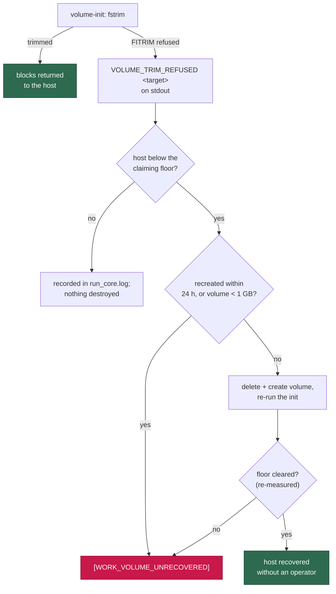

# Self-heal the work volume when FITRIM is refused (Issue #478)

## Summary

#384's launch-time `fstrim` has never worked on the Apple `container`
runtime: the ioctl is refused as root on a device that advertises discard
(`FITRIM ioctl failed: Operation not permitted`), so the thin-provisioned
`vibe-work` image only ever grows. GRQ-23 carried 26 GB on the host for
12.1 GB of live data, sat below its floor for three days claiming nothing out
of 43 claimable issues, and the only remedy the worker named —
`container volume delete vibe-work` — was addressed to a human who was not
there. An unattended host has no human, so the launcher now takes the remedy
itself. Closes #478.

- **The refusal is a fact, not a warning.** `container/volume-init.sh` prints
  `VOLUME_TRIM_REFUSED <target>` on stdout when the trim fails or `fstrim` is
  missing; the stderr warning stays. Exit status is unchanged — a runtime that
  cannot discard must not block a launch.
- **`run.sh` acts on it.** Each refused target is mapped back to its named
  volume and recorded in `run_core.log`, so a launch where FITRIM was refused
  is never recorded as a successful trim. When the host is also below the
  floor the worker stops claiming at — the larger of
  `VIBE_HOST_DISK_LOW_FLOOR_GB` (20) and `VIBE_HOST_DISK_LOW_FLOOR_PERCENT`
  (10 %), the same floor `worker/deno/lib/host_disk.ts` applies — the volume
  is deleted, recreated and re-initialised. This happens before any container
  starts, so no work is in flight: the clones re-clone and the approval
  snapshots re-baseline.
- **The attempt is bounded and never silent.** At most one recreate per
  `VIBE_WORK_VOLUME_HEAL_INTERVAL_HOURS` (24), recorded in
  `~/.vibe-coder/work-volume-heal`; volumes holding less than
  `VIBE_WORK_VOLUME_HEAL_MIN_GB` (1 GB) in the container store are never
  destroyed, because the host's missing space is somewhere else. Free space is
  **re-measured** after the recreate — a heal that did not clear the floor is
  reported as `[WORK_VOLUME_UNRECOVERED]` on stderr and in `run_core.log`,
  not as a fix. The launch still proceeds either way: only the hard floor
  refuses a launch, because a host that cannot claim must still run and report
  (Issue #477).
- **The alarm stops promising something false.** `work_volume_ratchet.ts` no
  longer says the launch-time trim "hands those blocks back on the next
  launch", nor tells an operator to stop the container and delete the volume;
  it names the launcher's own recreate and the `[WORK_VOLUME_UNRECOVERED]`
  escalation.

`run.ps1` deliberately has no counterpart (a comment records why): it drives
Docker and Podman, which bind-mount a host directory, so volume-init's
block-device branch — and therefore the trim — never runs there.

## Evidence

Backend/launcher change with no web interface, so the evidence is the test
suite and the launcher's own recorded behaviour rather than a screenshot.



The launcher tests run the real `run.sh` against a recording runtime stub, so
they assert what the launcher actually did — which volumes it deleted, how
many times it ran the init, and what it wrote to `run_core.log`:

```text
run.sh - a refused trim below the claiming floor recreates the volumes and re-runs the init (Issue #478) ... ok
run.sh - a refused trim on a host with room to spare destroys nothing (Issue #478) ... ok
run.sh - a recreate that did not clear the floor is not retried on the next launch (Issue #478) ... ok
run.sh - volumes too small to hold the missing space are escalated, not destroyed (Issue #478) ... ok
```

`./quality.sh` passes (deno tests, lint, type check, fmt, markdownlint,
mermaid, and the repository's chokepoint scans).

## Test Plan

Added:

- `worker/deno/tests/volume_init_script_test.ts` — a refused FITRIM is named
  on stdout as `VOLUME_TRIM_REFUSED /work` and still exits 0 with the chown
  done; a missing `fstrim` reports the same refusal; a successful trim and a
  bind-mounted target report none.
- `worker/deno/tests/run_sh_launcher_test.ts` — the four launcher cases listed
  above: recreate + re-init + `[WORK_VOLUME_UNRECOVERED]` below an unreachable
  floor (with the worker still started), no destruction above the floor, the
  24 h bound suppressing a second recreate, and the 1 GB volume-size guard.
- `worker/deno/tests/fixtures/launcher_harness.ts` — the stub now emits
  `STUB_INIT_STDOUT` from the init, records every volume deletion
  (`removedVolumes`) and counts init runs (`initCount`).

Modified (business-logic change, documented rather than removed):

- `work_volume_ratchet_test.ts` — the reclaim line must now name the
  launcher's recreate and must **not** carry the operator incantation
  (`stop the container and …`); the issue references widened to
  `Issues #384, #478`.
- `host_disk_test.ts`, `volume_init_script_test.ts` — the same widened issue
  reference in two assertions; the behaviour they pin is unchanged.

## Deno regression avoided

None needed — the change is in the bash launcher, the container init script
and existing Deno modules; no Node tooling was introduced and the tests run
under `deno test`.
