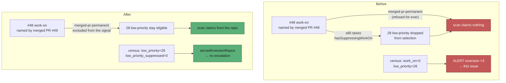

# Idle-inversion on NEAT-AI-Rebase: a permanently blocked `work-on` issue parked 28 `low-priority` issues

## Summary

The census and the claim scan disagreed about `stSoftwareAU/NEAT-AI-Rebase`
because **both** were wrong, one level apart. Closes #499.

**What the field data showed.** `NEAT-AI-Rebase#48` carries `work-on`, is
unassigned and carries no blocking label — but merged PR #49
("Emit population-candidate.json as a creature, not bare topology (Issue #48)")
names it, so `isBlockedByRecentlyClosedPR` makes the scan refuse it as
`merged-pr-permanent` on every cycle. That skip is permanent by design
(Issue #3151): only a trusted re-label dated after the merge lifts it.

Refusing #48 was right. What was not right is that #48 still raised
`hasSuppressingWorkOn`, and `selectHighestPriority` drops **every**
`low-priority` candidate from a repo in `reposWithOpenWorkOn`. So the repo was
deadlocked: #48 could never be claimed, and neither could any of the 28
`low-priority` issues parked behind it. That is exactly the state the issue
describes — *"that work is not being done by anyone"*.

The census, meanwhile, models the merged-PR gate (so `work_on=0
merged_pr_blocked=1`) but has never modelled tier-3 suppression at all, so it
kept counting all 28 as claimable. Three such cycles filed this issue.



### The changes

**1. `worker/deno/lib/collect_work_on_candidates.ts` — the starvation fix.**
`merged-pr-permanent` issues are counted and subtracted from the suppression
signal, alongside the existing `dependency-blocked` carve-out (Issue #2610):

```ts
const hasSuppressingWorkOn =
  (filtered.length - dependencyBlockedCount - mergedPrPermanentCount) > 0;
```

The rule that emerges is now consistent: a `work-on` issue suppresses the lower
tiers only when its blocker **clears by itself** (eligible, open PR, occupied
stream, closed-**unmerged** PR cooldown). A closed-unmerged PR still suppresses
— that block expires with the cooldown window.

**2. `worker/deno/lib/idle_decision_census.ts` — the census gap.** The census
now models tier-3 suppression, with the same two carve-outs the scan applies, and
reports the excluded backlog as `low_priority_suppressed=<n>` on the per-repo
`[idle-census]` line. Without this, any repo with a legitimately deferred
`work-on` issue (an open PR, an occupied stream) plus a `low-priority` backlog
manufactures this same escalation for as long as the deferral lasts.

Worth noting for the next time: `CENSUS_SCAN_GATE_COVERAGE` is a total map over
`SkipReason` precisely to stop this class of bug, and it did not catch this one —
tier-3 suppression happens in `selectHighestPriority`, never reaches
`logIssueSkipped`, and so has no `SkipReason` to classify. That limit is now
written down in `docs/IDLE-TASK-FRAMEWORK.md`.

## Evidence

Backend/CLI change with no web interface, so no screenshot applies. The evidence
is the regression tests plus the field data they encode.

**The regression test fails against the unfixed code.** With
`worker/deno/lib/collect_work_on_candidates.ts` stashed:

```text
collect_work_on_candidates - a work-on issue named by a merged PR does not suppress => ./tests/collect_work_on_candidates_suppression_test.ts:349:6
FAILED | 0 passed | 1 failed | 7 filtered out (19ms)
```

After the fix:

```text
ok | 8 passed | 0 failed (30ms)     # collect_work_on_candidates_suppression_test.ts
ok | 57 passed | 0 failed (11ms)    # idle_decision_census_test.ts
```

Full gate:

```text
Result: PASSED (with skipped checks)
```

(`config integration`, `pages-liquid` and `mermaid built output` skip in this
environment; every other check passed.)

## Test Plan

### Added — `worker/deno/tests/collect_work_on_candidates_suppression_test.ts`

- `a work-on issue named by a merged PR does not suppress` — the
  NEAT-AI-Rebase#48 / PR #49 shape. The regression test for this issue: it fails
  against the unfixed code (output above).
- `a work-on issue in closed-unmerged PR cooldown still suppresses` — the
  boundary. A self-clearing block must keep suppressing.
- `a merged-PR-blocked issue beside a workable one still suppresses` — no
  over-correction: one genuinely workable `work-on` issue still parks the tier.

### Added — `worker/deno/tests/idle_decision_census_test.ts`

- `a suppressing work-on issue removes the low-priority backlog from the
  claimable count` — the new gate, including `claimableIssues`.
- `with no work-on issue the low-priority backlog stays claimable` — the
  negative case.
- `a permanently merged-PR-blocked work-on issue does not suppress the backlog`
  — the NEAT-AI-Rebase case end to end: `work_on=0`, `merged_pr_blocked=1`,
  `low_priority=2`, `low_priority_suppressed=0`, so census and scan agree.
- `a purely dependency-blocked work-on issue does not suppress the backlog` —
  the #2610 carve-out is mirrored.
- `a stream-occupied work-on issue still suppresses the backlog` — a
  self-clearing deferral still suppresses in both instruments.
- `a blocked-label work-on issue does not suppress the backlog` — the #2751
  carve-out is mirrored.
- `formatter - per-repo line carries the low_priority_suppressed count`.

### Modified (business-logic change, documented)

`worker/deno/tests/idle_decision_census_test.ts` →
`census - counts unblocked issues per priority label` previously asserted
`unblocked.lowPriority === 1` for a repo that also holds two claimable `work-on`
issues. Under the new gate that `low-priority` issue is not a candidate the scan
would take, so the assertion is now `lowPriority === 0` plus
`lowPrioritySuppressed === 1`. The change is commented inline at the assertion.
No test was removed or disabled.

### Docs

- `docs/workflows/issue-processing.md` — new **Per-repo tier suppression**
  section with the suppresses / does-not-suppress table.
- `docs/IDLE-TASK-FRAMEWORK.md` — the census's new gate, the updated
  counting flowchart, and the note that the `SkipReason` compiler guard cannot
  cover selection-stage gates.
- `docs/SUPPLY-CHAIN-TRIAGE.md` — the tier-3 row said "any repo that has an open
  work-on issue", which is no longer accurate.

## Security self-check

- No new external input, shell, SQL, filesystem or HTTP call; both changes are
  pure in-process counting over data the worker already holds.
- No secrets, credentials or hidden files staged (`git diff --cached
  --name-only` verified before commit).
- No new dependency, no change to authentication, authorisation or error
  surfaces.
