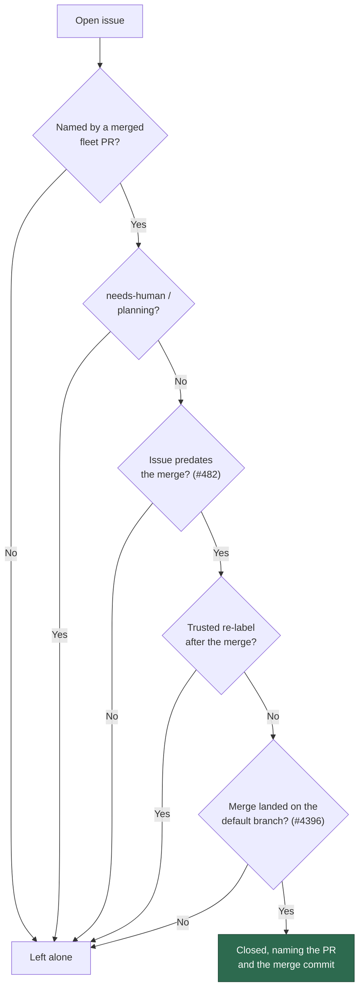
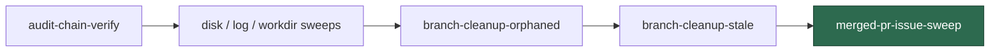

## Summary

The worker only closed an issue whose PR merged **from inside the run that was
working that issue**. `ensureIssueClosedIfPrMerged` — the belt-and-braces closer
whose own docblock says it "handles edge cases where GitHub auto-close fails" —
was only ever called from `execute_claude_phase.ts` and `completion_phase.ts`,
both inside a claim the worker holds. An issue fixed by a PR the worker did not
author, or by a run killed between the merge and its completion phase, was never
closed by anything: it stayed open for ever and every claim scan refused it as
`merged-pr-permanent`, a blocker that by design never clears.

This adds `merged-pr-issue-sweep` as the final housekeeping step. It points the
existing closer at exactly the set that cannot heal itself, and invents no new
rule — the candidates are the claim scan's own (`isBlockedByRecentlyClosedPR`
over the fleet's closed/merged PRs, taking only the `merged` verdicts), and
every gate that already guards a close still applies:

- the Issue #319 title matcher, so a repo-qualified or PR-qualified `#N` is not
  read as a fix;
- the Issue #482 ordering guard, so a merge never closes an issue filed after it;
- the Issue #4396 merge-landing check, so a merge that went nowhere leaves the
  issue open;
- the VibeCoder#42 escape hatch, so a trusted re-label dated after the merge
  hands the issue back to the fleet;
- `needs-human` and `planning`, which a merge elsewhere never resolves.

`LifecycleDeps` gains one optional seam, `closeCommentFn`, so the sweep's close
comment names the merge commit as well as the PR. The default wording is
unchanged for every existing caller.

Failures are loud: a repo that cannot be scanned, or a close that fails, is
recorded in `failures` and returned as a failed housekeeping step rather than a
green, empty sweep.

Closes #504.

## Evidence

Backend/CLI change — no web interface to screenshot. The behaviour is verified
by the tests listed below; the decision path the sweep applies is:

Where it runs in the startup sequence — last, because it is the only step that
touches GitHub rather than local disk:

The sweep's tests drive the real gates through a mocked `gh` seam — the real
`fetchAllIssues` / `fetchRecentlyClosedPRsForFleet` parsers, the real matcher,
the real `ensureIssueClosedIfPrMerged` and its real landing check — rather than
stubbing the decision, so a weakened gate fails the suite.

## Test Plan

`worker/deno/tests/merged_pr_issue_sweep_test.ts` (new, 10 tests) — one per
acceptance criterion plus the guards:

- closes an open issue named by a merged, landed PR, whoever authored it;
- the close comment names the PR and the merge commit;
- a merged PR whose change did **not** land leaves the issue open (#4396);
- an issue named only by a closed-unmerged PR is untouched;
- an issue named only by an open PR is untouched;
- an issue carrying `needs-human` is never closed;
- an issue filed **after** the merge is never closed by it (#482);
- a trusted re-label after the merge stops the closure (VibeCoder#42);
- a repo whose scan fails is reported loud and does not stop the sweep;
- an empty repo list is a clean no-op.

`worker/deno/tests/run_housekeeping_test.ts` (2 added) — the step is last in the
canonical order, wired to the worker login, and honours
`MERGED_PR_SWEEP_ISSUE_LIMIT`.

`worker/deno/tests/issue_lifecycle_test.ts` (1 added) — `closeCommentFn`
receives the PR number and the landing verdict and its output becomes the close
comment. No existing test was modified: the default wording is unchanged.

## Documentation

- `docs/INTERNALS.md` — startup housekeeping step 4 now describes the sweep,
  with the gate flowchart; the module table lists `merged_pr_issue_sweep.ts`.
- `docs/workflows/issue-processing.md` — `merged-pr-permanent` is no longer a
  standing strand.
- `docs/IDLE-TASK-FRAMEWORK.md` — `merged_pr_blocked=<n>` now counts issues
  awaiting the sweep, not a permanent population.
- `docs/CONFIGURATION.md` — `MERGED_PR_SWEEP_ISSUE_LIMIT`.
