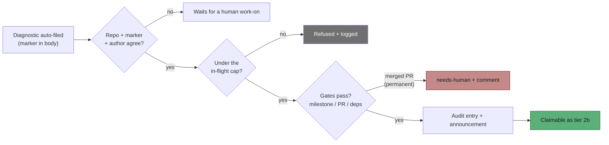
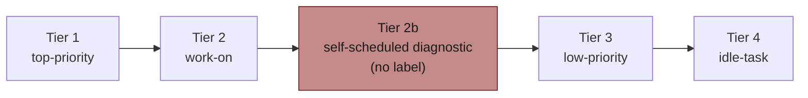

# Self-scheduling for auto-filed worker diagnostics (Issue #505)

## Summary

The worker diagnosed its own faults accurately and then stopped, because the
one action that schedules a fix — applying `work-on` — is the one action it must
never take. Unattended, nobody applied it: `NEAT-AI-Rebase#39` sat for two days,
and the fix took 79 minutes once a human finally scheduled it.

This adds a narrow, auditable path by which the worker schedules **its own
auto-filed diagnostics — and nothing else**. No label guard is relaxed and no
label is self-applied: `worker_label_guard.ts`, `wasLabelAddedByAllowedAuthor()`
and `verifyOperationalLabels()` are untouched, and `top-priority` / `work-on`
remain human-only unconditionally. Instead the claim scan gains **tier 2b** —
below both human-scheduled tiers, above the backlog — whose eligibility rests on
provenance rather than on a label. Closes #505.

Three signals must agree before an issue qualifies (`self_diagnostic_provenance.ts`):

1. **Repo** — the worker's own repo, where the deciding code lives.
2. **Marker** — a recognised template marker (`<!-- VIBE_IDLE_INVERSION:… -->`,
   `<!-- VIBE_RUN_FAILURE:… -->`), matched as a whole HTML comment.
3. **Author** — filed by a fleet worker login. Author alone is not sufficient:
   an injected agent can file issues too.

Bounded, visible and reversible:

| Requirement | Implementation |
|---|---|
| Bounded | `self_schedule_diagnostics_max_in_flight` (default `1`), counting assigned diagnostics — the assignee is the fleet's claim lock. The surplus is refused and logged. |
| Visible | Each decision is written to the audit chain under the distinct `self-schedule-diagnostic` verb **and** announced in a comment on the issue (once, deduped by marker). If either fails the diagnostic is not scheduled that scan. |
| Escalating | A permanently blocked diagnostic (a merged fleet PR names it) gets `needs-human` plus one explanatory comment instead of waiting silently. |
| Reversible | `self_schedule_diagnostics_enabled: false` restores the previous behaviour exactly. |

The idle-inversion issue body no longer says "the worker cannot self-apply that
label"; it now states that the worker schedules the diagnostic itself and that a
human `work-on` schedules it sooner.

## Evidence

Backend/CLI change — no web interface to screenshot. The evidence is the test
suite and the full quality gate.

```
$ deno test --allow-all tests/self_diagnostic_provenance_test.ts \
    tests/collect_self_diagnostic_candidates_test.ts \
    tests/issue_priority_self_diagnostic_test.ts \
    tests/find_oldest_issue_self_diagnostic_test.ts
ok | 34 passed | 0 failed

$ ./quality.sh < /dev/null
Result: PASSED (with skipped checks)
```

The end-to-end test drives the real `findOldestIssue`: an unlabelled,
worker-filed diagnostic is selected for work, and the worker logs the decision:

```
[self-schedule] scheduled stSoftwareAU/VibeCoder#39 (family=idle-inversion, cap=1)
```

### How a diagnostic reaches a slot



### Where tier 2b sits



### Pre-PR security self-check

- **Input validation** — the recogniser matches a whole HTML comment with a
  bounded value pattern; bodies are otherwise treated as untrusted data.
- **Secrets** — none staged; no hidden files touched.
- **Injection surface** — no new SQL/shell paths; `gh` is invoked through the
  existing injected command function with argument arrays.
- **Authorisation** — the new path *narrows* rather than widens: it grants no
  label capability, and every existing reserved-label guard is unchanged. An
  actor who could edit a worker-filed body could already apply `work-on`
  directly, so no new capability is created (stated as residual risk in
  `SECURITY.md`).
- **Error handling** — every failure is loud: refusals are logged with their
  cause and returned to the caller, and an unrecordable or unannounceable
  decision refuses to schedule rather than proceeding untraceably.
- **Dependencies** — none added.

## Test Plan

New tests:

- `worker/deno/tests/self_diagnostic_provenance_test.ts` — the recogniser
  accepts real filed bodies from both families and rejects prose naming a
  marker, an unknown family, a marker with no value, and an empty body; the
  repo gate and the announcement/escalation builders.
- `worker/deno/tests/collect_self_diagnostic_candidates_test.ts` — one test per
  acceptance criterion: a diagnostic is claimable with no label and no label
  call is made; the decision is audited and announced; the announcement is
  posted once, not once per scan; a product-repo issue, a human-filed issue and
  an unmarked issue are refused; the in-flight cap (and a cap of `0`) refuses
  the surplus and logs it; a raised cap admits more; an unrecordable or
  unannounceable decision is refused; a human-scheduled or `needs-human`
  diagnostic is left alone; an open fleet PR defers; a merged PR escalates with
  `needs-human` plus a comment.
- `worker/deno/tests/issue_priority_self_diagnostic_test.ts` — tier 2b loses to
  `top-priority` and `work-on`, beats `low-priority` and `idle-task`, is reached
  when the work-on tier is suppressed, and changes nothing when absent.
- `worker/deno/tests/find_oldest_issue_self_diagnostic_test.ts` — end-to-end
  through `findOldestIssue`: the diagnostic is selected with no human label, and
  is invisible when `self_schedule_diagnostics_enabled: false`.

Modified test:

- `worker/deno/tests/idle_inversion_streak_test.ts` — the body assertion now
  also requires the new "schedules this diagnostic itself" wording; the existing
  ``Apply `work-on` `` assertion is kept, since the label is still the way to
  schedule a diagnostic sooner.

Documentation updated: `README.md`, `SECURITY.md` (new §5a), `docs/CONFIGURATION.md`
(two new keys), `docs/INTERNALS.md`, `docs/IDLE-TASK-FRAMEWORK.md`, and
`docs/workflows/issue-processing.md` (tier table, flow diagram and a new
"Self-scheduled worker diagnostics" section).
