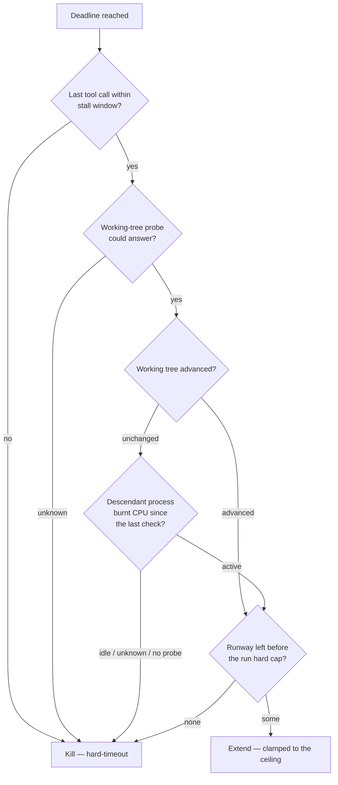

# Treat external work as progress in the extension gate (Issue #508)

## Summary

The progress-extension gate granted an extension only when the **git working
tree had advanced** since the previous probe. An agent supervising a
long-running job it started — a training run, an evolution sweep, a build —
makes tool calls every few seconds and produces no tree delta while it waits,
so it was indistinguishable from one that was spinning: refused an extension
and killed at the base budget, mid-flight. On `stSoftwareAU/GRQ` that became
the dominant execute-timeout mode (four of five refusals read
`working tree unchanged despite tool activity 26s ago`).

The tree is now **one progress signal of several**, not the only one:

- **New `worker/deno/lib/descendant_progress.ts`** — one bounded
  `ps -eo pid=,ppid=,time=` read is walked into the agent's own descendant
  subtree and the CPU those descendants have accumulated is compared with the
  previous read. CPU burnt between two checks is work; a subtree that burns
  none (a `sleep 60` poll loop with nothing behind it) is `idle`; a read that
  fails is `unknown`. The agent's own CPU is excluded — it burns some on every
  tool call, so counting it would stop the gate refusing anything.
- **`progress_extension.ts`** — the decision extends when tool activity is
  fresh **and** (the tree advanced **or** external work is active). An
  unchanged tree with an `idle`/`unknown`/absent external signal is still
  refused, an `unknown` tree probe still kills outright (Issue #4294's
  fail-safe direction, unchanged), stale tool activity still kills (Issue
  #399), and every grant is still clamped to the Issue #421 supervisor cap.
- **New `worker/deno/lib/wind_down_notice.ts`** — inside the last 600 s of
  runway the worker writes `.vibe-run-budget.md` into the checkout (seconds
  remaining, elapsed, extensions granted, and what to do about it) and
  refreshes it at every later check. The issue prompt now tells the agent to
  read that file between polls of a long-running job, so a run the cap is
  about to stop winds down deliberately instead of being SIGKILLed mid-poll.
  The name is hidden, so the enforced `.gitignore` keeps it out of every commit
  and `git status` never reports it — writing it cannot move the tree probe.
  A notice left by a previous run is cleared when the next execute phase
  starts.

Callers that wire no external probe (every phase other than issue work) get
byte-identical behaviour, refusal wording included.

Closes #508.

## Evidence

Backend/CLI change — there is no web interface to screenshot. The evidence is
the test suite below plus the decision flow it pins.



The rolling probe driven against real processes inside the container (a
throwaway script, deleted after the run) — the two states the old gate could
not tell apart, now distinguished:

```text
first check (no window yet):       unknown
nothing running:                   idle
descendant burning CPU:            active
descendant only sleeping (poll):   idle
```

Acceptance criteria, each pinned by a named test:

| Criterion | Test |
| --- | --- |
| A descendant consuming CPU is granted an extension despite an unchanged tree | `claude_runner_external_progress_508_test.ts` — "a live descendant doing work keeps a supervising agent alive…" |
| Recent tool calls, no tree delta, no live descendant → still refused | `claude_runner_external_progress_508_test.ts` — "tool calls with no tree delta and no live descendant are still killed" |
| No tool calls inside the staleness window → still refused | `progress_extension_external_508_test.ts` — "stale tool activity is refused however busy the descendants are" |
| A probe that cannot answer still kills (#4294) | `progress_extension_external_508_test.ts` — "an unknown tree probe still kills even with a live descendant"; "an unevaluable external probe never earns an extension" |
| An agent approaching the cap is told the remaining budget | `claude_runner_external_progress_508_test.ts` — "an agent approaching the hard cap is told its remaining budget before the kill" |
| Extensions remain bounded by the #421 cap | `progress_extension_external_508_test.ts` — "an external grant is still bounded by the run hard cap" |

Log lines an operator will now see:

```text
[progress-extension] a descendant process is doing work (working tree unchanged)
and tool activity 26s ago (within the 300s window) — extension 3 at 3600s elapsed…
[progress-extension] wind-down notice written: 420s of runway left before the run
hard cap, so the agent can stop waiting and preserve its work in progress
[progress-extension] not extending after 3600s: working tree unchanged and no
descendant process doing work (external idle) despite tool activity 26s ago
```

## Test Plan

Added:

- `worker/deno/tests/descendant_progress_test.ts` (13 tests) — CPU-time
  parsing in every `ps` shape, subtree summation excluding the agent, cycle
  safety, active/idle/unknown comparison, and a probe that never throws.
- `worker/deno/tests/progress_extension_external_508_test.ts` (11 tests) — the
  narrowed decision, the preserved kills, the unchanged legacy wording when no
  external probe is wired, the hard-cap interaction, and the interim-sample
  fold.
- `worker/deno/tests/claude_runner_external_progress_508_test.ts` (5 tests) —
  end-to-end through `runClaudeWithTimeout` with a stub agent: a supervising
  run survives, a spinning run dies, the probe is asked for the agent's own
  pid, a throwing probe is `unknown`, the wind-down notice is delivered before
  the kill and a throwing notice sink never kills the run.
- `worker/deno/tests/wind_down_notice_test.ts` (8 tests) — the window
  boundary, the notice text, the write/refresh/clear cycle, and a failed write
  that fails loud.

Extended:

- `worker/deno/tests/progress_extension_runtime_test.ts` — the external probe
  and wind-down sink are wired by `buildProgressExtension`; the rolling
  descendant probe baselines, detects a CPU delta once, and keeps its baseline
  across a failed read.
- `worker/deno/tests/prompt_builder_test.ts` — the issue prompt names the
  budget file, without which the notice would be invisible.

No existing test was modified or removed. `./quality.sh` run in the
foreground.
