## Summary

Assessed [GitHub spec-kit](https://github.com/github/spec-kit) against the Vibe
Coder workflow and committed the result as `docs/SPEC-KIT-COMPARISON.md`, with a
row added to the README documentation table. Five ideas are judged worth adopting
natively and each has its own follow-up issue; five are assessed and deliberately
rejected with the design reason recorded. No workflow code changes — this issue is
research and a decision record. Closes #510.

**Adopted (follow-up issues filed):**

| # | Idea | From |
| --- | --- | --- |
| #518 | Close the acceptance-criteria loop in the PR summary, including an `unrequested`/scope-creep line | `/speckit.converge` |
| #519 | Requirements-quality detection classes for grill-me ("unit tests for English") | `/speckit.checklist`, `/speckit.analyze` |
| #520 | Publish the plan→sub-issue coverage table and gate it at `closePlanningIssue()` | `/speckit.analyze` |
| #521 | Honest `verified` / `partial` / `not-run` reproduction status for `bug`-labelled work | `bug` extension |
| #522 | Name the MVP slice so a half-finished milestone still delivers value | spec template |

**Rejected, with reasons in the doc:** in-tree `spec.md`/`plan.md`/`tasks.md`
(GitHub is the control plane; concurrent workers would collide on a shared
`tasks.md`); a repo-owned authoritative constitution (repo context is
deliberately advisory and untrusted — `repo_context_reader.ts:165`); an
agent-authored `kill` verdict (issue lifecycle is not the agent's to change); the
converge *loop* as an unbounded semantic retry (every loop here is bounded on
purpose); and spec-kit's CLI/templates/extension plumbing (out of scope, and it
assumes an interactive session).

## Evidence

Backend/documentation change with no web interface to screenshot. The findings
are evidence-backed rather than inferred — each gap claim was verified against the
code before it was written down:

- **The orphaned artefact behind #518.** `prompts/planning/v21.md:95-97` writes
  `## Acceptance Criteria` into every sub-issue.
  `grep -rn "Acceptance Criteria" --include=*.ts worker/deno/lib` returns no
  matches, and `grep -n "Acceptance Criteria" prompts/issue/v35.md` returns no
  matches — nothing downstream reads it.
- **The unpublished coverage judgement behind #520.**
  `prompts/planning_critique/v5.md:15` asks for missing-work detection;
  `:164` states the critique is never published.
- **The bounded-loop position behind the converge rejection.**
  `worker/deno/lib/phases/quality_gate_remediation_phase.ts:298` —
  `const maxAttempts = 2`; `worker/deno/lib/config_defaults.ts:454` —
  `maxAutoFixAttempts: 3`; `docs/workflows/grill-me.md:402` —
  `maxGrillMeRounds` `5`.
- **The trust boundary behind the constitution rejection.**
  `worker/deno/lib/repo_context_reader.ts:165` fences repo context as advisory,
  never authoritative.
- spec-kit was read from a shallow clone of `github/spec-kit@main`
  (`templates/commands/*.md`, `templates/*-template.md`,
  `extensions/bug/`, `extensions/assess/`), not from memory. The clone lived in
  `/tmp` and is not part of this change. Every quoted line was re-checked
  against that clone: `extensions/bug/README.md:76` (the `not-run` guardrail),
  `templates/commands/checklist.md:9` ("Unit Tests for English"),
  `templates/commands/converge.md:153-155` (the `contradicts` / `unrequested`
  gap classes) and `templates/spec-template.md:16` (the "viable MVP" rule).

The two pipelines side by side, as committed in the doc:

```mermaid
flowchart TB
    subgraph SK["spec-kit — artefacts in the tree, human drives"]
        direction LR
        C1[constitution.md] --> S1[spec.md] --> CL1[clarify] --> P1[plan.md] --> T1[tasks.md]
        T1 --> A1[analyze] --> I1[implement] --> V1{converge}
        V1 -->|gaps| T1
        V1 -->|converged| PR1[review]
    end
    subgraph VC["Vibe Coder — state in GitHub, labels drive"]
        direction LR
        G1[coding_guidelines] --> IS[issue body]
        IS --> GM[grill-me rounds] --> QP[quorum / planning]
        QP --> SUB[sub-issues + milestone] --> IMP[implement + quality gate]
        IMP --> PRV[PR + review]
    end
    style V1 fill:#b60205,stroke:#7a0202,color:#fff
    style IMP fill:#2d6a4f,stroke:#1b4332,color:#fff
```

## Test Plan

No behavioural code changed, so no unit tests were added — the deliverable is a
document plus filed issues. Verification was the repository quality gate:

- `./quality.sh < /dev/null` — full gate, including the checks this change can
  break: `markdownlint` (the new doc and the added README table row, MD055/MD056
  column counts), `mermaid` (the flowchart renders), and `pages-liquid` (no bare
  `` or `{{ ... }}` reaches the GitHub Pages build).
- Each follow-up issue carries its own acceptance criteria and a failure-detection
  line, so the work it schedules is testable when it is picked up.
