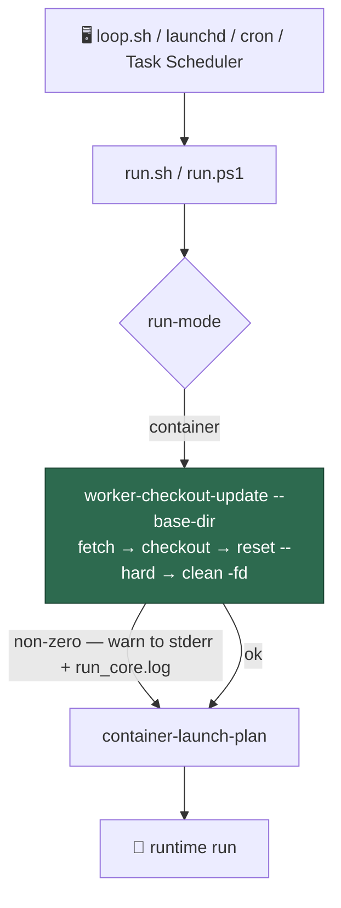

# Host launcher updates the worker checkout before each container launch

## Summary

The worker checkout is updated from *inside* the container today — the
bootstrap prelude's `git reset` — which is the only reason `/workspace` has to
be mounted read-write. Since the fleet self-update rewrites `run.sh`, code the
**host** executes, that mount is a container→host escape path.

This change moves the update to the host. A new `worker-checkout-update` Deno
command performs the prelude's own sequence (`git fetch origin` →
`git checkout <branch>` → `git reset --hard origin/<branch>` → `git clean -fd`)
against `--base-dir`, and both launchers run it before they build the launch
plan. The in-container reset stays for this release, exactly as the issue asks
— running both is harmless, the second reset is a no-op.

Closes #512.

- **DRY, not a restatement.** The command calls
  `resetCheckoutToDefaultBranch` and `resolveOriginDefaultBranch` from
  `worker/deno/lib/run_bootstrap.ts` (the reset was already there; it is now
  exported). The branch comes from `origin/HEAD`, repaired with
  `git remote set-head origin --auto` before failing; `--default-branch`
  overrides it.
- **Failure is not fatal.** A non-zero exit prints a loud warning to stderr and
  to `run_core.log`, and the launch continues on the existing checkout.
- **`VIBE_SKIP_CHECKOUT_UPDATE` turns the step off** for checkouts that must
  not be reset: a development tree, and CI — whose checkout is a pull-request
  merge commit, so an unguarded update would reset it to the default branch
  mid-run and the `no-runtime` smoke test would stop testing the PR. The skip
  is reported in the command's message, never silent. It was found the hard
  way: the first draft of this branch reset its own checkout when
  `container_restart_backoff_test.ts` ran the real `run.sh`.

## Evidence

Backend/CLI change — no web interface to screenshot. The evidence is the test
suite below plus `./quality.sh`.

### Security-fix evidence

- **Regression test.** Added
  `worker/deno/tests/launcher_parity_test.ts::launcherContractFaults - leaving the checkout update to the container is a fault (Issue #512)`,
  which reproduces the flaw: a launcher whose containment contract is otherwise
  sound but which leaves the checkout update to the container. It **fails
  against the unfixed code** — `LauncherContract` had no `updatesCheckout`
  field and `launcherContractFaults` raised no fault, so the assertion on a
  single `worker-checkout-update` fault could not hold — and **passes after the
  fix**. Its companion
  `worker/deno/tests/launcher_parity_test.ts::run.sh and run.ps1 - both update the worker checkout host-side (Issue #512)`
  asserts the same property of the two real launchers, and fails against the
  unfixed `run.sh` / `run.ps1`.
- **Trigger closed, no trivial bypass.** The trigger is the container being the
  only thing that can refresh the checkout, which forces `/workspace` to be
  writable from inside. After this change the update is performed entirely by
  the host launcher before the container starts, so the container performs no
  write that the refresh depends on — the read-only mount lands in the
  follow-up sub-issue of #509 with nothing left depending on the write. The
  obvious bypass — one launcher quietly dropping the step, so a Windows host
  stays on the old container-side update — is closed by the contract fault
  above: `launcherContractFaults` fails any launcher without the step, and
  `compareLauncherContracts` reports it as a divergence, both asserted against
  the real `run.sh` and `run.ps1` sources. A comment naming the command does
  not satisfy it (`executableLines` strips comments), which the
  "a comment naming the checkout update is not the step" test pins.
- **Blast-radius guard.** The launcher test harness always intercepts
  `worker-checkout-update`, so the suite can never git-reset the checkout it is
  running from, and `VIBE_SKIP_CHECKOUT_UPDATE` is set for the two places that
  run the real `run.sh` (the restart-backoff test and the `no-runtime` CI
  smoke).

## Test Plan

New — `worker/deno/tests/worker_checkout_update_test.ts` (real command, real
temporary git repositories):

- `worker-checkout-update - fast-forwards a clone to origin's default branch`
- `worker-checkout-update - discards local modifications and untracked files`
- `worker-checkout-update - returns a detached HEAD to the default branch`
- `worker-checkout-update - repairs a clone that has no origin/HEAD`
- `worker-checkout-update - honours an explicit --default-branch override`
- `worker-checkout-update - fails loud when the remote is unreachable`
- `worker-checkout-update - refuses a directory that is not a git checkout`
- `worker-checkout-update - requires --base-dir`
- `worker-checkout-update - VIBE_SKIP_CHECKOUT_UPDATE leaves the checkout untouched`
- `worker-checkout-update - VIBE_SKIP_CHECKOUT_UPDATE=0 does not turn the update off`

New — launcher coverage:

- `worker/deno/tests/run_sh_launcher_test.ts::run.sh - updates the worker checkout before it builds the launch plan (Issue #512)`
- `worker/deno/tests/run_sh_launcher_test.ts::run.sh - a failed checkout update warns and launches on the existing checkout (Issue #512)`
- `worker/deno/tests/run_ps1_launcher_test.ts` — the same two, PowerShell-gated
- `worker/deno/tests/launcher_parity_test.ts` — the contract fault, the
  divergence, the two real launchers, and (where PowerShell is installed) both
  launchers ordering the update before the plan and both surviving a failed
  update

Modified, with the reason:

- `worker/deno/tests/launcher_parity_test.ts` — the synthetic "sound launcher"
  fixtures gained the update line, and the rogue-launcher fault count went
  6 → 7, because a launcher without the step is now a fault.
- `worker/deno/tests/mod_test.ts` — registry count 141 → 142.
- `worker/deno/tests/container_restart_backoff_test.ts` — the helper that runs
  the real `run.sh` sets `VIBE_SKIP_CHECKOUT_UPDATE`.

`./quality.sh` passes.
