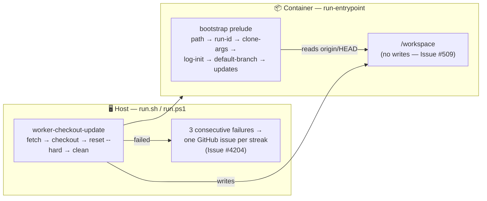

# Retire the in-container git reset from the bootstrap prelude

## Summary

The bootstrap prelude no longer writes to the worker checkout. The `git-reset`
step is gone from `PRELUDE_STEPS`, and with it the reset call, the
`resetToDefaultBranch` dependency hook and the whole Issue #4204 escalation
apparatus, which has moved to the host-side `worker-checkout-update` command —
the code that actually updates the checkout now (Issue #512). That leaves no
intentional in-container writer to `/workspace`, which is what makes the
read-only mount of Issue #509 safe to apply. Closes #513.

What changed:

- **`worker/deno/lib/checkout_update.ts` (new).** Holds the update sequence
  (`fetch` → `checkout` → `reset --hard` → `clean -fd`, moved verbatim from
  `run_bootstrap.ts`) plus everything Issue #4204 built around it: the "active
  development tree" diagnosis, the consecutive-failure streak, and the
  deduplicated GitHub escalation. Constants renamed to their new home
  (`CHECKOUT_UPDATE_ESCALATION_THRESHOLD`,
  `CHECKOUT_UPDATE_FAILURE_STREAK_FILE = "checkout-update-failure-streak"`);
  the streak file still lives under the log directory. The escalation issue is
  now titled `Worker checkout update failing on <host>` and says the host is
  running stale code, which is what a failed update actually means now that the
  launcher warns and launches anyway.
- **`worker/deno/lib/run_bootstrap.ts`.** Prelude is now
  `path → run-id → side-repo-clone-args → log-init → default-branch →
  software-update`. The checkout is touched by exactly one read — `git
  symbolic-ref refs/remotes/origin/HEAD` — because `run_worker.ts` passes
  `bootstrap.defaultBranch` to housekeeping's orphaned-branch clean-up. That
  read deliberately does **not** use `resolveOriginDefaultBranch`, which
  repairs a missing `origin/HEAD` with `git remote set-head` (a write); the
  host-side update does the repairing. An unreadable `origin/HEAD` is logged
  loud and costs that one housekeeping step, not the run.
  `resolveOriginDefaultBranch` stays exported — the host command uses it.
- **Software-update gate, documented in the module comment.** With no reset to
  gate it, the check runs on every prelude unless `skipSoftwareUpdate` is set
  (`--skip-software-update` / `SKIP_SOFTWARE_UPDATE` / the per-tool `SKIP_*`
  variables the callers resolve). It writes nothing to the checkout: its
  timestamps go to `timestampDir`, and `pull.log` now belongs to the host-side
  update, under the mounted log directory.
- **Launchers.** `run.sh` / `run.ps1` add `--allow-sys=hostname` to the
  `worker-checkout-update` invocation. Without it `Deno.hostname()` is refused
  and every host's escalation would collapse onto one shared
  `… on unknown-host` issue instead of one report per host.
- **Docs.** README, `docs/OVERVIEW.md`, `docs/INTERNALS.md`,
  `docs/CONTAINER.md`, `docs/CONFIGURATION.md` and `docs/TROUBLESHOOTING.md`
  updated — including the troubleshooting section, which described the old
  in-container `Git reset failed` crash-loop and now describes the host-side
  `Checkout update failed` symptom and the renamed streak file.

## Evidence

Backend/CLI change — no web interface to screenshot. Verified by unit tests
(below) and by the full `./quality.sh` gate.

Where the write to the checkout now happens:

Security posture of the change: it removes a writer rather than adding one. The
in-container process no longer executes `git fetch`/`reset --hard`/`clean`
against `/workspace`, so a compromised container can no longer reach the
launcher code the *host* executes through that path. The escalation still goes
through the `spawnGh` chokepoint, and its GitHub write happens on the host,
outside the container boundary.

## Test Plan

The reset removal is exercised against a real git checkout, not a mock:

- Added `worker/deno/tests/run_bootstrap_test.ts::runBootstrap - leaves a dirty
  checkout on another branch exactly as it is (Issue #513)` — clones a real
  repo, parks it on `fix/in-flight` with a modified tracked file and an
  untracked file, runs `runBootstrap`, and asserts the run succeeds, the branch
  and HEAD are unchanged, both files survive, and no `pull.log` was written.
  This reproduces the flaw: against the unfixed code the prelude reset the
  checkout, so the branch assertion (and the surviving-files assertions) fail;
  after the fix it passes.
- Added `worker/deno/tests/run_bootstrap_test.ts::runBootstrap - the prelude has
  no git-reset step (Issue #513)` — pins the exact step list.
- Added `worker/deno/tests/run_bootstrap_test.ts::runBootstrap - an unreadable
  default branch is logged loud but does not fail the run (Issue #513)` — the
  branch read is no longer fatal, and the refusal is on the record.
- Added `worker/deno/tests/checkout_update_test.ts` covering the relocated
  escalation: the streak increments, exactly one escalation at the threshold
  and silence afterwards, a success resetting the streak to zero, the
  "active development tree" diagnosis (and its absence on a clean on-branch
  failure), an escalation error never masking the update failure, and
  `updateCheckout - the streak file lives under the log directory (Issue #513)`
  driving the real filesystem streak through 1 → 2 → 3 → 0.
- Updated `worker/deno/tests/run_bootstrap_test.ts` (prelude order and the
  recording dependency set) and `worker/deno/tests/run_worker_test.ts`
  (`stepsRun` literals). No test was deleted to make the suite pass: the
  reset-specific tests were **moved** to `checkout_update_test.ts` alongside the
  behaviour they cover.

**Original trigger closed, no trivial bypass.** The trigger was the prelude's
own write to `/workspace`. Every path that could reach it is gone from the
module, not merely disabled: `PRELUDE_STEPS` has no `git-reset` entry, the
`resetToDefaultBranch` dependency hook and its default were deleted, and
`run_bootstrap.ts` no longer imports or defines any function that runs a
mutating git command — the only git it reaches is `git symbolic-ref` through
`resolveLocalDefaultBranch`. There is no option, environment variable or
dependency override that can reinstate a write, because there is no injection
point left to override; `BootstrapDeps` is a closed interface and a caller
cannot add a hook the prelude does not call.

Full `./quality.sh` passes.
