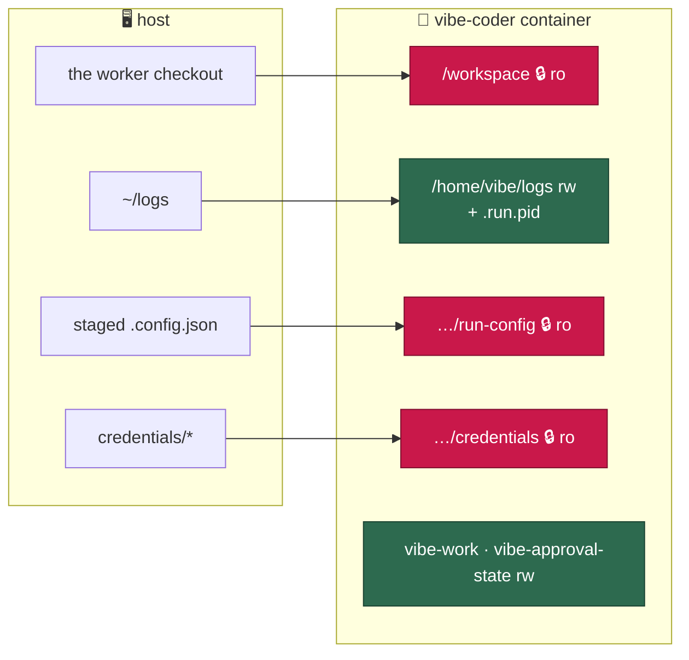

# Mount the worker checkout read-only at `/workspace`

## Summary

The launch plan now emits the worker checkout mount with `readOnly: true`, so
`run.sh` and `run.ps1` both start the container with `/workspace` read-only
without either restating the decision in shell or PowerShell. There is no reason
the Vibe Coder should ever modify the running code, and the last intentional
in-container writer is gone: Issue #512 moved the checkout update to the host
and Issue #513 retired the bootstrap prelude's `git reset`. Closes #514.

Three changes make a full work cycle survive the read-only mount:

1. **`worker/deno/lib/container_launch.ts`** —
   `{ source: base, target:
   targets.base, readOnly: true }`, with the stale
   "Read/write for that reason alone" comment replaced by why it is read-only
   now. The module doc's mount table says `ro`, and the paragraph that named the
   removed bootstrap self-update no longer does.
2. **`ensureDirectories`** — one filter with one reason. It excluded the base
   directory twice (once via `!mount.readOnly`, once via a `!== base` filter);
   now that the checkout is read-only the read-only test alone covers it, so the
   overlapping exclusion is removed rather than left undocumented.
3. **The incidental writers audit** (below).

### Incidental writers into the checkout

| Writer                                                                  | Verdict                                                                                                                                                                                                                                                                                                                                                                                                                                                                             |
| ----------------------------------------------------------------------- | ----------------------------------------------------------------------------------------------------------------------------------------------------------------------------------------------------------------------------------------------------------------------------------------------------------------------------------------------------------------------------------------------------------------------------------------------------------------------------------- |
| `${baseDir}/.run.pid` — the driver's PID file (`run_worker.ts`)         | **Relocated** to `${logDir}/.run.pid`. The log directory is the other host-visible read/write mount and, like the checkout, there is exactly one per host, so the guard still bounds one driver per host. `runPidFilePath()` in `run_entrypoint.ts` is now the single spelling; `diagnose`'s default and `docs/TROUBLESHOOTING.md` follow it. The production `claimPidFile` creates the directory, because a first-ever host run reaches the claim before the bootstrap's log init. |
| the entrypoint's staged worker source (`cp -R ${BASE_DIR}/worker/deno`) | **Fixed.** The copy is a read, but `cp -R` carries the read-only source's mode bits, and `rm -rf` cannot empty a directory with no write bit — so the _next_ launch's `rm -rf "${LOCAL_SRC}"` would fail and the worker would fall back to virtiofs for ever wherever the scratch root is the durable volume (Apple `container` takes no tmpfs). `chmod -R u+w "${LOCAL_SRC}"` after the copy, inside the same `&&` chain so a failure still degrades loudly.                       |
| `PROMPTS_DIR=${BASE_DIR}/prompts`                                       | **Read-only already.** `recordPromptVersion()` is the only writer in `prompt_manager.ts` and takes a caller-supplied log file; nothing in the run path calls it.                                                                                                                                                                                                                                                                                                                    |
| the bootstrap prelude's default-branch resolution                       | **Read-only already** since Issue #513 — `readOriginDefaultBranch` deliberately does not run the `git remote set-head` repair.                                                                                                                                                                                                                                                                                                                                                      |
| `git` with **no** `cwd` — the startup orphaned-branch sweep             | **Fixed.** `runGitCommand` with no `cwd` inherits the process working directory, and the entrypoint `cd`s to the checkout, so `branch-cleanup-orphaned` ran `git fetch --prune` and `git branch -d` _in_ `/workspace`. Both results were discarded, so under the read-only mount the step would report "No orphaned branches to clean up" for a pass it never made. `cleanupOrphanedLocalBranches` now probes the git directory first and returns a named `skippedReason`; the command reports the skip. A writable checkout sweeps exactly as before. |
| `git` with `cwd` set to the base directory                              | **None found.** Every `runGitCommand` call in the run path that passes a `cwd` points inside a managed clone; the bootstrap's are reads. The merged-PR sweep's local `git branch -d` also lands in the checkout, but it is a best-effort no-op there either way — the deletion that counts is the GitHub API one — so it is documented rather than changed.                                                                                                                                                                                            |
| `.config.json`                                                          | **Already off the checkout** — `CONFIG_PATH` points at the staged read-only copy.                                                                                                                                                                                                                                                                                                                                                                                                   |

### The mount set after this change



## Evidence

Backend/CLI change with no web interface, so the evidence is test output rather
than a screenshot.

**The regression test, and its linkage.** Added
`worker/deno/tests/container_launch_test.ts::buildContainerLaunchPlan - mounts the worker checkout read-only in every runtime dialect (Issue #514)`,
which builds a real plan for each supported dialect (Docker, Podman and Apple
`container`) and asserts the checkout mount carries `readOnly: true`, that the
rendered run arguments spell `/opt/VibeCoder:/workspace:ro` using that dialect's
own `readOnlyMountSuffix`, and that the NUL-framed plan the launchers parse
still carries it. It **fails against the unfixed code** — the mount was
`{ source: base, target: targets.base }` with no read-only flag, so both the
`readOnly` assertion and the rendered `:ro` assertion fail for every dialect —
and **passes after the fix**. It is the gate that stops a future edit silently
restoring `rw`.

Supporting tests, each also failing before the change:

- `worker/deno/tests/run_worker_test.ts::runWorker - guards, claims and cleans up a PID file in the log directory, never in the checkout (Issue #514)`
  — all three PID-file seams must agree on `/home/worker/logs/.run.pid`. Fails
  against the unfixed code, which passed `/repo/.run.pid`.
- `worker/deno/tests/run_worker_test.ts::runWorker - the real claimPidFile writes into a log directory that does not exist yet (Issue #514)`
  — exercises the production seam against a host with no `logs` directory.
- `worker/deno/tests/container_entrypoint_test.ts::entrypoint - a launch completes with the worker checkout mounted read-only (Issue #514)`
  — runs the real `container/entrypoint.sh` against a `chmod 0555` checkout: the
  launch must exit 0 with no `Read-only file system` / `Permission denied` and
  no `Warning:`, stage the driver out of the read-only tree, still export
  `PROMPTS_DIR` at the checkout, and leave the staged copy **writable**. The
  writable assertion fails against the unfixed entrypoint.
- `worker/deno/tests/container_containment_test.ts::containment harness - the worker checkout and its .git are probed read-only (Issue #514)`
  — guards the probe table itself where no container runtime is available.
- `worker/deno/tests/branch_cleanup_test.ts::branch cleanup - cleanupOrphanedLocalBranches names a checkout it cannot write instead of reporting a pass it never made (Issue #514)`
  — a real clone with a genuinely orphaned branch, its `.git` frozen with
  `chmod -R a-w`, so only the read-only tree can answer the assertion. Against
  the unfixed code the sweep returns no `skippedReason` and deletes the branch,
  so both assertions fail; after the fix it skips with a named reason and
  leaves the tree untouched.
- `worker/deno/tests/branch_cleanup_test.ts::branch cleanup - the cleanup-orphaned command reports the skip rather than 'no orphaned branches' (Issue #514)`
  — the housekeeping-facing seam: the message a frozen checkout produces must
  name the skip, never "No orphaned branches to clean up".
- `worker/deno/tests/branch_cleanup_test.ts::branch cleanup - cleanupOrphanedLocalBranches still sweeps a writable checkout (Issue #514)`
  — the guard must not disarm the sweep on a host checkout or a managed clone.
- The live containment run now probes `/workspace` and `/workspace/.git` as
  `ro-dir`, against a fixture checkout made world-writable (so only the mount
  flag can answer the assertion). It runs for real in
  `.github/workflows/container-build.yml` with `VIBE_CONTAINMENT_REQUIRED=1`.
- `worker/deno/tests/containment_docs_test.ts::CONTAINMENT.md documents exactly the mounts the launcher creates`
  — pre-existing, and it compares the documented table against the real plan, so
  the `ro` row in `docs/CONTAINMENT.md` is verified rather than asserted in
  prose.

**The original trigger is closed with no trivial bypass.** The trigger was a
container that could write to its own source tree: `/workspace` was bind-mounted
read/write, so any in-container process could rewrite the code the next cycle
executes. `buildContainerLaunchPlan()` is the single place the mount set is
decided — `run.sh` and `run.ps1` execute the rendered plan verbatim and
construct no mounts of their own — so setting `readOnly` there closes the write
path for every launcher and every dialect at once. Both dialects spell the flag
`:ro` and `buildMountArguments()` appends it unconditionally from
`mount.readOnly`, so no dialect can silently drop it, and the new per-dialect
test asserts the rendered argument rather than the field alone. There is no
second mount of the checkout to write through: the plan's mount list is
enumerated in one literal, the launchers cannot add to it, and the finished
argument list is re-checked for privilege-broadening flags before it is
returned.

Test output:

```
worker/deno$ deno test tests/container_launch_test.ts tests/containment_docs_test.ts
ok | 43 passed | 0 failed (208ms)

worker/deno$ deno test tests/run_worker_test.ts
ok | 21 passed | 0 failed (28ms)

worker/deno$ deno test tests/container_entrypoint_test.ts
ok | 29 passed | 0 failed (3s)

worker/deno$ deno test tests/container_containment_test.ts
ok | 6 passed | 0 failed | 1 ignored (26ms)
   (the live container run is skipped on this host — no runtime available;
    CI sets VIBE_CONTAINMENT_REQUIRED=1 so the skip is a failure there)

worker/deno$ deno test tests/branch_cleanup_test.ts \
    tests/branch_cleanup_cache_test.ts tests/run_housekeeping_test.ts
ok | 51 passed | 0 failed (287ms)

worker/deno$ deno task test:run-mode
ok | 209 passed | 0 failed | 22 ignored (1m30s)

VibeCoder$ ./quality.sh
  prompt immutability   PASSED     mermaid           PASSED
  benchmark audit       PASSED     markdownlint      PASSED
  hardcoded branches    PASSED     docs prompt vers  PASSED
  needs-human           PASSED     deno tests        PASSED
  gh spawn chokepoint   PASSED     deno lint         PASSED
  host work-dir guard   PASSED     deno type check   PASSED
  git ref chokepoint    PASSED     deno fmt          PASSED
  workflow hygiene      PASSED     source targets    PASSED

Result: PASSED (with skipped checks)
```

An earlier run of this branch saw one unrelated failure —
`secret_redaction_bounds_test.ts::redactSecrets - a 500 kB ragged long-line
blob stays bounded (Issue #196)` took 2155 ms against a 2000 ms wall-clock
bound, 8% over on a loaded host. It fails identically at the unmodified parent
commit (`4e0208c`), so it is host speed rather than this change, and it passes
in the run above. The timing assertion itself is recorded as
stSoftwareAU/VibeCoder#530 rather than folded into this PR, which touches no
redaction code.

## Test Plan

Added:

- `worker/deno/tests/container_launch_test.ts::buildContainerLaunchPlan - mounts the worker checkout read-only in every runtime dialect (Issue #514)`
- `worker/deno/tests/run_worker_test.ts::runWorker - guards, claims and cleans up a PID file in the log directory, never in the checkout (Issue #514)`
- `worker/deno/tests/run_worker_test.ts::runWorker - the real claimPidFile writes into a log directory that does not exist yet (Issue #514)`
- `worker/deno/tests/container_entrypoint_test.ts::entrypoint - a launch completes with the worker checkout mounted read-only (Issue #514)`
- `worker/deno/tests/container_containment_test.ts::containment harness - the worker checkout and its .git are probed read-only (Issue #514)`
- `worker/deno/tests/branch_cleanup_test.ts::branch cleanup - cleanupOrphanedLocalBranches names a checkout it cannot write instead of reporting a pass it never made (Issue #514)`
- `worker/deno/tests/branch_cleanup_test.ts::branch cleanup - cleanupOrphanedLocalBranches still sweeps a writable checkout (Issue #514)`
- `worker/deno/tests/branch_cleanup_test.ts::branch cleanup - the cleanup-orphaned command reports the skip rather than 'no orphaned branches' (Issue #514)`

Modified (expectations updated to the new boundary, none removed or disabled):

- `container_launch_test.ts` — the mount-set and provider-credential tests now
  expect the checkout in the read-only set; the `ensureDirectories` test also
  asserts the checkout is never created by the launcher.
- `run_sh_launcher_test.ts`, `run_ps1_launcher_test.ts` — both launchers must
  render `…:/workspace:ro`.
- `container_containment_test.ts` — the fixture checkout is world-writable with
  a `.git` of its own, and two `ro-dir` probes cover them.

Documentation updated in the same change: the mount tables in
`worker/deno/lib/container_launch.ts`, `docs/CONTAINMENT.md` and
`docs/CONTAINER.md` say `ro`; `docs/CONTAINMENT.md`'s writer inventory gains the
PID-file relocation and the orphaned-branch sweep; `docs/TROUBLESHOOTING.md`'s
"is the worker running" recipe reads `~/logs/.run.pid`.

## Pre-PR Security Self-Check

- **Input validation** — no new external input; `runPidFilePath()` takes the
  worker's own resolved log directory.
- **Secrets** — none staged; no hidden path outside the allowlist.
- **Injection surface** — no new shell, SQL or HTTP call. The one shell
  addition, `chmod -R u+w "${LOCAL_SRC}"`, uses a quoted variable the entrypoint
  itself derived.
- **Output encoding** — unchanged.
- **Authentication/authorisation** — unchanged; the credential mounts keep their
  read-only, per-sub-directory exposure.
- **Error handling** — the entrypoint's `chmod` sits inside the existing `&&`
  chain, so a failure takes the documented loud fallback rather than being
  swallowed; `claimPidFile`'s `mkdir` throws rather than silently skipping the
  claim.
- **Dependencies** — none added.
