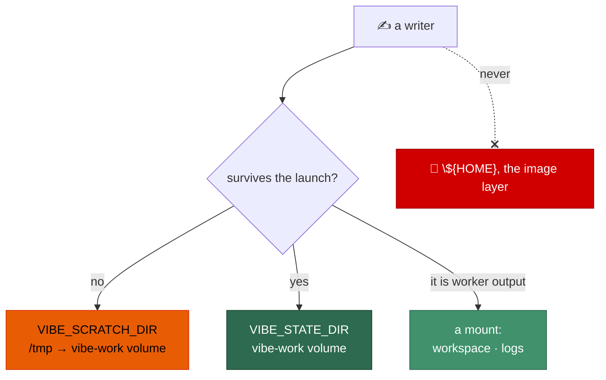

# Audit and relocate in-container writes outside `/tmp` and the named volumes

## Summary

Every in-container write that landed on the **image layer** — `${HOME}`, which
is `/home/vibe` and is not a volume — has been inventoried and relocated, so
the container root filesystem can be mounted `--read-only` without breaking a
run. Closes #515.

`container/entrypoint.sh` now resolves two container-managed writable roots
before its first write, and exports them for every process it spawns:

| Root | Env | Where | For |
| ---- | --- | ----- | --- |
| per-launch scratch | `VIBE_SCRATCH_DIR` | `${TMPDIR:-/tmp}/vibe-scratch`, else `…/auto-issue-work/.container-scratch` on the `vibe-work` volume | anything rebuilt on every start |
| durable state | `VIBE_STATE_DIR` | `…/auto-issue-work/.container-state` on the `vibe-work` volume, else `${VIBE_SCRATCH_DIR}/state` | caches worth keeping between launches |

A tmpfs alone could not be the answer: Apple `container` reports
`supportsTmpfs: false` (`worker/deno/lib/container_runtime.ts`), so on that
runtime `/tmp` is ordinary root filesystem and stops being writable the moment
the flag is set. Every scratch writer therefore has a `vibe-work` volume
fallback that works on a runtime taking no tmpfs at all — including `TMPDIR`
itself, so `mktemp` and `Deno.makeTempDir` still have somewhere to land.

Relocated writers (full inventory, with the class each was assigned, is in
`docs/CONTAINMENT.md`):

- `${HOME}/.worker-src` → `${VIBE_SCRATCH_DIR}/worker-src` (scratch — the tree
  is `rm -rf`'d and re-copied every start, so it is per-launch by
  construction).
- `${HOME}/.gitconfig` → `${VIBE_SCRATCH_DIR}/gitconfig` via
  `GIT_CONFIG_GLOBAL`. The `git config --global safe.directory` call was moved
  **below** the policy block — it was the launch's first global-config write.
- `${HOME}/.config/gh-runtime` → `${VIBE_SCRATCH_DIR}/gh` (re-copied from the
  read-only credential mount every start).
- The `DENO_DIR` fallback → `${VIBE_SCRATCH_DIR}/deno-cache` instead of the
  image's baked `/home/vibe/.cache/deno`. The durable cache on the volume is
  unchanged and still preferred.
- `XDG_CONFIG_HOME` → scratch; `XDG_CACHE_HOME`, `XDG_DATA_HOME`,
  `XDG_STATE_HOME`, `CARGO_HOME` and `npm_config_cache` → the durable state
  root. These are the dot-directory/XDG defaults the agent CLIs and package
  managers reach for, and every one of them defaulted under `${HOME}`.

The audit also found one writer outside the entrypoint: the crash-notification
rate limit wrote `${HOME}/.vibe-coder/last_crash_notification`, which
in-container is the **root-owned** parent the runtime creates for the
read-only credential and config mounts — so it was already being refused, and
the failing `recordNotificationSent` Result was discarded at the call site. It
now resolves to `…/auto-issue-work/.crash-state` in the container (host
behaviour unchanged), and a failure to record is warned about rather than
swallowed, because a lost rate limit means the next crash in a loop is
unthrottled. `.container-scratch`, `.container-state` and `.crash-state` are
added to `WORK_ROOT_STATE_DIRS` so the work-volume scratch pruner cannot age a
live launch's state out from under it.

Every relocation **degrades loudly**: each refused candidate is named on
stderr with the fallback that was taken, in the same shape as the existing
"could not use durable Deno cache … falling back" warning, and when no
candidate at all is writable the entrypoint says the legacy `${HOME}` paths
are being kept and that they need a writable root filesystem.

### Security self-check

- **Original trigger closed, no trivial bypass.** The trigger is a write to
  the image layer during a launch. Every writer the entrypoint owns now
  resolves its target from `VIBE_SCRATCH_DIR` / `VIBE_STATE_DIR`, which are
  computed by `vibe_first_writable_dir` from a fixed candidate list that
  contains no `${HOME}`-rooted path other than the `auto-issue-work` volume
  mount; the `${HOME}` spellings remain only as the last-resort branch, which
  is reached only when *no* candidate is writable and which announces itself
  on stderr. There is no equivalent bypass: the environment variables the
  relocated tools read (`GIT_CONFIG_GLOBAL`, `GH_CONFIG_DIR`, `DENO_DIR`,
  `XDG_*`, `CARGO_HOME`, `npm_config_cache`, `TMPDIR`) are exported before the
  driver starts, so a child that does not read them is a new writer and is
  caught by the `${HOME}`-untouched assertion in the test below.
- **Input validation.** `vibe_first_writable_dir` takes only paths the script
  itself composes; each candidate is probed with `mkdir -p` + `[[ -w ]]`
  rather than trusted. `resolveCrashStateDir` trims its inputs and falls back
  to the legacy path when the work dir is empty rather than composing a
  half-formed path.
- **No secrets staged**, no new dependency, no new network or shell surface.
  The gh credential copy keeps its `chmod 700` / `chmod 600`; it simply lands
  on the scratch root instead of `~/.config`.

## Evidence

Backend/CLI change — no web interface to screenshot. The evidence is the test
suite plus the read-only-image-layer launch below.

**Acceptance limitation, stated plainly:** the "full work cycle with
`--read-only` passed manually" criterion could not be executed in this run.
The worker runs inside the container itself and no container runtime is
reachable from it (`docker`, `podman` and `container` are all absent from
`PATH`), so no nested container could be launched. The nearest executable
equivalent was run instead and is committed as a test:
`container_entrypoint_test.ts::entrypoint - a launch completes with the image
layer read-only (Issue #515)` chmods `${HOME}` to `0555` — leaving only `/tmp`
and the already-created mount targets writable, exactly the shape
`--read-only` produces — and asserts the launch reaches the driver with no
`Read-only file system`, no `Permission denied` and **no warning at all**. The
real `--read-only` cycle belongs with the sub-issue that adds the flag to the
launch plan, which is where the automated regression gate lands.



Regression linkage — the five new entrypoint cases were run against the
**unfixed** `container/entrypoint.sh` (restored from `HEAD`) and all five
failed; they pass against the fixed script:

```text
$ git show HEAD:container/entrypoint.sh > container/entrypoint.sh
$ deno test --allow-all tests/container_entrypoint_test.ts | grep -c "515.*FAILED"
5

$ # with the fix restored
$ deno test --allow-all tests/container_entrypoint_test.ts
ok | 28 passed | 0 failed (1s)
```

`./quality.sh` on the finished branch:

```text
  deno tests                     PASSED
  deno lint                      PASSED
  deno type check                PASSED
  deno fmt                       PASSED

Result: PASSED (with skipped checks)
```

## Test Plan

Added to `worker/deno/tests/container_entrypoint_test.ts` (each reproduces the
flaw, fails against the unfixed code and passes after the fix):

- `worker/deno/tests/container_entrypoint_test.ts::entrypoint - writes nothing
  under HOME: the staged source, the git config and the gh copy all land on
  the scratch root (Issue #515)` — runs the real `git`, then asserts
  `${HOME}/.worker-src`, `${HOME}/.gitconfig`, `${HOME}/.config/gh-runtime`
  and `${HOME}/.cache` do not exist while the scratch root holds all three.
- `worker/deno/tests/container_entrypoint_test.ts::entrypoint - the tool
  caches every CLI reaches for are relocated off the image layer (Issue #515)`
  — asserts the exact `VIBE_SCRATCH_DIR`, `VIBE_STATE_DIR`,
  `GIT_CONFIG_GLOBAL`, `XDG_*`, `CARGO_HOME`, `npm_config_cache` and `TMPDIR`
  the driver inherits.
- `worker/deno/tests/container_entrypoint_test.ts::entrypoint - an unusable
  /tmp degrades loudly onto the work volume, never silently (Issue #515)` —
  the no-tmpfs runtime case: scratch and `TMPDIR` relocate to the volume and
  the warning names both.
- `worker/deno/tests/container_entrypoint_test.ts::entrypoint - an unusable
  durable Deno cache falls back to the scratch root, not the image default
  (Issue #515)`.
- `worker/deno/tests/container_entrypoint_test.ts::entrypoint - a launch
  completes with the image layer read-only (Issue #515)` — the acceptance
  proxy described above.

Added to `worker/deno/tests/crash_notification_test.ts`:

- `worker/deno/tests/crash_notification_test.ts::resolveCrashStateDir - in the
  container the state goes on the work volume, not ~/.vibe-coder` — container,
  host, explicit-override and missing-work-dir cases.
- `worker/deno/tests/crash_notification_test.ts::recordNotificationSent -
  reports failure rather than silently losing the rate limit`.

Modified (behaviour genuinely changed, no test removed or disabled): four
existing `container_entrypoint_test.ts` cases that asserted the old
`${HOME}/.worker-src` and `${HOME}/.config/gh-runtime` locations now assert
the scratch-root ones, and the shared `runEntrypoint` fixture pins `TMPDIR`
per case so the default scratch root cannot escape into the host's real
`/tmp`.
