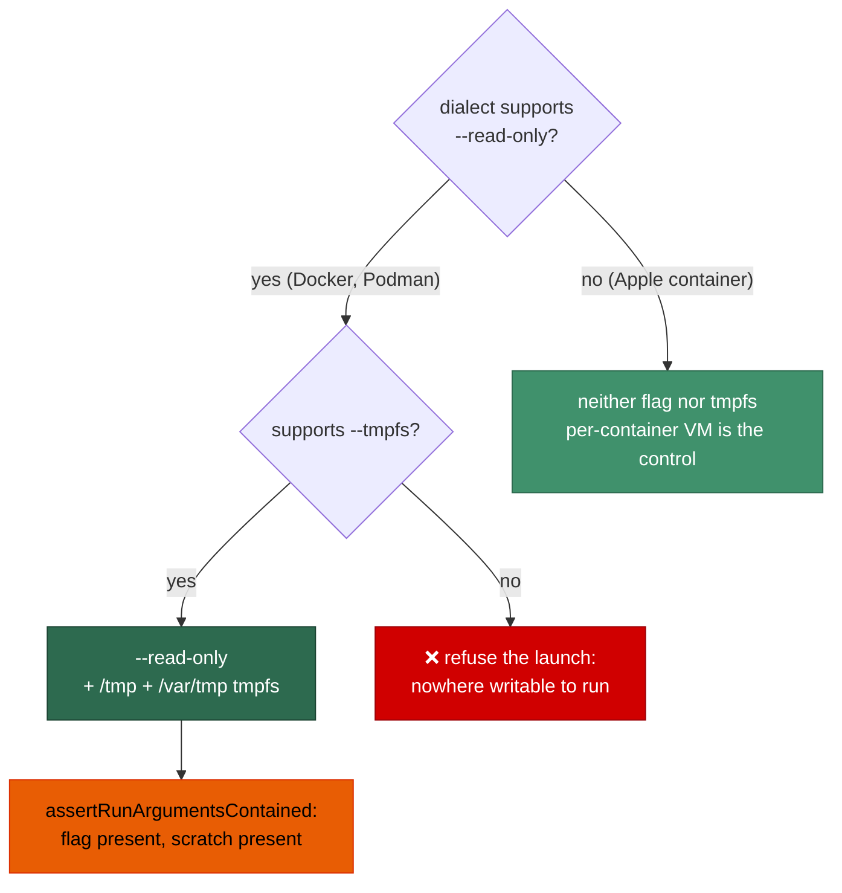

# Make the container root filesystem read-only (`--read-only` + scratch tmpfs)

## Summary

The worker container's root filesystem is now **immutable**. The launch plan
emits `--read-only` on every runtime that understands it, together with the
scratch `tmpfs` mounts that make a read-only root runnable, so a compromise
inside the container can persist nothing beyond the per-launch `tmpfs` and the
`vibe-work` volume it is meant to be able to write. Closes #516.

- `ContainerRuntimeDialect` gains `supportsReadOnly` (`worker/deno/lib/container_runtime.ts`):
  `true` for Docker and Podman, `false` for Apple `container`, which takes
  neither `--read-only` nor `--tmpfs` and gives each container its own
  lightweight VM as the compensating control.
- `worker/deno/lib/container_launch.ts` emits `--read-only` beside the existing
  `--cap-drop ALL` / `--security-opt no-new-privileges` block, followed by the
  scratch mounts in the new exported `SCRATCH_TMPFS_MOUNTS`:

  | Mount | Options | Why |
  | ----- | ------- | --- |
  | `/tmp` | `rw,nosuid,nodev,exec,mode=1777` | the entrypoint's `VIBE_SCRATCH_DIR`, `TMPDIR` and the browser profile (unchanged from before this issue) |
  | `/var/tmp` | `rw,nosuid,nodev,noexec,mode=1777` | POSIX's other world-writable scratch directory, which tools reach for without asking; pure data, so `noexec` |

  `/run` is deliberately **not** given a `tmpfs`: the image ships it root-owned
  `0755` and the worker runs as an unprivileged account, so it was never
  writable from inside the container and a `tmpfs` would only hand a root this
  container does not have somewhere to write.

### The gating decision, made explicitly

`--read-only` without writable scratch is a container that cannot run, so the
two are **one decision, not two independent `if`s**:

- `tmpfs` support is a **precondition** of read-only support. A dialect
  claiming `supportsReadOnly` without `supportsTmpfs` is refused loudly
  (`Refusing to launch: … the container would have nowhere writable to run`)
  rather than silently emitting half the pair.
- A dialect with `supportsTmpfs: false` therefore gets **neither** — that is
  Apple `container`, where each container is its own VM and
  `container/entrypoint.sh` already resolves its scratch root onto the
  `vibe-work` volume (Issue #515).
- `assertRunArgumentsContained` re-checks the finished list both ways: the flag
  must be **present** for a supporting dialect, and it can never appear without
  its `tmpfs` mounts. The reasoning is recorded in the module doc comment.

### Security self-check

- **Original trigger closed, no trivial bypass.** The trigger is durable state
  written to the container's image layer — anything a compromised agent leaves
  behind outside the mounts. With `--read-only`, every write outside `/tmp`,
  `/var/tmp` and the named volumes fails with `EROFS` at the kernel, not by
  policy, so there is no path to argue around: no binary can be planted on the
  image's `PATH`, no image script edited, nothing left under `${HOME}`. The
  equivalent bypass — dropping the flag in a later edit, or emitting it without
  its scratch — is closed by `assertRunArgumentsContained`, which refuses the
  argument list in both directions; the run-argument list is also still
  re-checked for `--privileged`, `--cap-add`, `--device`, published ports and
  host namespaces, and none of the new arguments trips those checks. The
  volume-init run keeps a writable root deliberately: it runs as root, where a
  read-only root is remountable and therefore not a boundary, and its only
  mounts are the volumes and the image.
- **Input validation.** The new arguments are fixed constants; no
  attacker-influenceable value reaches them.
- **No secrets staged**, no new dependency, no new network surface, no change
  to the mount set or the credential exposure.

## Evidence

Backend/CLI change — no web interface to screenshot. The evidence is the test
suite plus the regression linkage below.



**Regression linkage** — the new cases were run against the unfixed launch
plan (the `--read-only` emission removed, everything else in place). The
read-only case fails; with the fix in place every case passes:

```text
$ # --read-only emission removed
$ deno test --allow-all tests/container_launch_test.ts tests/container_containment_test.ts
buildContainerLaunchPlan - mounts the root filesystem read-only with its scratch tmpfs (Issue #516) ... FAILED
containment harness - the read-only root and its writable exceptions are probed (Issue #516) ... FAILED
error: Error: Refusing to launch: the runtime supports an immutable root filesystem but the run arguments do not carry --read-only (Issue #516).

$ # with the fix
$ deno test --allow-all tests/container_launch_test.ts tests/container_containment_test.ts
ok | 49 passed | 0 failed | 1 ignored
```

**Acceptance limitation, stated plainly.** The "full work cycle with the
read-only root filesystem" and "writing outside the allowed paths fails"
criteria could not be executed in this run: the worker itself runs inside the
container and no container runtime is reachable from it (`docker`, `podman` and
`container` are all absent from `PATH`), so no nested container could be
launched — the same limitation recorded for Issue #515. Both criteria are
covered by the containment integration suite, which starts the **real**
container from this launch plan and now also probes the immutable root and its
writable exceptions (`/home/vibe` and `/usr/local/bin` must be immutable;
`/tmp` and `/var/tmp` must be writable). That suite runs in
`.github/workflows/container-build.yml` with `VIBE_CONTAINMENT_REQUIRED=1`, so
it cannot be silently skipped there, and the probes are guarded by a harness
test that runs everywhere, runtime or no runtime.

## Test Plan

Added to `worker/deno/tests/container_launch_test.ts`:

- `worker/deno/tests/container_launch_test.ts::buildContainerLaunchPlan - mounts the root filesystem read-only with its scratch tmpfs (Issue #516)`
  — for Docker and Podman: `--read-only` is present, the `--tmpfs` values are
  exactly `SCRATCH_TMPFS_MOUNTS` in order with their hardening options, and
  both survive the rendered-plan round trip the launcher parses. This
  reproduces the flaw, fails against the unfixed code and passes after the fix.
- `worker/deno/tests/container_launch_test.ts::buildContainerLaunchPlan - a runtime with no tmpfs gets neither --read-only nor scratch (Issue #516)`
  — Apple `container` gets neither half of the pair.
- `worker/deno/tests/container_launch_test.ts::buildContainerLaunchPlan - refuses a read-only root with no tmpfs to write on (Issue #516)`
  — a dialect claiming `supportsReadOnly` without `supportsTmpfs` fails loud
  instead of emitting half the pair.

Added to `worker/deno/tests/container_containment_test.ts`:

- `worker/deno/tests/container_containment_test.ts::containment harness - the read-only root and its writable exceptions are probed (Issue #516)`
  — the probe set asserts `${HOME}` is immutable (it is owned by the worker's
  own account, so it is writable on a writable root and immutable only because
  the root is), that every declared scratch mount is probed writable, and that
  a plan without `--read-only` is not asserted against a property it was never
  given. Also fails against the unfixed code.
- `readOnlyRootProbes()` adds those probes to the live containment run, which
  is the runtime gate: a missed writable path fails loudly with `EROFS`.

Documentation: `docs/CONTAINMENT.md` (a rewritten "The container root
filesystem is read-only" section with the writable-exception table and the
gating reasoning), `docs/THREAT-MODEL.md` (control **C22** and the
fully-compromised-agent assumption list) and `docs/CONTAINER.md` (the
least-privilege list and the dialect description).
