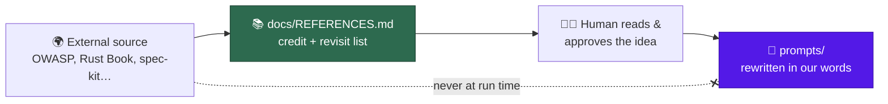

# Add a references doc crediting external sources of embedded ideas

## Summary

Added `docs/REFERENCES.md` — a standalone, curated credit list for the external
sources whose ideas are embedded in the Vibe Coder's prompts and docs — and
linked it from the README's Documentation table. Closes #517.

The list was seeded by a one-off, read-only sweep of `prompts/` and `docs/`:
every external URL and named source was collected, then reduced to 29 entries
grouped into security and threat modelling, agents and prompting, language and
platform best practices, project and release conventions. Each entry records the
source name, its canonical `https://` URL, one line on what we took, and the
repo path where the idea shows up. Known seeds from the issue — OWASP Top 10,
Rust best practices, GitHub spec-kit (#510) and the
[Caveman](https://github.com/JuliusBrussee/caveman) verbosity idea — are all
credited.

The document states the three boundaries the issue asked for: attribution never
goes in a prompt template, nothing is fetched at run time (that would be a
supply-chain vector), and a human approves each idea before it reaches a prompt.
**No prompt template was changed by this PR.**

To stop the credit list rotting, `worker/deno/lib/references_doc.ts` parses the
credit tables into data and fails loud on a malformed row, so the tests can hold
every entry to a real source and a path that still exists.

## Evidence

Documentation and CLI-side change — there is no web interface to screenshot, so
the evidence is the test suite plus the quality gate.

`worker/deno/tests/references_doc_test.ts` — 16 tests, all passing. The parser
was written after the tests; the first run failed on the missing module.

Full gate: `./quality.sh` passes. It caught one thing worth noting for
reviewers — a new published page needs an entry in `_data/page_titles.yml`, so
`docs/REFERENCES.md` was added there (title and 📚 icon) alongside its README
row.

## Test Plan

Added `worker/deno/tests/references_doc_test.ts`:

- **Happy path** — a credit row yields name, URL, note and paths; multiple
  paths in one cell; rows collected across several credit tables.
- **Error paths** (fail loud, never silently drop a credit) — unlinked source,
  `http://` URL, empty note, no backticked path, and a document with no credit
  table each throw with the offending row in the message.
- **Edge cases** — empty document rejected; unicode and em dashes in a source
  name survive parsing; a table with a different header is ignored.
- **The real document** — the four seed sources from the issue are credited,
  every path in the "where it shows up" column exists on disk, and each source
  URL appears exactly once.
- **Invariants** — `docs/REFERENCES.md` is linked from `README.md`, and no
  file under `prompts/` references the credit list (prompt purity).
