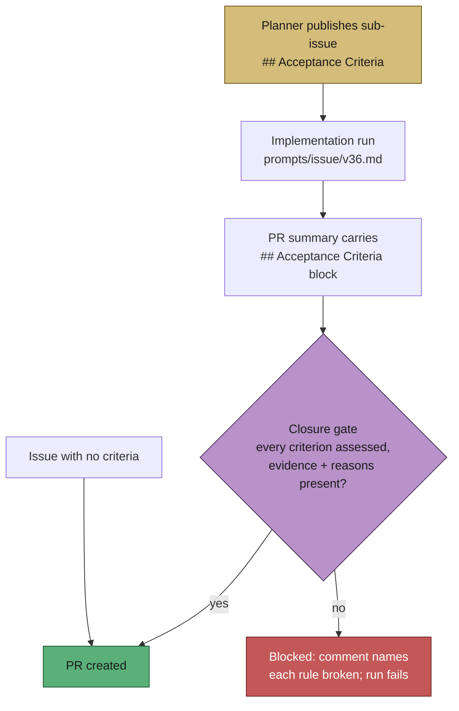

# Acceptance criteria published by the planner are now read back before the PR

## Summary

The planner writes a `## Acceptance Criteria` checklist into every published
sub-issue and nothing downstream ever read it again — the implementing run never
saw the criteria as a target, and the PR summary never said which were met. This
closes the loop with the *assessment* half of spec-kit's `/speckit.converge`,
native to the existing implementation run rather than a new loop. Closes #518.

- `prompts/issue/v36.md` (new version; v35 untouched) requires the run to walk
  each stated criterion **before** writing the PR summary and record it in a
  `## Acceptance Criteria` block as `met` / `partial` / `missing`, each naming
  the file or test that evidences it, with a one-line reason for every gap and an
  `unrequested` entry for any change in the diff not traceable to the issue —
  the output surface the prose "Change Scope" rule never had.
- `worker/deno/lib/acceptance_criteria_gate.ts` parses both artefacts and
  `phases/completion_phase.ts` blocks PR creation when a criteria-bearing issue
  produces a summary with no closure block, fewer assessments than criteria, a
  `met`/`partial` entry with no evidence, or a gap with no reason. The gate
  comments on the issue naming every rule broken and the required shape.
- Issues with **no** acceptance criteria are unaffected: the gate does not apply.

## Evidence

Backend/CLI change — no web interface to screenshot. The evidence is the test
suite driving the real functions and the live completion phase.



```text
deno test tests/acceptance_criteria_gate_test.ts \
          tests/completion_phase_acceptance_closure_test.ts
ok | 18 passed | 0 failed
```

## Acceptance Criteria

- **met** — a new `prompts/issue/vN.md` requires the closure block when the issue
  body has criteria — evidence: `prompts/issue/v36.md` §"Acceptance-Criteria
  Closure — Answer the Criteria Before the PR"
- **met** — a test drives the parser/verifier against a summary that omits the
  block and one that includes it, with real function calls — evidence:
  `worker/deno/tests/acceptance_criteria_gate_test.ts` and
  `worker/deno/tests/completion_phase_acceptance_closure_test.ts::completion - a
  criteria-bearing issue whose summary omits the block is blocked`
- **met** — `docs/PROMPTS.md` and the workflow manual describe the new block —
  evidence: `docs/PROMPTS.md` (issue prompt row) and
  `docs/workflows/issue-processing.md` §"Acceptance-criteria closure before the
  PR"
- **met** — prompt immutability respected — evidence: `prompts/issue/v36.md` is a
  new file and `prompts/issue/v35.md` is unmodified in this diff; the
  `prompt immutability` stage of `./quality.sh` passes
- **unrequested** — `docs/SPEC-KIT-COMPARISON.md` updated (converge row, v35 →
  v36 references) — reason: the new prompt version makes the existing references
  stale, which the docs prompt-version freshness check fails on

## Test Plan

- Added `worker/deno/tests/acceptance_criteria_gate_test.ts` — 15 tests over the
  real parser/verifier: criteria extraction, the summary that omits the block
  (fails), the complete block (passes), partial coverage, unexplained gaps,
  missing evidence, `unrequested` entries, nested evidence lines, and issues with
  no criteria (gate does not apply).
- Added `worker/deno/tests/completion_phase_acceptance_closure_test.ts` — 3
  integration tests driving the live `workOnIssueCompletion`, asserting on the
  observable outcome (whether `gh pr create` ran): blocked without the block,
  PR created with it, and unaffected when the issue states no criteria.
- `./quality.sh` run in full.
