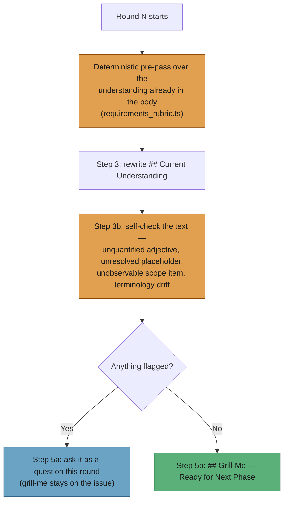

# PR Summary — Issue #519

## Summary

Grill-me converged whenever the model judged there was nothing meaningful left
to ask, and the only quality guidance on the resulting `## Current
Understanding` block was a single line of prose in the template. That is a
quality escape: the same defect slips through on one run and is caught on the
next. This change adopts spec-kit's framing — a checklist is "unit tests for
English", validating the *requirements text* and explicitly not the
implementation — and names the failure classes so the judgement is repeatable.
Closes #519.

What landed:

- **`worker/deno/lib/requirements_rubric.ts`** — a deterministic rubric over the
  understanding block with five named classes: `unquantified-adjective`,
  `unresolved-placeholder`, `unobservable-scope-item`, `terminology-drift`, and
  `missing-understanding` (an absent block is never a silent pass).
  `decideGrillMeReadiness()` is the readiness decision — any finding means the
  round is not ready. Bounded by construction: fixed word lists, a handful of
  regexes over one section, capped at eight findings.
- **`prompts/grill-me/v13.md`** — Step 3b applies the four named classes to the
  understanding the round just wrote, before Step 4 decides. Every flagged item
  becomes a question in *that* round, and Step 5b may not post the Ready comment
  while one is outstanding. A worked example shows a Ready being withheld.
- **`buildGrillMePrompt`** — injects the deterministic pre-pass over the
  understanding already in the body as `{{RUBRIC_FINDINGS}}`, in the same shape
  as the `duplicated_knowledge` duplicate-block pre-pass. Every excerpt drawn
  from untrusted issue text is character-filtered, truncated to 60 characters
  and run through `sanitiseDelimiterPatterns()` before it leaves the module, so
  the block is safe outside the fenced untrusted region.
- **Docs** — a rubric section and a lifecycle node in
  `docs/workflows/grill-me.md`; `docs/SPEC-KIT-COMPARISON.md` gap #2 marked
  adopted (which also cleared its now-stale `prompts/grill-me/v12.md`
  reference).

v12 is untouched — prompt versions are immutable.

## Evidence

Backend/CLI change with no web interface to screenshot. Evidence is the test
suite and the full quality gate.

`./quality.sh < /dev/null` — **PASSED** (19 checks; `config integration`,
`pages-liquid` and `mermaid built output` skipped as usual in this container):

```
  prompt immutability            PASSED
  mermaid                        PASSED
  markdownlint                   PASSED
  docs prompt versions           PASSED
  deno tests                     PASSED
  deno lint                      PASSED
  deno type check                PASSED
  deno fmt                       PASSED

Result: PASSED (with skipped checks)
```

`deno test tests/requirements_rubric_test.ts` — **20 passed | 0 failed**.

Where the check sits in a round:



### Security self-check

- **Input validation** — the rubric only reads text; every excerpt it emits is
  restricted to an allowlisted character class, truncated, and sanitised.
- **Injection surface** — findings are rendered into the prompt *outside* the
  untrusted fence, so `sanitiseDelimiterPatterns()` is applied and a
  `<<<ISSUE_BODY_END_…>>>`-shaped fragment in an issue body cannot survive into
  the block. There is a regression test for exactly that.
- No new dependencies, no shell or filesystem access, no secrets touched.

## Test Plan

New — `worker/deno/tests/requirements_rubric_test.ts` (20 tests):

- **Readiness decision (the issue's failure detection)** — an understanding
  carrying an unquantified adjective *and* an unresolved placeholder yields
  `ready: false` with both classes reported; a clean understanding yields
  `ready: true` with no findings; a body with no understanding block is not
  ready.
- **Per class** — vague qualifier flagged; a measurable criterion in the same
  sentence clears it; `<placeholder>` and `???` flagged; an autolink is not
  mistaken for a placeholder; a scope bullet with no observable outcome flagged
  while one naming a result is not; a title term absent from the understanding
  is drift while a plural of a present term is not.
- **Bounds and safety** — findings capped at `MAX_FINDINGS`; delimiter-shaped
  text from the issue is neutralised in the rendered findings.
- **Prompt integration** — v13 carries the four class names and the no-Ready
  rule; `buildGrillMePrompt` substitutes `{{RUBRIC_FINDINGS}}` with the flagged
  classes and renders the explicit nothing-flagged line when clean.

Existing suites re-run unchanged: `grill_me_processor_test.ts`,
`grill_me_processor_escalation_test.ts`, `prompt_substitution_pattern_test.ts`,
`fable5_remaining_prompts_test.ts`, `unfenced_untrusted_text_test.ts`,
`prompt_manager_test.ts` — 191 passed. No existing test was modified or
removed.
