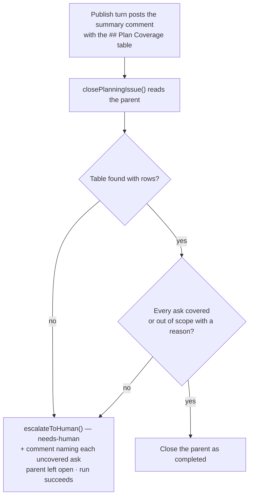

# Plan-to-sub-issue coverage is published and gated

## Summary

The critique turn was already asked to hunt for "asks in the issue with no
sub-issue covering them", but the critique is deliberately never published — so
the coverage judgement left no artefact and nothing failed when an ask was
dropped. A silently uncovered requirement looked exactly like a complete plan.

Coverage now takes the same shape `## Failure Detection` took: a **published
artefact** plus a **deterministic gate** at the single `closePlanningIssue()`
chokepoint.

- The publish turn (`prompts/planning_critique/v6.md`) posts a `## Plan Coverage`
  table in its summary comment on the parent — one row per ask, the covering
  sub-issue(s), and a note. A deliberately dropped ask stays as a row marked
  `Out of scope` with its reason.
- Each sub-issue's `## Context` carries a matching `Covers ask:` line
  (`prompts/planning/v22.md`), so a reviewer can follow sub-issue → ask → parent.
- `worker/deno/lib/plan_coverage_gate.ts` re-reads the parent at
  `closePlanningIssue()` and rejects a table that is missing, empty, or carries
  an ask with no covering sub-issue and no out-of-scope reason.
- A failing gate routes through the **existing** `escalateToHuman()` chokepoint
  (`needs-human` + one explanation comment) and leaves the parent open — no new
  label, no second escalation path. It deliberately does not borrow
  `needs-failure-detection-repair`: that label's resume pass re-gates Failure
  Detection only, so it would find nothing to repair, clear the label, and bury
  the coverage defect.
- Publishing `prompts/planning/v22.md` and `prompts/planning_critique/v6.md`
  made four `prompts/planning/v21.md:NN` / `prompts/planning_critique/v5.md:15`
  citations in `docs/SPEC-KIT-COMPARISON.md` stale, which the docs
  prompt-version freshness gate (`worker/deno/lib/docs_prompt_version_check.ts`)
  fails on. Those citations are now version-free directory references; the one
  that must cite the historical state keeps its `<!-- pinned: -->` marker.

Closes #520.

## Evidence

Backend/CLI change with no web interface to screenshot — the evidence is the
test suite. `deno test worker/deno/tests/plan_coverage_gate_test.ts` (29 tests)
covers the accept and reject shapes directly; the two new end-to-end tests in
`planning_processor_test.ts` drive the real `processIssuePlanning()` and assert
the wired behaviour (parent left open + `needs-human` on an uncovered ask;
parent closed with no label when every ask is accounted for).

```text
worker/deno/tests/plan_coverage_gate_test.ts .......... ok | 29 passed
worker/deno/tests/planning_coverage_prompts_test.ts ... ok |  4 passed
worker/deno/tests/planning_processor_test.ts ......... ok | 110 passed
```

Flow of the new gate:



Full `./quality.sh`: all checks pass except four pre-existing failures in
`tests/gh_spawn_test.ts` and `tests/service_account_env_test.ts` that reproduce
identically on a stashed (clean) tree — they exercise a real `gh` spawn and a
`chmod`ed config directory, neither of which this change touches.

## Acceptance Criteria

- **met** — A published plan carries a coverage table on the parent issue —
  evidence: `prompts/planning_critique/v6.md` ("Publish the coverage table" plus
  the `## Plan Coverage` block in the summary-comment skeleton), the shared
  `COVERAGE_TABLE_REQUIREMENT` interpolated into both in-code fallback publish
  prompts, and
  `worker/deno/tests/planning_coverage_prompts_test.ts::planning_critique v6 - the example table it teaches passes the real gate`
  (the prompt's own example is fed to the gate, so prompt and gate cannot drift).
- **met** — A new gate function rejects a coverage table with an uncovered,
  unexplained ask and accepts one where every ask is covered or explicitly out of
  scope — evidence:
  `worker/deno/tests/plan_coverage_gate_test.ts::validateCoverageTable - an uncovered, unexplained ask is an offender`
  and `::validateCoverageTable - an out-of-scope ask with a reason passes`,
  calling `validateCoverageTable()` / `judgePlanCoverage()` with both shapes.
- **met** — The gate is wired at `closePlanningIssue()`, not at a second
  chokepoint — evidence: the single `runPlanCoverageGate()` call site in
  `worker/deno/lib/planning_processor.ts` inside `closePlanningIssue()`
  (immediately after the Failure-Detection gate), verified behaviourally by
  `worker/deno/tests/planning_processor_test.ts::processIssuePlanning - an uncovered ask leaves the parent open and escalates (Issue #520)`
  and `::processIssuePlanning - a fully covered plan closes the parent (Issue #520)`.
- **met** — `docs/workflows/planning-and-questions.md` documents the table and
  the gate — evidence: the new "🗂️ Plan-coverage table and gate (Issue #520)"
  section (artefact, gate rules, outcome, and a Mermaid flow).
- **unrequested** — four stale prompt-version citations rewritten in
  `docs/SPEC-KIT-COMPARISON.md` (plus its "Adopted (#520)" paragraph) — reason:
  publishing v22/v6 makes the old `v21.md:NN` / `v5.md:15` pins fail the docs
  prompt-version freshness gate, so the change cannot ship without them.

## Test Plan

Added:

- `worker/deno/tests/plan_coverage_gate_test.ts` — 29 tests: table extraction
  (column-signature match, escaped pipes, unrelated tables ignored), accept
  shapes (`#N`, multiple refs, issue URL, out-of-scope with a reason), reject
  shapes (empty cell, `None`, bracketed placeholder, bare `Out of scope`, empty
  ask), missing/empty table, the `gh` read orchestration (newest comment wins,
  body fallback, unreadable parent reported not passed), the escalation reason
  wording, and `escalateUncoveredAsks()` labelling + commenting through the
  shared chokepoint.
- `worker/deno/tests/planning_coverage_prompts_test.ts` — 4 tests: v6/v22 carry
  the coverage instructions (v5/v21 read from disk as the negative control), and
  the example table the publish prompt teaches passes the real gate.
- `worker/deno/tests/planning_processor_test.ts` — three tests: the fallback
  publish prompts carry `COVERAGE_TABLE_REQUIREMENT`, plus the two end-to-end
  wiring tests above.

Modified (documented, no test removed or weakened): ten existing
`processIssuePlanning` tests that publish sub-issues and assert the **close**
path now serve a compliant `## Plan Coverage` table from the gate's
`gh issue view --json body,comments` read, via the shared `coverageReadResponse()`
/ `isCoverageRead()` helpers. That is exactly what the publish turn posts in
production; without it the new gate correctly refuses to close a parent whose
plan shows no coverage at all. Their assertions are unchanged.
