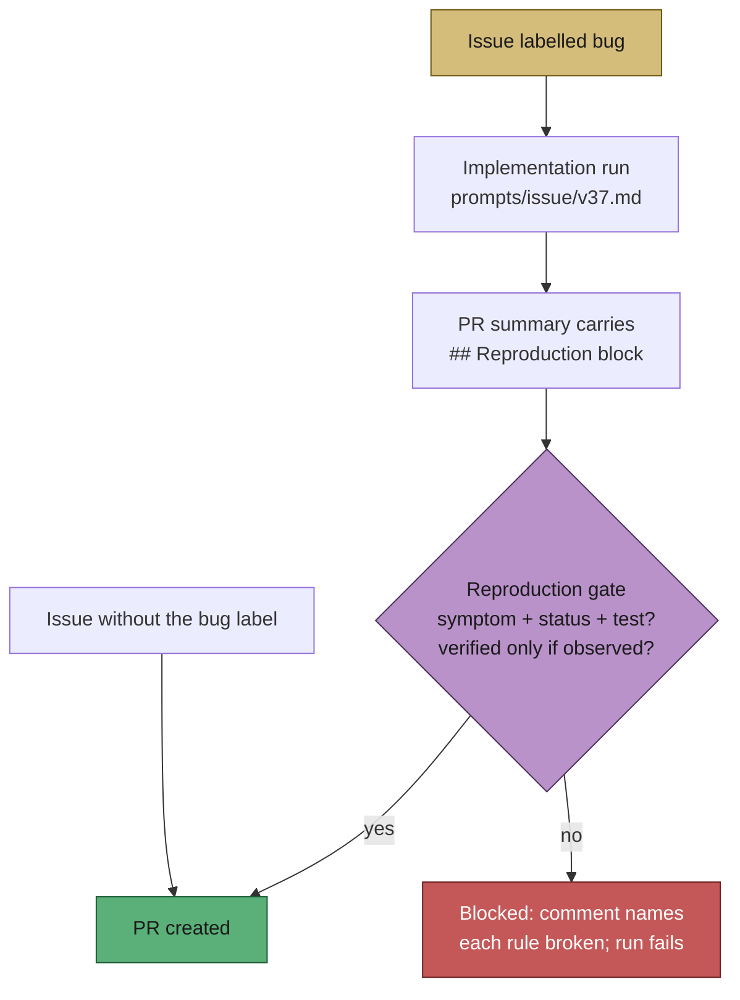

# Bug fixes now record an honest reproduction status

## Summary

`bug` is a purely descriptive label on the one shared work-tier pipeline, so a PR
summary saying "added a regression test" read identically whether the test was
watched to fail before the fix or merely written afterwards — the over-claim the
fail-loud standard exists to prevent. This adopts spec-kit's `bug`-extension
guardrail as a conditional block in the existing PR-summary contract: no new
label, no new tier, no separate lane. Closes #521.

- `prompts/issue/v37.md` (new version; v36 untouched) requires a
  `## Reproduction` block for a `bug`-labelled issue, recording the symptom, the
  status as `verified` / `partial` / `not-run`, and the covering regression test.
  `verified` may only be claimed when the test was observed failing against the
  unfixed code and passing after the fix; anything less is `partial` or `not-run`
  with a one-line reason — a not-run reproduction is a legitimate, reportable
  outcome, not a failure to hide.
- `worker/deno/lib/reproduction_status_gate.ts` parses the block and
  `phases/completion_phase.ts` blocks PR creation when a `bug`-labelled issue
  produces a summary with no block, no symptom, no recognised status, a
  `verified` claim naming no regression test or stating no fail-before/pass-after
  observation, or a downgraded status with no reason. The gate comments on the
  issue naming every rule broken and the required shape.
- Issues **without** the `bug` label are unaffected: the gate does not apply.

## Evidence

Backend/CLI change — no web interface to screenshot. The evidence is the test
suite driving the real parser/verifier and the live completion phase.



```text
deno test tests/reproduction_status_gate_test.ts \
          tests/completion_phase_reproduction_status_test.ts
ok | 20 passed | 0 failed
```

`./quality.sh` was run in full. Every check passes except `deno tests`, which
fails only on six pre-existing, environment-bound cases — confirmed by running
them on a stashed (clean) tree: `tests/gh_spawn_test.ts` (3 cases),
`tests/service_account_env_test.ts` (1 case, the container runs as a user for
whom the "unwritable" directory is still writable), and
`tests/run_core_test.ts` / `tests/run_core_rate_limit_resume_test.ts`, which
abort on a live GitHub `API rate limit already exceeded`. None touch this change.

## Acceptance Criteria

- **met** — a new `prompts/issue/vN.md` requires the `## Reproduction` block for
  `bug`-labelled issues, with the three-value vocabulary and the `verified`
  precondition stated — evidence: `prompts/issue/v37.md` §"Reproduction Status —
  Say How Far You Actually Reproduced the Bug"
- **met** — tests call the PR-summary validator with a bug-labelled summary
  missing the block (rejected), one claiming `not-run` with a reason (accepted),
  and one with the block complete (accepted) — evidence:
  `worker/deno/tests/reproduction_status_gate_test.ts::gate - a bug-labelled
  summary with no block is rejected`, `::gate - an honest not-run with a reason
  is accepted`, `::gate - a complete verified block is accepted`
- **met** — non-`bug` issues are unaffected, covered by a test — evidence:
  `worker/deno/tests/reproduction_status_gate_test.ts::gate - does not apply to
  an issue without the bug label` and
  `worker/deno/tests/completion_phase_reproduction_status_test.ts::completion - a
  non-bug issue with no reproduction block is unaffected`
- **met** — the validator test fails if a bug-labelled PR summary without a
  `## Reproduction` block is accepted (the stated failure detection) — evidence:
  `worker/deno/tests/completion_phase_reproduction_status_test.ts::completion - a
  bug-labelled summary with no reproduction block is blocked` asserts
  `gh pr create` never runs
- **met** — `docs/workflows/issue-processing.md` documents the block — evidence:
  `docs/workflows/issue-processing.md` §"🐛 Reproduction status on a bug fix"
- **unrequested** — `docs/PROMPTS.md` and `docs/SPEC-KIT-COMPARISON.md` updated
  (the `bug`-extension row and section 4 marked adopted, v36 → v37 references) —
  reason: the new prompt version makes the existing references stale, which the
  `docs prompt versions` quality check fails on, and PROMPTS.md is the index of
  what each prompt requires
- **unrequested** — `worker/deno/tests/issue_worker_test.ts::completion - updates
  existing PR labels on recovery (Issue #1189)` now writes a PR summary carrying
  the block — reason: its fixture issue is `bug`-labelled, so the new gate
  applies to it; the test's own assertions are unchanged and no test was removed
  or disabled

## Test Plan

- Added `worker/deno/tests/reproduction_status_gate_test.ts` — 16 tests over the
  real parser/verifier: label detection, field parsing (list form and prose
  form), the absent block, the honest `not-run`, the complete `verified` block,
  and each rejection — no block, no symptom, an unrecognised status, `not-run`
  without a reason, `verified` without a named test, and `verified` without the
  fail-before/pass-after observation.
- Added `worker/deno/tests/completion_phase_reproduction_status_test.ts` — 4
  integration tests driving the live `workOnIssueCompletion`, asserting on the
  observable outcome (whether `gh pr create` ran): blocked without the block, PR
  raised for `not-run` and for `verified`, and unaffected for a non-`bug` issue.
- Modified `worker/deno/tests/issue_worker_test.ts` (one test, as recorded above).
- `./quality.sh` run in full.
