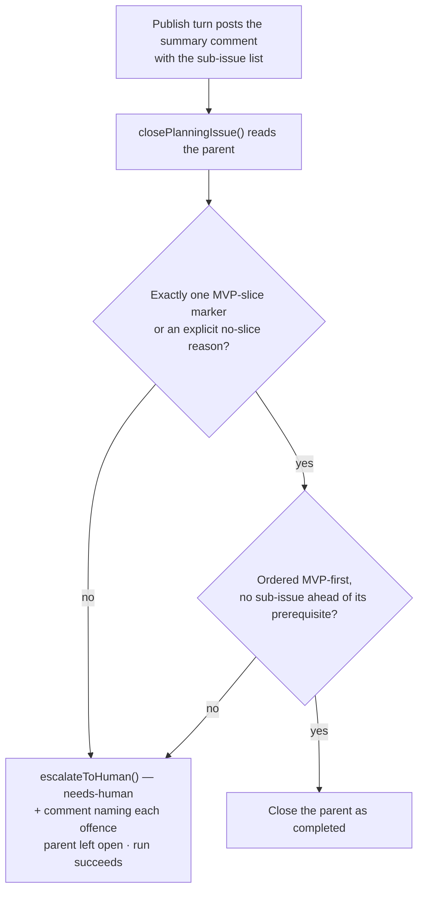

# PR Summary — Issue #522

## Summary

Planning ordered sub-issues by **dependency** only — technical order, which
never says whether landing just the first sub-issue leaves the repo better off.
A milestone that stops part-way therefore delivered whatever the dependency
graph happened to unblock, possibly nothing usable.

The publish turn now names the **MVP slice** on the summary comment it already
posts (no new comment type), and a deterministic gate enforces it at the same
`closePlanningIssue()` chokepoint as the plan-coverage and Failure-Detection
gates:

- `prompts/planning/v23.md` (draft) and `prompts/planning_critique/v7.md`
  (publish) require **exactly one** sub-issue marked `**MVP slice**` with a
  sentence saying what value lands if nothing after it is ever built — or, where
  nothing is deliverable alone (a pure refactor, a mechanical migration), the
  explicit line `No independently valuable slice — <reason>`.
- The list is ordered **MVP-first inside the dependency graph**: value ordering
  never places a sub-issue ahead of one it `Depends on #N`.
- `worker/deno/lib/mvp_slice_gate.ts` re-reads the parent, judges the published
  plan, and routes a failure through the existing `escalateToHuman()`
  chokepoint (`needs-human` + one explanation comment, parent left open, run
  still completes with `mvpSliceOffences`). No new label, no new escalation
  path.

Closes #522.

## Evidence

Backend/CLI change — no web interface to screenshot. Evidence is the test suite:
`deno test worker/deno/tests/mvp_slice_gate_test.ts` (32 tests),
`worker/deno/tests/planning_mvp_prompts_test.ts` (4 tests) and the three new
end-to-end cases in `worker/deno/tests/planning_processor_test.ts`.

The shape the publish prompt teaches, fed to the real gate by
`planning_mvp_prompts_test.ts::planning_critique v7 - the example summary it
teaches passes the real gate`:

```markdown
Sub-issues created, MVP slice first (dependencies still lead their dependants):

1. #101 — Add the query result cache (`enhancement`) — **MVP slice**: repeated dashboard queries are served from memory, even if nothing after this ever lands
2. #102 — Rewrite the query planner (`enhancement`, depends on #101)
```

**Quality gate.** `./quality.sh` passes every check except `deno tests`, which
reports four failures that are **pre-existing and environmental**, not caused by
this change: `tests/gh_spawn_test.ts` (three `spawnGh` cases whose real `gh`
calls hit `API rate limit already exceeded`) and
`tests/service_account_env_test.ts::applyServiceAccountEnv - an unwritable gh
config dir is restaged writable` (the container's `GH_CONFIG_DIR` overrides the
temp path the test expects). Verified by running both suites in a git worktree
at the parent commit — same four failures, `FAILED | 31 passed | 4 failed`.
Every planning suite this change touches passes:
`tests/planning_processor_test.ts` (114 passed),
`tests/mvp_slice_gate_test.ts` (32 passed),
`tests/planning_mvp_prompts_test.ts` (4 passed).



## Acceptance Criteria

- **met** — New planner prompt version requires the MVP marker or an explicit
  `No independently valuable slice — <reason>` statement — evidence:
  `prompts/planning/v23.md` ("Name the MVP slice"),
  `prompts/planning_critique/v7.md` ("Name the MVP slice in the summary"), and
  `worker/deno/tests/planning_mvp_prompts_test.ts::planning v23 - the draft turn names the MVP slice or says none exists`
  (v22/v6 read from disk as the negative control).
- **met** — Tests assert the published plan carries exactly one MVP marker, or
  the explicit no-slice statement, by calling the parser with both shapes and
  with a plan carrying two markers (rejected) — evidence:
  `worker/deno/tests/mvp_slice_gate_test.ts::judgeMvpSlice - exactly one marked slice passes`,
  `::judgeMvpSlice - an explicit no-slice statement passes`,
  `::judgeMvpSlice - two markers are rejected`, and
  `::judgeMvpSlice - zero markers and no statement is rejected` (the
  failure-detection case named in the issue).
- **met** — Value ordering never reorders across a `Depends on` edge — evidence:
  `worker/deno/tests/mvp_slice_gate_test.ts::judgeMvpSlice - value ordering must not override a dependency edge`,
  `::validatePlanOrder - a dependency listed after its dependant offends`, and
  `::validatePlanOrder - a prerequisite ahead of the MVP slice is allowed`.
- **met** — `docs/workflows/planning-and-questions.md` documents the marker —
  evidence: the new "🥇 MVP slice marker and gate (Issue #522)" section
  (artefact, ordering rule, gate, outcome, Mermaid diagram).
- **unrequested** — the gate is wired into `planning_processor.ts` (run at
  `closePlanningIssue()`, escalation, parent left open, `mvpSliceOffences` on
  the result) and `MVP_SLICE_REQUIREMENT` is interpolated into both in-code
  fallback publish prompts — reason: requirement 2 ("the published plan summary
  orders sub-issues MVP-first") and the issue's failure-detection line need a
  parser that actually runs on published plans; an unwired parser would enforce
  nothing.
- **unrequested** — `docs/SPEC-KIT-COMPARISON.md` §5 updated from proposal to
  **Adopted** — reason: that document is the issue's stated background and
  records adoption for every sibling item (#518–#521); leaving it stale would
  contradict the shipped behaviour.

## Test Plan

- **Added** `worker/deno/tests/mvp_slice_gate_test.ts` — 32 tests: list parsing
  (numbers, markers, `Depends on` extraction, issue URLs), both accepted shapes,
  every rejected shape (zero markers, two markers, marker with no value
  sentence, `TBD`/bracketed placeholder, bare no-slice line, contradictory
  marker + no-slice line, missing list), the ordering rules, the
  fetch-and-judge orchestration (newest comment wins, body fallback, unreadable
  parent), the reason wording and the `escalateToHuman()` chokepoint.
- **Added** `worker/deno/tests/planning_mvp_prompts_test.ts` — 4 tests: the new
  instructions are present in the built prompts and absent from the immutable
  v22/v6 predecessors, plus the anti-drift test that feeds the publish prompt's
  own example summary to the real gate.
- **Added** to `worker/deno/tests/planning_processor_test.ts` — 4 tests: both
  fallback publish prompts carry `MVP_SLICE_REQUIREMENT`; a plan naming no slice
  leaves the parent open and escalates; a plan naming one slice closes the
  parent; an explicit no-slice statement closes the parent.
- **Modified (documented)** — the shared fixtures `coverageReadResponse()` and
  `coverageReadWith()` in `worker/deno/tests/planning_processor_test.ts` now
  include a compliant sub-issue list with an MVP marker. No test was removed or
  weakened: those tests exercise the *coverage* gate, and the published plan
  they simulate must now also satisfy the MVP-slice gate to reach the close —
  the fixture change reflects that new business rule, and each test still
  asserts exactly what it asserted before.
