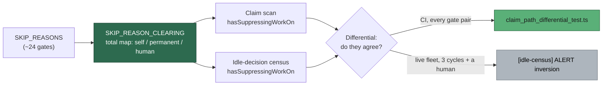

## Summary

A gate's clearing behaviour is now **data**, and the claim path's tests moved up
an altitude — from "gate X refuses issue Y" to "given a repo in this state, does
the loop claim anything?". Closes #524.

`collect_work_on_candidates.ts` decided whether a refused `work-on` issue could
still park a repo's lower tiers by subtracting the two gates somebody
remembered:

```ts
(filtered.length - dependencyBlockedCount - mergedPrPermanentCount) > 0
```

A 25th gate with permanent semantics reintroduces #499 exactly, and nothing
forces anyone to notice.

**What changed**

- **`worker/deno/lib/skip_reason_clearing.ts` (new)** — `SKIP_REASON_CLEARING`,
  a map **total** over `SkipReason`, declaring how each gate's refusal is
  lifted: `self` (a cooldown expires, a PR lands, a stream frees), `permanent`
  (only a trusted re-approval or an operator config change), or `human`
  (somebody must act, or work the suppression itself would freeze must land).
  Adding a skip reason without classifying it is a compile error.
- **`collect_work_on_candidates.ts`** — counts the surviving issues whose gate
  is declared `self`-clearing, accumulated at each decision point. No per-gate
  subtraction remains; `merged-pr-permanent` and `dependency-blocked` are data,
  not special cases.
- **`idle_decision_census.ts`** — the census mirrors the scan through the *same*
  declaration (`censusVisibleRefusal` → `suppressesLowerTiers`) instead of
  restating which gates carve out, so the two instruments cannot disagree about
  a gate.
- **`work_on_content_integrity.ts`** — a new
  `verifyWorkOnContentIntegrityDetailed` returns *which* gate refused, not just
  "blocked". `verifyWorkOnContentIntegrity` is unchanged for its other callers.
  This also closes an Issue #460 gap: a content-blocked issue was missing from
  `blockedDetails` entirely.

**Behaviour change worth a reviewer's eye.** Deriving the rule moves two gates
off the suppressing side: `label-author-not-allowed` and
`content-modified-after-approval`. Both need a person before the issue can ever
be claimed, so parking the repo's backlog behind them was the #499 deadlock in
another costume. Every `self`-clearing gate (open PR, occupied stream,
closed-**unmerged** cooldown) still suppresses, so the
one-PR-per-work-stream guarantee is untouched — pinned by the covering tests
listed below.

## Evidence

Backend/CLI only — no web interface to screenshot. Evidence is the test suite.



The tests have teeth — each was run against a deliberately broken map before
being kept:

| Defect reintroduced | Fails |
|---|---|
| `merged-pr-permanent` declared `self` (i.e. #499) | `claim_path_differential_test.ts` (#499 shape) and `collect_work_on_candidates_suppression_test.ts` |
| `label-author-not-allowed` declared `self` | `claim_path_monotonicity_test.ts` (untrusted label starves the backlog) |

```text
deno task test <37 dependent suites> tests/claim_path_*_test.ts
ok | 349 passed | 0 failed (8s)
```

## Test Plan

Added:

- `tests/skip_reason_clearing_test.ts` — the map is total with no stray keys;
  suppression is derived from the declaration for every reason rather than
  restated; the #499 gates can never raise the signal; a bounded wait still
  does; both gate maps cover exactly the same gates.
- `tests/claim_path_monotonicity_test.ts` — the two-state invariant: adding an
  issue never leaves the scan with nothing to claim, and a gate parks the lower
  tiers **iff** it is declared `self`-clearing. Includes the covering test that
  an eligible `work-on` issue *does* still park tier 3, and the converse
  direction (blocking an issue never grows its own tier).
- `tests/claim_path_differential_test.ts` — census vs scan over generated repo
  states: every **pair** of `modelled` gates in three tier arrangements, plus
  each gate alone. Every incident to date (#319, #375, #429, #437, #499) was a
  pair or a single.
- `tests/claim_path_incident_test.ts` +
  `tests/fixtures/claim_path_incidents/` — recorded field states replayed in CI.
  Two committed: `NEAT-AI-Rebase 2026-08-28` (#499, the scan was wrong) and
  `NEAT-AI 2026-08-23` (#3852, the census was wrong). The directory README
  documents how to record the next one.
- `tests/fixtures/claim_path_state.ts` — one repo state described once and
  rendered both ways: the `gh` surface `findOldestIssue` reads, and the
  already-fetched input `buildIdleDecisionCensus` reads.

Unmodified and still passing: `collect_work_on_candidates_suppression_test.ts`,
`idle_decision_census_test.ts`, and the 37 suites touching the collectors, the
census, `find_oldest_issue` and content integrity.

Docs updated in the same change: `docs/workflows/issue-processing.md`
(suppression table now carries the declared clearing behaviour),
`docs/IDLE-TASK-FRAMEWORK.md` (the second total map, and the differential now
running in CI rather than only on the fleet), `docs/INTERNALS.md` (module
table).
