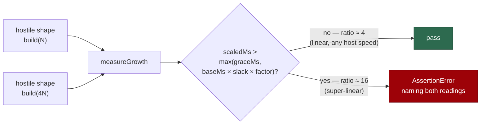

# PR Summary — Issue #530

## Summary

`secret_redaction_bounds_test.ts` asserted an absolute 2000 ms wall clock
inside a unit test, so a fleet host 8% slower than the one the constant was
chosen on reported a still-linear redaction rule as a correctness failure.

The bound is now asserted on the **shape** of the growth instead of the clock.
A new shared helper, `worker/deno/tests/support/growth.ts`, redacts the same
hostile shape at N and 4N characters and fails only when the cost grew faster
than the input did:

- linear work costs ~4× — allowed (the helper permits `slack × sizeFactor`,
  i.e. 8×);
- quadratic work costs ~16× — fails loudly, on a fast host and a slow one
  alike;
- a uniformly slower host inflates **both** readings, so the ratio is
  unchanged and the check stays green.

`graceMs` (default 50 ms) is a floor, not a ceiling: it suppresses the ratio
only when the scaled run is small enough to be scheduler noise. It cannot mask
a real blow-up, because a super-linear rule at these sizes costs seconds.

The constant was not raised, and no assertion was deleted — all 11 tests in the
file remain, with the small fixed-size cases (the `sk-` run, the 39-character
Google key) now asserting masking only, since timing a 4 KiB input measured
nothing.

Closes #530.



## Evidence

Backend/test-harness change with no web interface, so there is nothing to
screenshot; the evidence is command output.

**1 — the reported failure, reproduced.** The unmodified test from `HEAD` was
restored to a scratch file and run under CPU load (40 busy loops on a 21-core
host) to emulate a slower host. It failed with the reported message:

```text
redactSecrets - a 500 kB ragged long-line blob stays bounded (Issue #196) ...
error: AssertionError: 500 kB ragged PEM-body near-miss took 2658 ms
       (limit 2000 ms) — the rule is still super-linear
FAILED | 10 passed | 1 failed (6s)
```

**2 — the reworked test under the same load.** Same host, same load still
running, redaction rules untouched:

```text
running 11 tests from ./tests/secret_redaction_bounds_test.ts
redactSecrets - a ragged long-line blob stays bounded (Issue #196) ... ok (1s)
ok | 11 passed | 0 failed (4s)
```

**3 — a real super-linear rule is still caught.** The pre-fix Issue #3942
`url-userinfo` pattern (`[a-z][a-z0-9+.-]*` unanchored and greedy) run through
the new helper:

```text
DETECTED: pre-fix url-userinfo: 16384 chars took 170 ms but 65536 chars (4.0x)
took 2708 ms, over the 1357 ms a linear rule allows — the rule is super-linear
```

**4 — unloaded run is faster than before** (1.6 s versus 3.1 s wall for the
file), because the growth check works at 16 KiB/64 KiB rather than 500 kB — the
exponent is size-independent, so smaller inputs detect the same blow-up.

### Quality gate

`./quality.sh` passes every check except `deno tests`, which fails on three
pre-existing, environment-caused failures unrelated to this change:

- `tests/gh_spawn_test.ts` (3 tests) — the run's `gh` wrapper on `PATH` is
  broken in this container: `gh --version` exits 1 with
  `error: Module not found "file:///tmp/vibe-scratch/worker-src/worker/deno/lib/gh_guard_cli.ts"`,
  and those tests invoke the real `gh`.
- `tests/run_core_test.ts`, `tests/run_core_rate_limit_resume_test.ts`
  (uncaught errors) and `tests/service_account_env_test.ts` — reproduce
  identically when run alone, with none of the files this PR touches loaded.

`deno lint`, `deno check`, `deno fmt`, markdownlint, mermaid and every
chokepoint check pass.

## Reproduction

- **symptom** — `deno task test` failed with
  `AssertionError: 500 kB ragged PEM-body near-miss took 2155 ms (limit 2000 ms)`
  on hosts slower than the one the constant was chosen on, reporting a
  performance signal as a correctness failure
- **status** — `verified` — the unmodified test was observed failing (2658 ms
  over the 2000 ms limit, under emulated host slowness) and the reworked test
  passes under exactly the same load with the redaction rules untouched
- **regression test** —
  `worker/deno/tests/growth_bound_test.ts::exceedsGrowthBound - a uniformly slower host is not a regression`
  (a host 1×, 10× and 100× slower must not fail a linear rule) paired with
  `worker/deno/tests/growth_bound_test.ts::assertLinearGrowth - catches genuinely quadratic work on a real clock`
  (the detector still fires on real super-linear work)

## Test Plan

- **Added** `worker/deno/tests/support/growth.ts` — `growthAllowanceMs`,
  `exceedsGrowthBound`, `measureGrowth`, `assertLinearGrowth`, with an
  injectable clock so callers' tests stay deterministic.
- **Added** `worker/deno/tests/growth_bound_test.ts` — 14 tests covering the
  happy path (linear growth passes), the error paths (`RangeError` on negative
  milliseconds, `sizeFactor <= 1`, `slack < 1`, negative grace, zero
  `baseChars`, zero repeats, an empty built input), and the edges (exclusive
  allowance boundary, grace floor on a fast host, fastest-of-repeats discarding
  a descheduled run, actual built lengths driving the factor, a slower host at
  1×/10×/100×, quadratic growth failing, and a real quadratic function tripping
  the detector on a real clock).
- **Modified** `worker/deno/tests/secret_redaction_bounds_test.ts` — the six
  hostile shapes (alphanumeric run, hyphen run, injected blob with a trailing
  credential, near-miss `sk-` and `AIzaSy` prefixes, uniform and ragged PEM-body
  near-misses) now assert linear growth plus the same output correctness as
  before. The two fixed-size cases keep their masking assertions and drop the
  meaningless timing. No test was removed or disabled.
- **Modified** `CODING-STANDARDS.md` — the Unit Tests vs Benchmarks section now
  points at the helper for the narrow case where a test must measure.
- Commands run: `deno test tests/secret_redaction_bounds_test.ts`,
  `deno test tests/growth_bound_test.ts`, the full `deno test` suite, and
  `./quality.sh < /dev/null`.
