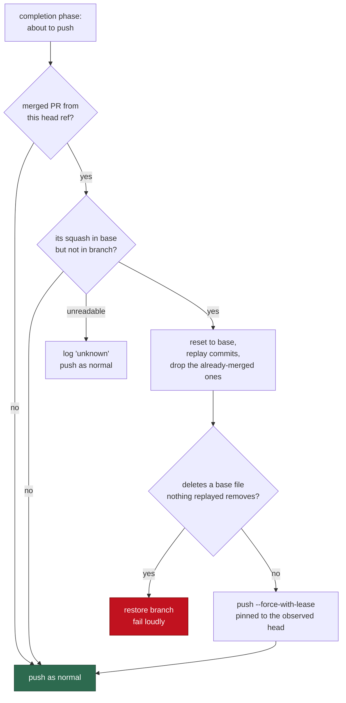

# Rebase a squash-merged stale branch instead of pushing an unmergeable PR

## Summary

Two runs held one issue branch. Writer A rebased and force-pushed; writer B
never saw it, kept committing on the pre-rebase lineage, and 2 seconds after the
merge reaped the branch it **re-created that branch** and opened a duplicate PR.
The squash means the branch's old commits are not ancestors of the base, so
identical content collides (`CONFLICT (add/add)`) and no `git merge` can ever
resolve it — the PR sat `CONFLICTING`, could not run CI, and was two attempts
from `needs-human`.

`worker/deno/lib/stale_branch_lineage.ts` is a new guard the completion phase
runs **before it pushes**. It detects the shape from one `gh` read and two
ancestry tests, then heals it by resetting the branch to the current base and
replaying only the commits the base does not already carry. Closes #534.

Detection — a branch is stale exactly when:

1. a **merged** PR was raised from this head ref, and
2. its merge commit is contained in the base branch, but
3. the branch tip does **not** contain that merge commit.

A branch that *was* rebased onto the post-merge base contains the merge commit,
so legitimate follow-up work on a reused branch name is never flagged.
`ensureHistoryDepth()` runs first, because ancestry on a `--depth=1` clone is
unanswerable and an unanswerable test would read as "not stale".

A cheap local pre-filter runs before any `gh` call: a branch that already
contains the base tip cannot be replaying a squash of itself, so the common case
costs one `merge-base` and no API quota.

Recovery replays content rather than picking a side, with three post-conditions:

- **No unexplained deletion.** If the result removes a file the base has and no
  replayed commit deletes, the heal is refused and the branch restored. On the
  original incident, "resolve in favour of the PR side" would have reverted
  Issue #517's merged work — this is the check that catches it.
- **No side-picking.** A cherry-pick conflict restores the branch and refuses,
  the same stance `pr_merge_conflict_scan.ts` takes.
- **Lease-protected republish.** The healed branch is force-pushed with
  `--force-with-lease` pinned to the remote SHA read *before* the rebase, so a
  writer whose remote head moved underneath it stops rather than destroying the
  other writer's commits — the exact loss that started this. When the merge
  reaped the branch there is nothing to force past: the now-lying
  remote-tracking ref is dropped and the push is a plain one, so a concurrent
  re-creation rejects it as non-fast-forward.

A refusal is a loud phase failure, never a silent push. Every read failure is
`unknown` — the run carries on and the reason is logged, because this guard
gates finished, quality-gated work and a `gh` hiccup must not withhold it.

### Issue acceptance, item by item

- **#533 mergeable or superseded, no `needs-human`** — PR #533 merged as
  `509bee9` on `milestone/509-make-vibe-coder-checkout-and-container-root-fi`
  before this run; no escalation was raised.
- **Issue #517's files still on the milestone** — verified at `509bee9`:
  `docs/REFERENCES.md`, `worker/deno/lib/references_doc.ts`,
  `worker/deno/tests/references_doc_test.ts` and `pr-summary-517.md` are all
  present.
- **A regression test reproducing the shape** — see the Test Plan below.
- **Stale `work-on` on closed #514 cleared** — removed in this run; #514 now
  carries only `enhancement` and `security`.

## Evidence

Backend/CLI change with no web interface, so there is no screenshot to capture.
The evidence is the regression suite, which builds the incident with **real
git** (bare origin, squash merge, branch reaped, stale second writer) and
asserts the healed outcome — including that the file another issue added to the
base survives.



Test output:

```text
running 21 tests from ./tests/stale_branch_lineage_test.ts
...
healStaleBranchLineage - rebases a squash-merged lineage instead of opening a
  conflicting PR (Issue #534) ... ok
ok | 21 passed | 0 failed

running 1 test from ./tests/completion_phase_stale_lineage_test.ts
completion - a stale lineage that cannot be rebased safely stops before the
  push (Issue #534) ... ok
ok | 1 passed | 0 failed
```

## Test Plan

Added `worker/deno/tests/stale_branch_lineage_test.ts` (21 tests):

- **The incident, end to end with real git** — a branch is squash-merged into
  `main` and reaped, a second writer commits on the pre-merge lineage, and
  `healStaleBranchLineage` must rebase it: only the genuinely unmerged commit is
  replayed, the squashed one is dropped, base becomes an ancestor of the branch
  (so a PR can fast-forward), `docs/REFERENCES.md` added to base while the
  branch was stale is **still present**, and the healed head reaches origin.
- **A surviving stale remote branch** is replaced under `--force-with-lease`.
- **A branch that already contains base** returns `not-stale` with a `gh` runner
  that throws if called — the pre-filter must spend no API quota.
- **A branch with no merged PR** is left byte-for-byte alone.
- **An unreadable `gh` lookup** yields `unknown` and touches nothing — never a
  silent "not stale".
- **`rebaseOntoBase` refuses a dirty working tree** rather than `reset --hard`
  over uncommitted work, and **restores the branch unchanged on a conflicting
  replay**.
- **`classifyBranchLineage`** names the stale merge against a real graph, and
  reports `unknown` when the merge commit is absent from the clone.
- Pure rules: `decideLineage` (5 cases, including the rebased-branch case that
  must *not* be flagged), `unexplainedDeletions`, `parseMergedPrList`
  (malformed JSON is an error, never an empty list).

Added `worker/deno/tests/completion_phase_stale_lineage_test.ts`: the completion
phase fails loudly with the Issue #534 reason and **never reaches the push** when
the branch is stale and cannot be healed safely.

Existing completion-phase suites (`head_reconcile`, `superseded_wip`,
`wip_only_gate`, `rest_pr_fallback`) still pass — the guard fails open when the
lookups it needs are unavailable.
