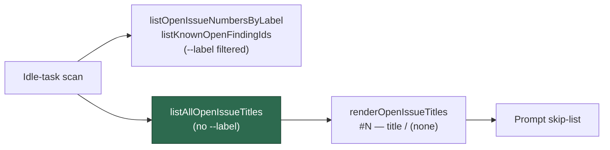

# Repo-wide open-issue title lister for cross-label dedup

## Summary

Idle-task scans dedup only against issues carrying their **own** label and
`finding-id` marker, so a finding already open under another template's label is
invisible and gets re-filed (NEAT-AI-Rebase #64 duplicated #37, which had been
open under `needs-human` alone). This adds the missing primitive to
`worker/deno/lib/idle_task_snapshot.ts` — an unfiltered view of what a repo
already has open — so a scan template can hand the model a semantic-duplicate
skip-list. Additive only: no existing helper changes behaviour and no caller is
rewired. Closes #535.

- `listAllOpenIssueTitles(repo, ghCommandFn, opts?)` runs
  `gh issue list --repo <repo> --state open --json number,title --limit <limit>`
  with **no `--label` argument** and returns `{ number, title }[]`.
  - Parsing routes through `parseGhJsonArray`, so a malformed payload logs a
    labelled failure instead of being swallowed.
  - A `ghCommandFn` throw returns `[]` — a transient lookup hiccup never aborts
    a scan.
  - Bounded at 300 by default. Reaching the bound emits a `console.error`
    naming the repo and the limit and the word `TRUNCATED`, because a silently
    truncated skip-list reads to the model exactly like "no duplicate found".
- `renderOpenIssueTitles(issues, opts?)` is a pure formatter producing one
  `#<number> — <title>` line per issue, `(none)` when empty (matching the
  `{{SUPPRESSED_IDS}}` / `{{KNOWN_OPEN_FINDING_IDS}}` convention).

Titles are untrusted GitHub text, so each is scrubbed before rendering:
`sanitiseDelimiterPatterns` (delimiter shapes, `BOUNDARY_…`, trust vocabulary,
doubled braces), `neutraliseHtmlComments` (so no forged `<!-- finding-id: … -->`
marker can form), control/line-break characters collapsed to a space so a title
cannot span more than its own line, and a 160-character cap with a visible `…`.
A title scrubbed to nothing renders `(untitled)`, never a blank line.

## Evidence

Backend/CLI change with no web interface — no screenshot applies. Verified by
unit tests calling the real helpers with a stub `ghCommandFn`.

```
deno test --allow-all tests/idle_task_snapshot_test.ts
ok | 42 passed | 0 failed (50ms)
```

Where the new helper sits relative to the existing label-filtered ones:



## Test Plan

Added to `worker/deno/tests/idle_task_snapshot_test.ts`:

- `listAllOpenIssueTitles` — returns number/title pairs; **no `--label`** in the
  captured gh args (plus `--repo`/`--state`/`--json`/`--limit` asserted);
  caller-supplied limit honoured; non-positive limit falls back to the default;
  gh throw yields `[]`; malformed JSON yields `[]` and logs via the
  `parseGhJsonArray` path; entries lacking a finite number or string title are
  skipped; hitting the limit logs a loud truncation warning naming the repo and
  the limit; staying under the limit logs nothing.
- `renderOpenIssueTitles` — `(none)` on empty; one `#N — title` line per issue;
  a newline-bearing title stays on one line; delimiter-shaped text
  (`---END UNTRUSTED`, `BOUNDARY_…`, `<<<…>>>`, `[TRUSTED]`, `{{…}}`) is
  neutralised; an HTML-comment marker cannot form; long titles are capped; a
  caller-supplied cap is honoured; a title scrubbed to nothing renders
  `(untitled)`.

`./quality.sh` passes.
