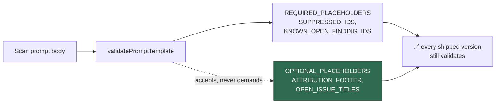

# Register `OPEN_ISSUE_TITLES` as an optional scan placeholder (Issue #536)

## Summary

Registered `OPEN_ISSUE_TITLES` — the all-open-issues dedup block — as an
**optional** placeholder in `worker/deno/lib/prompt_manager.ts` for every scan
type that files findings, so a later prompt version carrying the block
validates. `{{KNOWN_OPEN_FINDING_IDS}}` stays the deterministic first line of
dedup; the title list is what lets a scanner skip a semantic duplicate already
open under someone else's label. This sub-issue only opens the gate — no prompt
version or substitution code changes here. Closes #536.

Optional, not required: `REQUIRED_PLACEHOLDERS` is enforced against every
shipped version of a type and the immutability tests pin older versions, so
requiring the placeholder would retroactively invalidate ~14 prompt histories.
This follows the `ATTRIBUTION_FOOTER` (#2439) and `CODING_GUIDELINES` (#3813)
precedent already documented in the file.

Two registry gaps had to be closed for the acceptance criterion "validation
accepts the block for each listed type" to hold:

- `supply_chain_readiness` and `supply_chain_detection` were in
  `REQUIRED_PLACEHOLDERS` only, so `getOptionalPlaceholders` errored on them.
  They now have optional entries (`OPEN_ISSUE_TITLES` only — their prompts
  carry no attribution footer).
- `dead_code`, `deprecated_api` and `format_drift` were unregistered in **both**
  maps, so `validatePromptTemplate` refused the surface outright with "Unknown
  template type" and nothing guarded their two dedup placeholders. They are now
  registered with the placeholders every shipped version already carries
  (`SUPPRESSED_IDS`, `KNOWN_OPEN_FINDING_IDS`) — the `doc_coverage` precedent
  from #3807. Verified backwards compatible: v1 onwards of all three carry
  both, and the new "every shipped scan version still validates" test asserts
  it against the real files in `prompts/`.

## Evidence

Backend-only change to a placeholder registry — no web interface to screenshot.
Verified by tests run against the real `prompts/` tree:

```text
$ deno test --allow-all tests/prompt_manager_test.ts tests/prompt_verbosity_injection_test.ts
ok | 63 passed | 0 failed (188ms)

$ ./quality.sh < /dev/null
  prompt immutability            PASSED
  deno tests                     PASSED
  deno lint                      PASSED
  deno type check                PASSED
  deno fmt                       PASSED
Result: PASSED (with skipped checks)
```

The new tests fail against the unfixed registry — before the change all three
new registry tests errored with `type 'dead_code' is unregistered` and
`OPEN_ISSUE_TITLES missing from optional placeholders`.



## Test Plan

Added to `worker/deno/tests/prompt_manager_test.ts`, each driving the real
functions over all 14 scan types:

- `prompt manager - OPEN_ISSUE_TITLES is optional for every scan type` —
  `getOptionalPlaceholders` includes it and `getRequiredPlaceholders` does not.
- `prompt manager - accepts a scan body carrying OPEN_ISSUE_TITLES` —
  `validatePromptTemplate` accepts a body with the block.
- `prompt manager - accepts a scan body without OPEN_ISSUE_TITLES` — backwards
  compatible; a body without it still validates.
- `prompt manager - every shipped scan version still validates` — loads every
  `vN.md` under `prompts/` for each scan type and validates it, so registering
  the three previously-unregistered types cannot invalidate a prompt history.

The existing immutability tests (pinned to older versions) pass unchanged.
