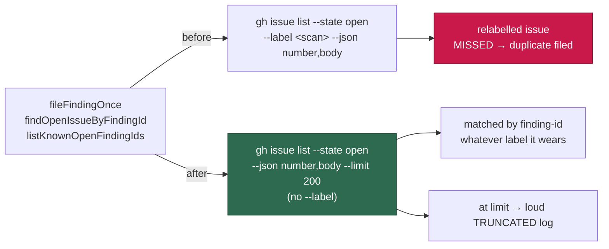

# Repo-wide deterministic finding-id dedup

## Summary

The two `finding-id` look-ups in `worker/deno/lib/idle_task_snapshot.ts` added
`--label` to their `gh issue list` call, so an already-tracked finding became
invisible the moment its issue was relabelled or triaged into `needs-human` —
the marker was still in the body, but the label-scoped query could not see it,
and the scan re-filed (NEAT-AI-Rebase #37 → #64). Both look-ups are now
**repo-wide**: the `<!-- finding-id: … -->` marker is the dedup key and the
label is not part of it. Closes #539.

- `findOpenIssueByFindingId` (the pre-file guard behind `fileFindingOnce`) and
  `listKnownOpenFindingIds` (the `{{KNOWN_OPEN_FINDING_IDS}}` skip-list) share a
  new private `listOpenIssueBodies()` helper that issues **no `--label`**
  argument.
- **The `label` parameter's fate:** kept, renamed `logLabel` in
  `findOpenIssueByFindingId`, `listKnownOpenFindingIds` and the
  `fileFindingOnce` params object, and documented as a log-line label that
  filters nothing. All five `fileFindingOnce` call sites were updated
  (`best_practices`, `github_actions_audit`, `bash_script_refs`,
  `bash_syntax_audit`, `alert_feed_enable_issue`); the positional callers of the
  other two needed no change.
- Every robustness property is preserved: one hardcoded module-level
  `FINDING_ID_RE` (no dynamic `RegExp`; `matchAll` iterates an internal clone,
  so the shared `g` flag carries no `lastIndex` state), `parseGhJsonArray`
  parsing, `null` / `[]` on a `gh` failure or malformed payload, and
  **open-issues-only** matching so a closed prior issue still re-files.
- Bodies are heavier than titles and the query is now repo-wide, so the list
  stays bounded at `--limit 200` (below the title lister's 300) and hitting the
  bound logs the same loud `TRUNCATED` warning introduced in #535 — a truncated
  dedup list reads exactly like "no duplicate found".
- The `idPrefix` filter (default `"BP-"`) is now load-bearing rather than
  incidental: the repo-wide payload also carries `SEC-…` / `SWEEP-…` ids from
  other scans, and a regression test proves they are not mistaken for this
  scan's.

## Evidence

Backend/CLI change with no web interface — no screenshot applies. Verified by
unit tests calling the real helpers with a stub `ghCommandFn` that returns `[]`
whenever `--label` is present, so a reinstated label filter fails the suite.

```
deno test --allow-all tests/idle_task_snapshot_test.ts
ok | 52 passed | 0 failed (16ms)

deno test --allow-all <every fileFindingOnce / listKnownOpenFindingIds caller>
ok | 237 passed | 0 failed (644ms)
```

`./quality.sh` → `Result: PASSED (with skipped checks)`.



## Test Plan

Added to `worker/deno/tests/idle_task_snapshot_test.ts`:

- `findOpenIssueByFindingId` — queries every open issue with **no `--label`**
  (plus `--repo`/`--state`/`--json`/`--limit` asserted); matches an open issue
  wearing another label (the regression); malformed JSON returns `null` and logs
  the parse failure; hitting the 200 limit logs a loud `TRUNCATED` warning while
  still returning the match.
- `listKnownOpenFindingIds` — no `--label` in the captured gh args; collects ids
  from issues wearing another label; ignores foreign-prefix ids (`SEC-…`,
  `SWEEP-…`) from other scans; hitting the limit logs the truncation warning;
  staying under it logs nothing.
- `fileFindingOnce` — skips filing when the open duplicate wears another label
  (`fileFn` never called). The existing closed-issue test still proves a closed
  match does not suppress a re-file.

Test fixtures updated (no test removed or weakened) because the stubs modelled
the old query shape:

- `tests/best_practices_template_test.ts` — `makeGhStub` dispatched the
  known-open look-up on `--label best-practices`; it now dispatches on
  `--json number,body`.
- `tests/alert_feed_enable_issue_test.ts` — `createGhFake` filtered every list
  by `--label`; a `--label`-less list now returns every open issue, as real
  `gh` does.
