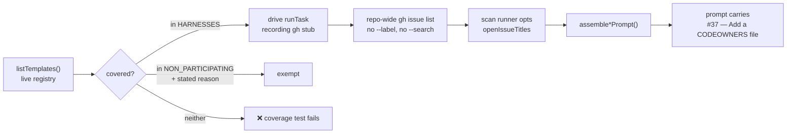

# PR Summary — Issue #540

## Summary

Added a framework-wide conformance test that walks the **live** idle-task
template registry and proves every scan template dedups against *all* open
issues, not just the ones wearing its own label. Closes #540.

Issue #537 wired `listAllOpenIssueTitles` into each scan template and #538 added
the matching `{{OPEN_ISSUE_TITLES}}` prompt block — but wiring seventeen
templates up once does nothing to stop the eighteenth being written against the
old, label-scoped pattern. This test is the standing guard:
`worker/deno/tests/idle_task_scan_dedup_conformance_test.ts`.

For each participating template it drives the real `runTask` through a recording
`ghCommandFn` and a capturing scan-runner stub, then asserts:

1. **the repo-wide lookup happened** — a `gh issue list … --state open --json
   number,title` call carrying neither `--label` nor `--search`;
2. **its result reached the prompt** — the captured titles are fed through the
   template's own exported `assemble*Prompt` (the same call its default scan
   runner makes) and the rendered `#37 — Add a CODEOWNERS file` line must appear
   with no `{{OPEN_ISSUE_TITLES}}` left unsubstituted;
3. **the negative** — with the gh stub serving the fixture *only* to a
   `--label`-scoped title query, a conformant template captures nothing. A
   template that scoped its dedup list by label captures the fixture and fails;
4. **safe degradation** — a `gh` failure yields an empty list and the scan still
   runs.

Coverage is enumerated from `listTemplates()` after the same side-effect imports
`idle_task_claim_handler.ts` performs, so a newly registered template is covered
automatically. Templates that legitimately do not participate — the four native
scanners, which invoke no LLM and assemble no prompt — sit in an explicit
`NON_PARTICIPATING` allow-list with a stated reason each. The allow-list is
itself asserted: entries must name a registered template, must carry a
non-trivial reason, and must not overlap the harness. An implicit skip is not
available, which is what let this class of bug through the first time.

`docs/IDLE-TASK-FRAMEWORK.md` gains a matching subsection telling a template
author they must either wire the new template into `HARNESSES` or exempt it with
a reason.

## Evidence

Backend/CLI change — no web interface to screenshot. The evidence is the test
run plus three deliberate mutations verifying the test actually bites.

**Baseline — all 71 cases pass:**

```text
$ deno test --allow-all tests/idle_task_scan_dedup_conformance_test.ts
...
github-actions-audit - a same-finding issue open under another label reaches the prompt ... ok (86µs)

ok | 71 passed | 0 failed (10ms)
```

**Mutation 1 — delete the title lookup from one template**
(`format_drift_template.ts`, `listAllOpenIssueTitles(...)` → `[]`):

```text
format-drift - runTask looks up open issues repo-wide ... FAILED
format-drift - the open issues reach the scan prompt ... FAILED

error: AssertionError: format-drift: runTask never issued a repo-wide
open-issue lookup — the cross-label dedup list is empty by construction.
```

**Mutation 2 — make that same lookup label-scoped** (the exact blind spot from
parent #523):

```text
format-drift - runTask looks up open issues repo-wide ... FAILED
format-drift - the open issues reach the scan prompt ... FAILED
format-drift - the dedup list is not label-scoped ... FAILED
```

**Mutation 3 — register an eighteenth template without wiring it up:**

```text
conformance - every registered template is covered or allow-listed ... FAILED
FAILED | 70 passed | 1 failed
```

All three mutations were reverted; the working tree contains only the test and
the doc change.

**Quality gate:**

```text
$ ./quality.sh
deno tests                     FAILED
(every other stage PASSED or SKIPPED)

$ deno test  # full suite
FAILED | 15671 passed (4 steps) | 4 failed | 38 ignored (10m17s)
```

The same 4 failures are sandbox artefacts unrelated to this diff — they are the
ones already recorded in `pr-summary-552.md` on this milestone branch, and this
commit touches only `worker/deno/tests/idle_task_scan_dedup_conformance_test.ts`
and `docs/IDLE-TASK-FRAMEWORK.md`:

- `gh_spawn_test.ts` ×3 — they run the real `gh --version`, which the agent
  container's guard wrapper refuses (`[SECURITY] [GH_GUARD_ERROR] guard could
  not evaluate this gh command`) because its scratch module is missing.
- `service_account_env_test.ts::applyServiceAccountEnv - an unwritable gh config
  dir is restaged writable` — it reads the ambient `VIBE_STATE_DIR` the
  container exports; verified locally that the file passes under
  `env -u VIBE_STATE_DIR deno test tests/service_account_env_test.ts`
  (`ok | 22 passed | 0 failed`).



## Acceptance Criteria

- **met** — The test enumerates templates from the live registry rather than a
  hand-maintained list, so a newly registered template is covered automatically
  — evidence:
  `worker/deno/tests/idle_task_scan_dedup_conformance_test.ts::conformance - every registered template is covered or allow-listed`
  (mutation 3 above: registering an unwired template fails the run)
- **met** — Deleting the title lookup from any one scan template makes the test
  fail — evidence: mutation 1 above, verified locally against
  `format_drift_template.ts`; the assertions are
  `<name> - runTask looks up open issues repo-wide` and
  `<name> - the open issues reach the scan prompt`
- **met** — Non-participating templates are enumerated in a commented allow-list
  with a reason each — evidence: `NON_PARTICIPATING` in the test file, guarded by
  `conformance - every allow-list entry states a reason`,
  `conformance - every allow-list entry names a registered template`, and
  `conformance - no template is both covered and allow-listed`
- **met** — The reported scenario — a same-finding issue open under an unrelated
  label — reaches the scan prompt — evidence:
  `github-actions-audit - a same-finding issue open under another label reaches the prompt`,
  which asserts `knownOpenFindingIds` stays empty (the finding-id line is blind,
  as reported) while the title list still carries `#37 — Add a CODEOWNERS file`
  into the assembled prompt
- **partial** — `deno test worker/deno/tests/idle_task_scan_dedup_conformance_test.ts`
  passes; `./quality.sh` passes — evidence: the 71-passing run above; every
  `quality.sh` stage passes except `deno tests` — reason: 4 pre-existing sandbox
  failures in `gh_spawn_test.ts` and `service_account_env_test.ts` (detailed
  under Evidence) that this diff does not touch and cannot fix from inside the
  container
- **unrequested** — `docs/IDLE-TASK-FRAMEWORK.md` gains an
  "Adding a template — the conformance test enforces this" subsection — reason:
  the repo's "a code change owes a docs change" rule; a template author needs to
  know the wire-up-or-exempt choice exists, and the doc already documents the
  cross-label dedup this test guards

## Test Plan

Added `worker/deno/tests/idle_task_scan_dedup_conformance_test.ts` — 71 cases,
no network, no Claude, no filesystem writes:

- **Registry coverage (5 cases)** — every registered template is covered or
  allow-listed; no stale harness entry; no stale allow-list entry; every
  allow-list entry states a reason; no template is in both lists.
- **Per template (5 cases × 13 templates)** — the harness builds the registered
  template (name and wrapper title match the registry instance); `runTask`
  issues the repo-wide open-issue lookup; the result reaches the scan runner and
  the assembled prompt; the dedup list is not label-scoped; a failed lookup
  degrades to an empty list.
- **Reported scenario (1 case)** — `github-actions-audit` with an open issue
  under an unrelated label and no `finding-id` marker: the finding-id skip-list
  is empty and the title list carries the issue into the prompt.

Covered templates: `best-practices`, `dead-code`, `deprecated-api`,
`doc-coverage`, `documentation-audit`, `duplicated-knowledge`, `format-drift`,
`github-actions-audit`, `orphan-deps`, `private-repo-reference-audit`,
`security-scan`, `supply-chain-readiness`, `test-audit`. Allow-listed:
`alert-feed`, `bash-script-refs`, `bash-syntax-audit`,
`workflow-annotation-scan`.

No existing test was modified or removed.
