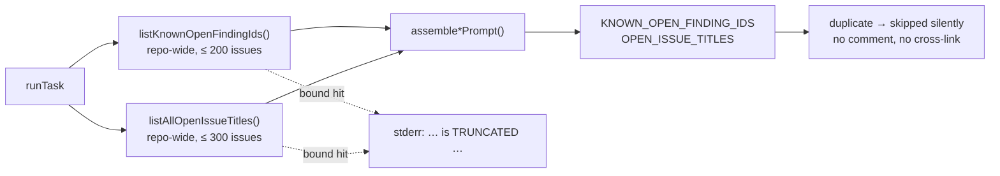

# Document the cross-label dedup contract (Issue #541)

## Summary

The idle-task docs still described dedup as **label-scoped** — the shape that
let `github-actions-audit` re-file NEAT-AI-Rebase #64 over the already-open #37.
After #537/#538/#539 both dedup lookups are repo-wide, so the docs were actively
misleading: a template author reading them would rebuild the defect.

This change documents the **two-line, repo-wide dedup contract** across the
framework doc, every scan doc that enumerates prompt placeholders, and the
template-authoring guidance, and adds a docs guard so a future scan doc cannot
list `{{KNOWN_OPEN_FINDING_IDS}}` without `{{OPEN_ISSUE_TITLES}}`.
Closes #541.

- `docs/IDLE-TASK-FRAMEWORK.md` — rewrote **Cross-label dedup**: both lines are
  repo-wide and label-blind (`logLabel` names the caller in logs only, it never
  filters); documented the bounds (300 titles / 200 finding-id bodies), quoted
  both loud `TRUNCATED` stderr lines with the operator instruction to check the
  log before treating a duplicate as a dedup bug, and stated the silent-skip
  rule (no comment, no cross-link; closed issues may legitimately re-file).
  Corrected the Mermaid diagram, which still labelled the finding-id lookup
  "label-scoped". Added `{{OPEN_ISSUE_TITLES}}` to the wrapper placeholder list
  and a mandatory dedup step to **Adding a new template**.
- Ten scan docs now list `{{OPEN_ISSUE_TITLES}}` beside
  `{{KNOWN_OPEN_FINDING_IDS}}` with the `(none)`-on-empty note and a link to the
  contract: `SECURITY-SCAN`, `BEST-PRACTICES-SCAN`, `TEST-AUDIT-SCAN`,
  `GITHUB-ACTIONS-AUDIT-SCAN`, `SUPPLY-CHAIN-READINESS-SCAN`, `ORPHAN-DEPS-SCAN`,
  `DOCUMENTATION-AUDIT-SCAN`, plus the three siblings whose prompts carry the
  block (`DUPLICATED-KNOWLEDGE-SCAN`, `PRIVATE-REPO-REFERENCE-AUDIT-SCAN`,
  `SUPPLY-CHAIN-DETECTION-SCAN`).
- `docs/EXTENDING.md` — new "A new idle-task scan prompt inherits the dedup
  contract" section, so the next author gets it from the docs rather than by
  copying an older module, plus the "reference `prompts/<type>/`, never a pinned
  version" rule the `docs prompt versions` check enforces.
- No doc pins a prompt version for the touched types — every reference is the
  directory-only `prompts/<type>/` form.

## Evidence

Documentation-only change with no web interface to screenshot. The regression
guard is a Deno test that reads the real `docs/` tree.

Before the doc edits, the new test failed with exactly the seven stale docs:

```text
dedup placeholder docs: FAILED (7 doc(s) list {{KNOWN_OPEN_FINDING_IDS}} without {{OPEN_ISSUE_TITLES}})
  docs/BEST-PRACTICES-SCAN.md:264 lists only the finding-id
  docs/DOCUMENTATION-AUDIT-SCAN.md:175 lists only the finding-id
  docs/GITHUB-ACTIONS-AUDIT-SCAN.md:259 lists only the finding-id
  docs/ORPHAN-DEPS-SCAN.md:206 lists only the finding-id
  docs/SECURITY-SCAN.md:278 lists only the finding-id
  docs/SUPPLY-CHAIN-READINESS-SCAN.md:233 lists only the finding-id
  docs/TEST-AUDIT-SCAN.md:221 lists only the finding-id
FAILED | 6 passed | 1 failed
```

After: `ok | 7 passed | 0 failed`.

The contract the docs now describe:



## Acceptance Criteria

- **met** — `docs/IDLE-TASK-FRAMEWORK.md` describes the two-line, repo-wide
  dedup contract — evidence: `docs/IDLE-TASK-FRAMEWORK.md` §"Cross-label dedup —
  the open-issue title list", matching `worker/deno/lib/idle_task_snapshot.ts`
  (`listKnownOpenFindingIds`, `listAllOpenIssueTitles` — neither issues
  `--label`).
- **met** — every scan doc listing prompt placeholders includes
  `{{OPEN_ISSUE_TITLES}}` — evidence:
  `worker/deno/tests/dedup_placeholder_docs_test.ts::dedup docs - every
  published VibeCoder doc lists both lists`.
- **met** — truncation and silent-skip behaviour documented — evidence:
  `docs/IDLE-TASK-FRAMEWORK.md` §"Both lists are bounded — and say so loudly"
  (both stderr lines quoted verbatim from `idle_task_snapshot.ts`) and the
  silent-skip paragraph above it.
- **met** — the template-authoring guidance names the dedup requirement —
  evidence: `docs/IDLE-TASK-FRAMEWORK.md` step 3 of "Adding a new template" and
  the four-point list under "Adding a template — the conformance test enforces
  this"; `docs/EXTENDING.md` §"A new idle-task scan prompt inherits the dedup
  contract".
- **met** — no doc pins a prompt version for the touched types — evidence: the
  `docs prompt versions` check in `./quality.sh` passes; every touched reference
  uses the `prompts/<type>/` directory form.
- **met** — `./quality.sh` passes, including `docs prompt versions` — evidence:
  full gate run in this branch.
- **unrequested** — `worker/deno/lib/dedup_placeholder_docs_check.ts` and its
  test — reason: the issue's Failure Detection section says the docs have no
  automated gate; this adds the cheap one that would have caught the stale docs,
  following the existing `bucket_docs_check.ts` test-only precedent (no shared
  quality-gate check, since only this repo owns the scan prompts).

## Test Plan

- Added `worker/deno/tests/dedup_placeholder_docs_test.ts` (7 tests): the stale
  doc shape fails with the right file and line, the corrected shape passes, a
  doc naming neither placeholder is out of scope, `docs/archive/` is excluded
  while live docs are not, a repo with no `docs/` is SKIPPED, a synthetic tree
  reports the offending file loudly, and the real `docs/` tree passes.
- Added `worker/deno/lib/dedup_placeholder_docs_check.ts` — the pure scanner
  (`scanDedupPlaceholderContent`) plus the tree walker
  (`runDedupPlaceholderDocsCheck`) the test drives.
- `./quality.sh < /dev/null` run in full: every check PASSED except
  `deno tests`, which reports **four pre-existing, environment-caused
  failures** unrelated to this diff —
  `tests/gh_spawn_test.ts` ×3 ("production runner tolerates a discarded
  stderr/both streams/stdin path") and
  `tests/service_account_env_test.ts::applyServiceAccountEnv - an unwritable gh
  config dir is restaged writable` (the container runs as root, so an
  unwritable directory stays writable). Verified pre-existing: the same four
  fail with this branch's changes stashed —
  `git stash -u && deno task test tests/gh_spawn_test.ts
  tests/service_account_env_test.ts` → `FAILED | 31 passed | 4 failed`.
  The remaining 15,706 tests pass.
