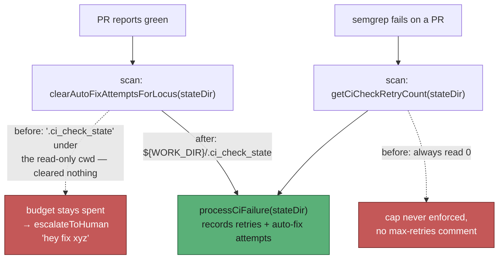

## Summary

The CI-fix lane's two halves addressed **different state directories**, so a
red check the fleet could repair was handed to a human instead. Closes #552.

[Issue #580](https://github.com/stSoftwareAU/VibeCoder/issues/580) (PR #582)
moved the **processor** — `processCiFailure` — onto the work volume via
`resolveCiCheckStateDir(workDir)`, and made its writers fail open. That fixed
the crash this issue's log evidence shows:

```text
[2026-08-29 20:35:12Z] INFO: Found failed CI check repo=stSoftwareAU/VibeCoder prNumber=548 checkName=semgrep checkId=99156131115
[2026-08-29 20:35:21Z] ERROR: [m1] Error in priority 1.55 (CI Fix): Read-only file system (os error 30): writefile '.ci_check_state/stSoftwareAU_VibeCoder_99156131115.retries'
```

It left the **scanner** — `findFailedCiChecks` — on the bare relative default
`".ci_check_state"`, resolved against a working directory that is the read-only
checkout in container mode. Two consequences, both of which end with a human
being asked to fix a check the fleet could have fixed:

1. **The retry cap was never enforced.** The scan called
   `getCiCheckRetryCount(".ci_check_state", …)` and always read `0`, because
   the counters were written to `${WORK_DIR}/.ci_check_state`. The
   "exceeded max retries — skipping" branch and its explanatory PR comment
   could never fire, so an unfixable check was re-picked at priority 1.55 every
   cycle, ahead of other maintenance work.
2. **A green build never cleared the auto-fix budget.** On a PR with no failing
   checks the scan calls `clearAutoFixAttemptsForLocus(stateDir, …)`. Pointed
   at the wrong directory, `Deno.readDir` threw, the catch returned `0`, and
   nothing was cleared. The budgets recorded by the processor therefore
   accumulated permanently — and once a signature reached `maxAutoFixAttempts`,
   `processCiFailure` stopped fixing it and ran `escalateToHuman`. That is
   exactly the "hey fix xyz" this issue is about.

### What changed

- **`worker/deno/lib/ci_check_state_dir.ts`** (new) is the single resolver both
  halves share. It lives on its own so `pr_maintenance` can use it without
  importing the much larger `pr_ci_processor`. The result is **always
  absolute**: the explicit work directory, then `WORK_DIR`, then
  `$HOME/auto-issue-work`, then `/tmp/auto-issue-work` — any candidate that is
  not absolute is skipped, because a relative state directory is the fault the
  function exists to prevent.
- **`worker/deno/lib/pr_ci_processor.ts`** re-exports `resolveCiCheckStateDir`
  and `CI_CHECK_STATE_DIR_NAME` from that module instead of defining its own,
  so there is one implementation and #582's import sites are unchanged.
- **`worker/deno/lib/run_core_production_deps.ts`** resolves the store **once**
  (`const ciCheckStateDir = resolveCiCheckStateDir(workDir)`) and passes the
  same value to `findFailedCiChecks` and `processCiFailure`. The scan had no
  `stateDir` at all before.
- **`worker/deno/lib/pr_maintenance.ts`** and
  **`worker/deno/commands/pr_maintenance.ts`** default via the resolver rather
  than the relative literal, so the trap cannot be reintroduced by a caller
  that forgets to pass one. The CLI's explicit `--state-dir` /
  `CI_CHECK_STATE_DIR` override is unchanged.

`recordCiCheckRetry` keeps #582's **fail-open** behaviour — a lost counter is
warned about, not fatal. This PR does not reintroduce a throw there.

## Evidence

Backend/worker change with no web interface to screenshot. The evidence is the
worker log above, the regression tests below driving the real functions, and
the flow:



Both new scanner tests were confirmed to **fail against the unfixed code** —
reverting `pr_maintenance.ts` to `stateDir = ".ci_check_state"` gives:

```text
FAILURES

findFailedCiChecks - observes the retry cap written by the processor's store
findFailedCiChecks - a green build clears the auto-fix budget the processor recorded

FAILED | 8 passed | 2 failed
```

With the fix in place:

```text
deno test tests/ci_check_state_dir_test.ts
ok | 10 passed | 0 failed

deno test tests/pr_ci_processor_test.ts tests/pr_maintenance_test.ts \
          tests/pr_ci_processor_lock_test.ts tests/pr_ci_processor_auto_fix_cap_test.ts \
          tests/auto_fix_attempt_tracker_test.ts tests/pr_uninvited_action_test.ts \
          tests/ci_check_state_dir_test.ts
ok | 138 passed | 0 failed
```

### Quality gate

`./quality.sh` passes every stage except `deno tests`, whose 4 failures are
sandbox artefacts unrelated to this diff. They were **verified to reproduce on
an unmodified `origin/main` worktree** (`FAILED | 31 passed | 4 failed`):

- `gh_spawn_test.ts` ×3 — they run the real `gh --version`, which the agent
  container's guard wrapper refuses.
- `service_account_env_test.ts::applyServiceAccountEnv - an unwritable gh
  config dir is restaged writable` — it reads the ambient `VIBE_STATE_DIR`,
  which the container exports.

Neither touches the CI-check state directory or anything else in this change.

## Test Plan

- Added `worker/deno/tests/ci_check_state_dir_test.ts` — 10 tests over the real
  functions:
  - `findFailedCiChecks` **with no `stateDir`** (the production default path)
    observes a retry cap written by `recordCiCheckRetry` into the resolved
    store, and returns `null` instead of handing back a capped check. **The
    primary regression test** — it fails against the unfixed scanner.
  - `findFailedCiChecks` on a **green** PR clears an auto-fix budget recorded
    by `recordAutoFixAttempt` in the resolved store. **The second regression
    test** — the path that ends in `escalateToHuman`.
  - `findFailedCiChecks` still returns a failure whose budget is unspent, so
    the fix does not over-skip.
  - `resolveCiCheckStateDir` — explicit work directory, trailing-slash
    normalisation, `WORK_DIR` fallback, `$HOME/auto-issue-work` fallback, a
    relative `WORK_DIR` ignored in favour of `HOME`, and the invariant that a
    blank/relative/root base never yields a path relative to the cwd.
  - `recordCiCheckRetry` — the counter increments on disk in the state
    directory.
- **Modified one existing test**, documented here as the business-logic change
  requires it: `pr_ci_processor_test.ts::resolveCiCheckStateDir - lands on the
  work volume, not the read-only CWD` asserted that a fully unconfigured
  environment returns the bare relative `".ci_check_state"`. That is the shape
  this PR removes, since a relative result is what let the scanner and the
  processor diverge. The assertion now covers the two new absolute fallbacks
  (`HOME`, then `/tmp/auto-issue-work`). No test was deleted or disabled.
- Re-ran the CI-fix suites (`pr_ci_processor`, `pr_maintenance`,
  `pr_ci_processor_lock`, `pr_ci_processor_auto_fix_cap`,
  `auto_fix_attempt_tracker`, `pr_uninvited_action`) — 138 passed.
- `./quality.sh` run in full.
