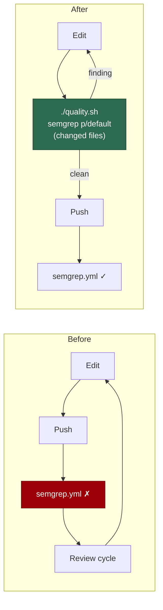

# Run semgrep in the local quality gate, over changed files

## Summary

`semgrep ci --config p/default` is a **blocking** PR check
(`.github/workflows/semgrep.yml`) that nothing ran locally, so an agent's first
sight of a SAST finding was a red PR — after the branch, the push and a review
cycle. Two PRs (#548, #549) sat blocked on the same
`javascript.lang.security.audit.detect-non-literal-regexp` rule because two
agents wrote the same shape and neither could know until CI told them.

This adds a `semgrep` stage to the quality gate
(`worker/deno/lib/semgrep_check.ts`, wired into `quality_gate.ts`) that runs the
**same ruleset** over the branch's **changed files** only, and names the
standard `detect-non-literal-regexp` remedy in both the gate output and the CI-fix
prompt (`prompts/ci_fix/v13.md`). Closes #559.

Design points, each mapped to the issue's suggested shape:

- **Changed files only** — the diff against the merge-base with the remote's
  default branch (`refs/remotes/origin/HEAD`, never a hardcoded branch name),
  plus uncommitted and untracked files, filtered to extensions semgrep has rules
  for. A docs-only change scans nothing and returns PASSED without even probing
  for the tool.
- **Pinned the way CI pins it** — where a container runtime already holds
  `SEMGREP_IMAGE` (the tag+digest reference from `pinned_actions.ts` that
  `semgrep.yml` uses) the scan runs inside that image, so a local pass predicts a
  CI pass. A `semgrep` binary on PATH is used first; when its version differs
  from the CI pin the drift is named in the output rather than being fatal. The
  image is **never pulled** by the gate — a mid-run download is exactly the
  critical-path cost this stage must not add.
- **Off the critical path, but never silent** — no semgrep, no git work tree, an
  unreachable rule registry, or a scan past the 300s deadline each return
  `SKIPPED` with the reason spelled out, exactly as the gate's other optional
  tools behave; `./quality.sh --strict` promotes every one of them to FAILED. A
  non-zero exit that is *none* of those is FAILED: an unreadable or empty report
  is never read as "clean".
- **The remedy is named where it is met** — a `detect-non-literal-regexp`
  finding prints the standard fix (build the regex from a literal, or escape the
  interpolated value; a dynamic regex over agent-authored constants is still
  flagged, so the pattern changes rather than being argued with). `ci_fix` v13
  carries the same remedy as a worked example for the fix-after-the-fact half.

## Evidence

Backend/CLI change — no web interface to screenshot. The evidence is the test
suite plus the check running against this very branch.

Where the finding is now met, versus where it was met before:



The check driven against this branch's own working tree (real `git`, real
detection — semgrep is not installed in the container, so it skips, loudly and
with both remedies named):

```text
{
  files: [
    "worker/deno/lib/quality_gate.ts",
    "worker/deno/lib/semgrep_check.ts",
    "worker/deno/tests/semgrep_check_test.ts"
  ],
  base: "622eba3bf47a09be44506d630ae6e405f229a2d6"
}
semgrep: SKIPPED (semgrep is not installed and no container runtime holds
semgrep/semgrep:1.173.0@sha256:6731995…cb77a — install semgrep
(`pipx install semgrep`) or pull the CI image so p/default runs before the push)
```

`worker/deno/tests/semgrep_check_test.ts` — 22 tests, all passing:

```text
ok | 22 passed | 0 failed (548ms)
```

`./quality.sh < /dev/null` — every stage green except `deno tests`, whose
failures are **pre-existing and environmental**, not from this change:

```text
  workflow hygiene               PASSED
  markdownlint                   PASSED
  mermaid                        PASSED
  docs prompt versions           PASSED
  semgrep                        SKIPPED
  deno tests                     FAILED
  deno lint                      PASSED
  deno type check                PASSED
  deno fmt                       PASSED
```

The full suite reports `15925 passed | 36 failed`, and every named failure needs
a working `gh` this container does not have — every `gh` call is refused with
`[SECURITY] [GH_GUARD_ERROR] guard could not evaluate this gh command` because
the guard's own module is missing:

- `tests/gh_spawn_test.ts` ×3 — spawn the real `gh --version`, which the broken
  guard refuses.
- `tests/run_core_test.ts`, `tests/run_core_rate_limit_resume_test.ts` —
  `API rate limit already exceeded`.
- `tests/service_account_env_test.ts` — the container presets `GH_CONFIG_DIR`.

Checked out at `HEAD~1` (before this change) in a scratch worktree, the same
tests fail identically — `FAILED | 31 passed | 4 failed`, the same four names —
so they are not this change's doing.

### Reviewer note — the fleet container has no semgrep

The agent container does not ship a `semgrep` binary (`container/tools.json`
carries shellcheck, actionlint, cargo-deny, node, npm, markdownlint-cli2 and
rust — no semgrep), so in fleet runs this stage reports `SKIPPED`, not a scan.
Installing it is separate container work: semgrep is a Python application, and
the image has no Python toolchain, so it needs its own pinned-manifest entry,
a `container_manifest_test.ts` update and a container-docs entry. That is
deliberately not folded into this change.

**The follow-up issue for that container work is still unfiled.** Two runs have
now tried: every `gh` write is refused with
`[SECURITY] [GH_GUARD_ERROR] guard could not evaluate this gh command`, because
the guard's own module
(`/tmp/vibe-scratch/worker-src/worker/deno/lib/gh_guard_cli.ts`) is missing from
this container — the directory holds only `mod.ts` and `deno.lock`. The issue
body that could not be posted is reproduced in this PR's final message so it can
be filed by hand.

## Test Plan

Added `worker/deno/tests/semgrep_check_test.ts` (22 tests):

- **Changed-file selection** — `isScannablePath` / `selectScannableFiles`
  accept source extensions and reject prose, images and extensionless files;
  `collectChangedFiles` unions the merge-base diff with untracked files, falls
  back to `HEAD` when the remote default branch cannot be resolved, and returns
  null outside a git work tree.
- **Report parsing** — `parseSemgrepJson` flattens findings, drops entries with
  no usable location, and **throws** on an empty report rather than reporting
  clean; `isRegistryUnavailable` distinguishes an offline rule fetch from an
  ordinary rule error.
- **The blocked-PR shape** — a `detect-non-literal-regexp` finding is FAILED
  locally, naming the file, line, rule and the standard remedy; a finding from
  another rule omits the remedy.
- **Skip-loudly paths** — SKIPPED (with the reason asserted) for no semgrep, no
  git repository, an unreachable registry, and an over-deadline scan; a SKIPPED
  `semgrep` fails the gate under `--strict` via the real `formatSummary`.
- **Fail-loud paths** — a tool error with no report, and a non-zero exit with an
  empty report, are both FAILED.
- **Invocation shape** — `buildContainerArgs` carries the tag+digest
  `SEMGREP_IMAGE`, mounts the repo read-only, and places `--` before the paths
  so a dash-leading filename cannot be parsed as an option (CWE-88).
- **Gate wiring** — the real `runQualityGate` records a `semgrep` check.

Docs updated in the same change: `CONTRIBUTING.md` (new *Semgrep (SAST) before
the push* section with a Mermaid flow), `CODING-STANDARDS.md`, `README.md`, and
`docs/INTERNALS.md` § Quality gate.
