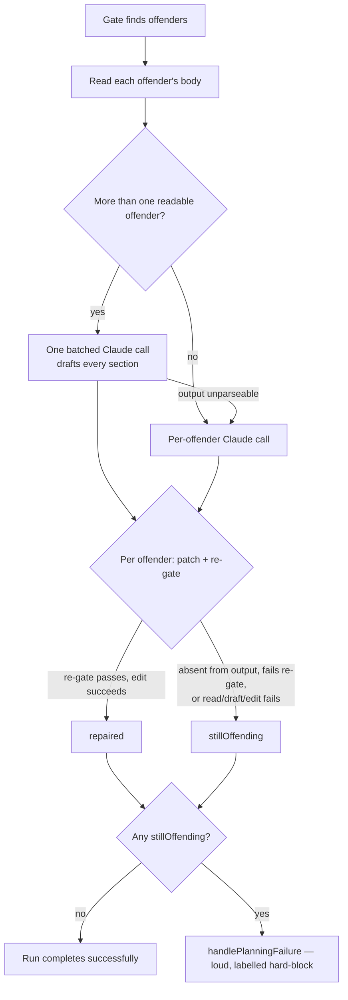

# PR Summary — Batch the Failure-Detection self-repair into a single Claude call

## Summary

The Failure-Detection self-repair (`worker/deno/lib/failure_detection_repair.ts`)
invoked Claude **once per offending sub-issue, sequentially**. Observed on
GRQ-validation#835: 8 offenders × ~18 s ≈ 2.5 min of repair tail appended to a
planning run that had already spent ~5 min — a cost that grew linearly with a
plan's fan-out and did not fit the Planning handler's budget.

The repair now drafts **every** readable offender in a **single** Claude call:

- `buildBatchRepairPrompt(subIssues)` fences all sub-issues in one prompt and
  asks for one clearly delimited block per sub-issue number. It reuses the same
  untrusted-content handling as the single-offender builder (Issue #3706):
  `sanitiseDelimiterPatterns`, `createPromptDelimiters`, `codeFenceFor` and
  `buildBoundaryIntegrityInstruction` (which now names "the sub-issue titles and
  bodies" as the fenced blocks).
- `parseBatchRepairOutput(output)` splits that output back into
  `sub-issue number → drafted section`, tolerating a missing closing marker,
  ignoring numbers that are not offenders, and dropping empty blocks.
- **Applying stays per-offender**, so every safety property is kept: each
  drafted section is patched into that sub-issue's own body, re-gated with
  `validateFailureDetectionCriteria()` on exactly the body about to be written,
  and only then written via `gh issue edit`.
- Only a **positively confirmed** repair is reported as repaired — an offender
  the batched output omitted, whose draft fails the re-gate, or whose edit
  throws stays in `stillOffending` by construction.
- The single-offender `buildRepairPrompt` path is kept as the **fallback**: used
  when there is one offender and when the batched output cannot be split into
  blocks, so behaviour is never worse than the sequential loop it replaced.
- A batched call that outright fails or times out leaves its offenders
  un-repaired rather than retrying per offender — retrying would multiply the
  very cost batching removes, and a rate limit or timeout recurs anyway.
- `invocations` records the batched call, including `runStats`, `fallbackModel`,
  `preflightDegraded` and `preflightDegradedReason` (Issue #3272 — the run's
  stats must not report "no served model observed").

Closes #57.

## Evidence

Backend/CLI change with no web interface — no screenshot applies. The evidence
is the injected-`runClaude` call-count assertion below plus the full quality
gate.

**Measured metric — Claude invocations per repair pass** (the cost driver the
issue names; wall-clock is a fixed multiple of it at ~18 s per call):

| Offenders (N) | Before | After |
| ------------- | ------ | ----- |
| 8             | 8      | 1     |
| 3             | 3      | 1     |
| 1             | 1      | 1     |

Asserted directly in
`worker/deno/tests/failure_detection_repair_test.ts` — the N=8 case asserts the
injected runner was called exactly once, so a silent return to the sequential
loop fails CI.

`./quality.sh` result: every check passes except `deno tests`, which reports
**7 pre-existing failures unrelated to this change** —
`tests/fleet_health_test.ts` (1), `tests/optional_feature_env_test.ts` (1) and
`tests/setup_workdir_reminder_test.ts` (5). They fail identically on the
milestone branch with this change stashed (verified by
`git stash && deno test … && git stash pop`), and touch no code in this diff.
Every test in the two files this PR changes passes (47 passed, 0 failed).

## Test Plan

New cases in `worker/deno/tests/failure_detection_repair_test.ts`:

- `repair - eight offenders are drafted in a single Claude call` — N=8 asserts
  the injected `runClaude` call count is **1**, every sub-issue is repaired with
  **its own** criterion (no cross-assignment), and each written body passes the
  pure gate.
- `repair - offender absent from the batched output stays in stillOffending` —
  an omitted sub-issue is never silently reported as repaired and gets no edit.
- `repair - batched draft that fails the re-gate writes no body` — a bracketed
  placeholder block leaves that offender in `stillOffending` with no
  `gh issue edit`.
- `repair - unparseable batched output falls back to the per-offender path` —
  one batched attempt then one call per offender; all offenders repaired.
- `repair - a single offender uses the single-offender prompt` — N=1 skips the
  batched prompt entirely.
- `repair - batched call failure leaves every offender un-repaired, no invocation`.
- `repair - batched invocation records runStats, fallbackModel and preflightDegraded`.
- `buildBatchRepairPrompt` / `parseBatchRepairOutput` unit tests: block markers
  per sub-issue, mapping, a tolerated missing end marker, and empty/unmarked
  output yielding no entries.

New cases in `worker/deno/tests/unfenced_untrusted_text_test.ts` (Issue #3706
protections preserved on the batched builder):

- `buildBatchRepairPrompt - fences every sub-issue in nonced markers`.
- `buildBatchRepairPrompt - a bare --- or code fence cannot close a block`.
- `buildBatchRepairPrompt - neutralises forged delimiters and block markers` —
  including a forged `<<<SUB_ISSUE_n>>>` planted in a sub-issue body, which
  could otherwise misroute one sub-issue's draft onto another.

**Modified test (documented business-logic change):**
`repair - mixed batch: one repaired, one un-repairable` previously drove two
sequential per-offender calls via a call counter. Under batching that shape no
longer exists, so the case is now expressed as **one** batched output carrying a
good block and a placeholder block. Its intent — mixed outcome, one repaired,
one still offending, no edit for the failure — is unchanged. No test was
removed or commented out.

Docs: `docs/workflows/planning-and-questions.md` — the self-repair section now
describes the batched call, the fallback, and the updated flow diagram.
