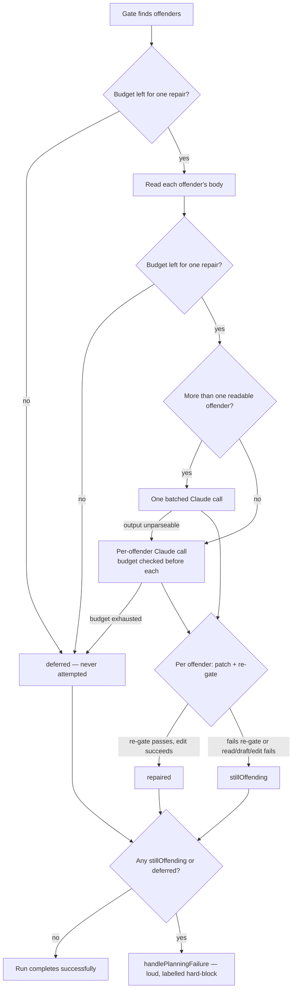

# Make the Failure-Detection repair deadline-aware

## Summary

The Failure-Detection self-repair runs **inside** the Planning handler, after
sub-issues are published, with no awareness of how much handler time is left. On
`stSoftwareAU/GRQ-validation#835` the watchdog killed the handler mid-repair (6
of 8 repaired) and the two Claude calls still in flight were reported as "timed
out or was empty — leaving un-repaired" — indistinguishable, in the logs and in
the result, from a genuine model failure.

The repair is now **deadline-aware**: it checks the remaining budget against a
per-repair cost estimate before every Claude invocation and, when the budget
cannot fit another repair, stops cleanly and reports the untouched offenders as
**deferred** instead of starting work it cannot finish. Closes #58.

What changed:

- `repairFailureDetectionSections()` (`worker/deno/lib/failure_detection_repair.ts`)
  gains optional `deadlineMs` (absolute epoch-ms), an injected `now: () =>
  number`, and `repairCostEstimateMs` (default `DEFAULT_REPAIR_COST_ESTIMATE_MS`
  = 2 min) — injected-dependency shaped like the existing `ghCommandFn` /
  `runClaude` / `logger`, so the budget is unit-testable with no timers.
- `FailureDetectionRepairResult` gains `deferred: FailureDetectionOffender[]`,
  documented as "never attempted — out of budget" and deliberately distinct from
  `stillOffending` ("the model tried and could not produce a passing section").
- The budget is checked before the body reads, before the batched call, and
  before each per-offender call. A budget-driven stop logs its own message
  naming the handler budget and the deferred numbers — never the existing
  "Claude draft timed out or was empty" warning.
- The dispatcher (`run_core.ts`) hands each handler the epoch-ms instant its
  watchdog will abandon it, computed from `handlerHardTimeoutMs()` itself — the
  very value the watchdog arms, so the two cannot drift. It rides
  `IssueContext.handlerDeadlineEpochMs` through `findAndProcessByLabel` into the
  planning processor's repair call site (no fresh constant anywhere).
- Deferred offenders still **block** the run: the criterion is missing either
  way, so a deferral is never a silent pass. They are named in the parent
  failure comment alongside `stillOffending`, with a distinct log line and a
  distinct suffix on the run's error message.
- With no deadline supplied (tests, CLI paths) behaviour is unchanged and
  `deferred` is empty.

## Evidence

Backend/CLI change — no web interface to screenshot. The behaviour is verified
by unit tests driving an injected clock (no real waiting) and by a call-site
test in the planning processor.



Test run (the new cases):

```text
repair - deadline already passed: zero Claude calls, every offender deferred (Issue #58) ... ok
repair - budget for exactly one repair: one repaired, the rest deferred (Issue #58) ... ok
repair - budget too small for the batched call defers every offender (Issue #58) ... ok
repair - no deadline supplied: unchanged behaviour, deferred is empty (Issue #58) ... ok
repair - an unreadable offender stays stillOffending while others defer (Issue #58) ... ok
processIssuePlanning - a spent handler deadline defers the Failure-Detection repair
  instead of starting it (Issue #58) ... ok
ok | 27 passed | 0 failed  (failure_detection_repair_test.ts)
ok | 100 passed | 0 failed (planning_processor_test.ts)
```

`./quality.sh` reports PASSED for lint, type check, fmt, mermaid, markdownlint
and every chokepoint gate. The full `deno test` run shows **7 pre-existing
failures** unrelated to this change (`fleet_health_test.ts`,
`optional_feature_env_test.ts`, `setup_workdir_reminder_test.ts` — all
host-environment dependent); they were confirmed failing on the milestone branch
with this change stashed, and every other one of the 14 349 tests passes.

## Test Plan

New cases in `worker/deno/tests/failure_detection_repair_test.ts`:

- `deadline already passed` — asserts **zero** injected `runClaude` calls, zero
  `gh` edits, every offender in `deferred`, and that the warning names the
  budget and is **not** the "timed out or was empty" message. This is the case
  that fails loudly the moment the repair starts work it cannot finish.
- `budget for exactly one repair` — injected clock charges 1 s per Claude call;
  one offender is repaired and the rest deferred, with no real waiting.
- `budget too small for the batched call` — the batched invocation is never
  started; all offenders deferred.
- `no deadline supplied` — behaviour unchanged, `deferred` empty.
- `an unreadable offender stays stillOffending while others defer` — proves the
  two lists stay distinct.

New case in `worker/deno/tests/planning_processor_test.ts`:

- `a spent handler deadline defers the Failure-Detection repair instead of
  starting it` — sets `ctx.handlerDeadlineEpochMs` in the past and asserts no
  repair prompt ever reaches Claude, no sub-issue is edited, and the run still
  fails loudly with both offenders named — proving the deadline is threaded from
  the processor through to the repair.

Docs: `docs/workflows/planning-and-questions.md` gains the deadline-awareness
section and an updated Mermaid flow.
