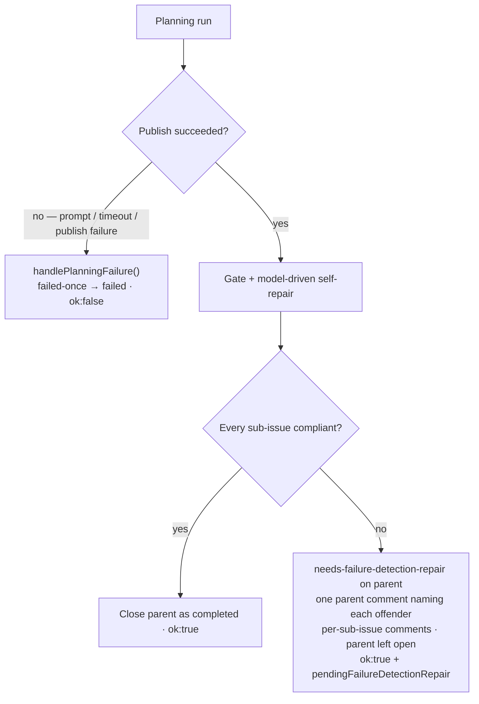

# A partial Failure-Detection repair leaves a resumable state

## Summary

A planning run that **published its sub-issues** but could not repair every
`## Failure Detection` section was being run through `handlePlanningFailure()`
— `failed-once` on the parent and `ok: false` for the run. On
stSoftwareAU/GRQ-validation#835 that read as a failed plan when the plan was
sound: 8 sub-issues published, 6 compliant, 2 not. The published sub-issues stay
published regardless, so the "failure" undid nothing; it only told the retry
machinery to re-plan from the top, which is the wrong recovery.

That outcome is now a distinct **partial repair**. When the run published
sub-issues and one or more still lack the criterion, the worker:

- applies the new **`needs-failure-detection-repair`** label to the parent —
  never `failed-once` / `failed`;
- posts **one** parent comment naming every sub-issue still needing repair and
  the reason for each (`buildParentPartialRepairComment()`, sharing its rule
  wording with `buildParentGateFailureComment()` so the two cannot drift);
- keeps the existing per-sub-issue gate comment on each offender;
- leaves the parent **open** — reopening it when the planner closed it inline —
  so the resume pass (#60) can find it; and
- returns a success-shaped result carrying `pendingFailureDetectionRepair`.

The loud failure machinery is unchanged for **genuine** planning failures (a
prompt failure, a timeout, or a publish failure): they still drive
`handlePlanningFailure()` with the `failed-once` → `failed` progression. This
change narrows *when* the gate fails a run, not the failure machinery itself.

`needs-failure-detection-repair` is in `RESERVED_LABELS` (so the planner can
never apply it as a descriptive label and manufacture a phantom repair queue)
and is named in `RESERVED_LABEL_PROHIBITION`; the worker's own label guard
allowlists it, because the worker is the only thing that may raise it.

Closes #59.

## Evidence

Backend/CLI change — no web interface to screenshot. Verified by the test suite
and the repo quality gate.



Test results (from `worker/deno`):

```
deno test tests/planning_processor_test.ts        →  102 passed | 0 failed
deno test tests/failure_detection_gate_test.ts    →   18 passed | 0 failed
deno test tests/failure_detection_repair_label_test.ts →  7 passed | 0 failed
full suite                                        → 14360 passed | 7 failed
./quality.sh → lint PASSED · type check PASSED · fmt PASSED · mermaid PASSED
               · markdownlint PASSED · deno tests FAILED (see below)
```

The 7 remaining failures are **pre-existing and environment-dependent** —
identical on the unmodified branch (verified with `git stash`): they live in
`tests/fleet_health_test.ts` (container-mode work-dir mount),
`tests/optional_feature_env_test.ts`, and `tests/setup_workdir_reminder_test.ts`
(host work-dir layout), and none touch planning or the gate.

## Test Plan

Added:

- `worker/deno/tests/failure_detection_repair_label_test.ts` (new module) —
  label applied to the parent; a failed apply is reported loudly and returns
  `false` (never a silent pass); one parent comment naming every offender; an
  open parent is not reopened while an inline-closed one is; a failed comment is
  non-fatal; and the reservation invariants (`isReservedLabel` true
  case-insensitively, `isWorkerAppliableLabel` true, canonical
  name/colour/description present).
- `planning_processor_test.ts` — *a genuine planning failure still drives the
  failed-once progression (Issue #59)*: the publish call fails, so
  `handleIssueFailure()` runs, the result is `ok: false`, and the partial-repair
  label is never applied. This is the paired regression case that stops the two
  outcomes being collapsed back together.
- `planning_processor_test.ts` — *reopens an inline-closed parent that still has
  outstanding repairs*.
- `failure_detection_gate_test.ts` — `buildParentPartialRepairComment()` names
  every offender with its reason, states the run is not a failure, names the
  label, and shares the failure comment's rule wording.

Modified (business-logic change, documented in-file):

- `planning_processor_test.ts` — *records a partial repair … when a published
  sub-issue's criterion cannot be repaired*: previously asserted `ok: false` +
  `failed-once`; now asserts the partial-repair outcome (label on the parent,
  no `failed-once`, parent not closed, one parent comment naming `#202` only,
  offender sub-issue comment preserved).
- `planning_processor_test.ts` — *a spent handler deadline defers the repair
  (Issue #58/#59)*: the deferred set no longer fails the run; the assertions
  moved to the partial-repair outcome. Both deferred sub-issues are still named,
  loudly.
- `setup_label_definitions_test.ts` / `setup_label_sync_test.ts` — label counts
  17 → 18 (16 → 17 workflow) for the new label definition.

Docs updated in the same change: `docs/workflows/planning-and-questions.md`
(new "Partial repair leaves a resumable state" section, plus the gate/repair
prose and flowchart that described the old hard-block) and
`docs/workflows/label-flows.md` (label table row).
