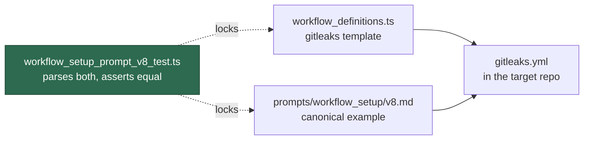

# Refresh the workflow_setup prompt's Gitleaks reference (v8)

## Summary

`prompts/workflow_setup/v8.md` replaces the stale Gitleaks guidance v7 taught.
Two paths provision a repository's `gitleaks.yml` — the deterministic template
in `worker/deno/lib/workflow_definitions.ts` (refreshed by #594) and the
LLM-authored setup run driven by `prompts/workflow_setup/`. v7 still described
`gitleaks-action@v2` with no `pull_request` branch filter and an "optional"
licence fallback, so an LLM-authored copy reintroduced the milestone-PR gap
#594 closed. v8's *Gitleaks Reference Implementation* section now reproduces the
refreshed canonical workflow verbatim and states its requirements explicitly:

- gitleaks-action **v3.0.0**, pinned to the SHA in
  `worker/deno/lib/pinned_actions.ts`
  (`e0c47f4f8be36e29cdc102c57e68cb5cbf0e8d1e`);
- `pull_request.branches: [Develop, main, milestone/*]` — never the bare
  `["*"]`, because a GitHub branch-filter `*` does not match a `/` and so skips
  every milestone sub-issue PR;
- the licence-less CLI fallback is **mandatory**, version-pinned and verified
  with `sha256sum -c -`, because Dependabot PRs receive no Actions secrets;
- the existing hardening rules are kept — SHA-pin every action, fetch the base
  branch before scanning, `fetch-depth: 0` with `persist-credentials: false`,
  and no `pull_request_target`.

v7 is untouched (prompt immutability, Issue #235) and serves as the negative
control in the new tests. The placeholder set is unchanged, so prompt-manager
validation still passes. Closes #596.

## Evidence

Backend/prompt-text change with no web interface, so there is no screenshot to
capture. The evidence is the new test suite, which parses the prompt's canonical
example as YAML and asserts on behaviour rather than grepping prose — including
an equality check against the workflow the deterministic template emits, so the
two provisioning paths cannot silently disagree.



Test run (`worker/deno`):

```text
deno test --allow-read --allow-env tests/workflow_setup_prompt_v8_test.ts
ok | 11 passed | 0 failed
```

Full gate: every stage passes except `deno tests`, whose six failures are
pre-existing and environmental — see the Acceptance Criteria entry below.

## Acceptance Criteria

- **met** — `prompts/workflow_setup/v8.md` exists and is selected as the latest
  version by `getLatestVersion("workflow_setup")` — evidence:
  `worker/deno/tests/workflow_setup_prompt_v8_test.ts::workflow_setup v8 - is
  the version the loader selects`
- **met** — its Gitleaks section names gitleaks-action v3.0.0, requires the
  explicit `[Develop, main, milestone/*]` branch list, forbids `["*"]`, and
  requires the licence-less CLI fallback — evidence:
  `worker/deno/tests/workflow_setup_prompt_v8_test.ts::workflow_setup v8 -
  pins the gitleaks action to the repository's v3 pin`, `::the canonical
  example filters on milestone branches`, `::the prose forbids the bare star
  filter`, `::the example keeps both scan paths`
- **met** — all five required placeholders are present in v8 — evidence:
  `worker/deno/tests/workflow_setup_prompt_v8_test.ts::workflow_setup v8 -
  carries every required placeholder`
- **met** — the docs/prompt version check passes — evidence: the
  `docs-prompt-version` stage of `./quality.sh`, plus
  `worker/deno/tests/docs_prompt_version_freshness_test.ts`. No published
  document pins a `prompts/workflow_setup/vN` reference, so nothing needed
  updating.
- **partial** — `./quality.sh` passes — evidence: every stage passes except
  `deno tests`, which fails on six pre-existing, environment-dependent tests
  unrelated to this change (`tests/gh_spawn_test.ts` ×3,
  `tests/service_account_env_test.ts` ×1, and `tests/run_core_test.ts` /
  `tests/run_core_rate_limit_resume_test.ts`, which abort on
  `GraphQL: API rate limit already exceeded`) — reason: the same four
  assertions fail identically when run from a worktree at the parent commit
  (`git worktree add /tmp/vc-base-596 HEAD~1` → `4 failed`), so they are the
  container's `gh` config/rate-limit state, not this diff. 15,899 tests pass,
  including all 11 new ones.

## Test Plan

Added `worker/deno/tests/workflow_setup_prompt_v8_test.ts` (11 tests):

- v8 is the version `getLatestVersion` selects, and carries all five required
  placeholders.
- The canonical example's `on.pull_request.branches` matches `Develop`, `main`
  and `milestone/example` via `anyBranchMatches` (the fleet's own matcher), and
  is not `["*"]`; the prose names the forbidden filter.
- The example pins `gitleaks/gitleaks-action` to the SHA in
  `pinned_actions.ts`, every `uses:` resolves to a 40-character SHA, and v8 no
  longer names `gitleaks-action@v2`.
- Both scan paths survive: the licensed action guarded by
  `env.GITLEAKS_LICENSE != ''`, and the CLI fallback guarded by `== ''` with a
  pinned `GITLEAKS_VERSION` and a `sha256sum -c -` verification; checkout uses
  `fetch-depth: 0`.
- The example never uses `pull_request_target`, while v8 still tells the agent
  to avoid it.
- The example parses equal to the `gitleaks` template in
  `workflow_definitions.ts`, so the LLM and deterministic paths cannot drift.
- Negative control on frozen v7: its example declares no `on:` block (the gap)
  and still names `gitleaks-action@v2`. Every v8 assertion above failed before
  `v8.md` was added.
