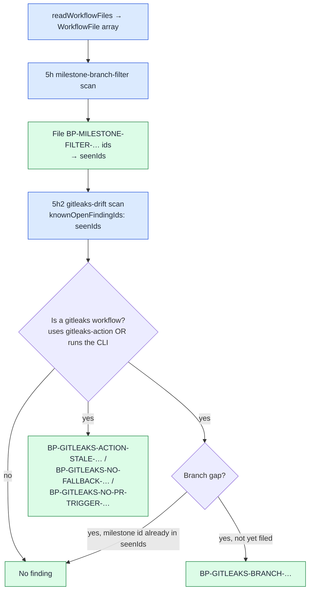

# Detect drift in per-repo gitleaks.yml copies

## Summary

The `gitleaks` workflow spec detects presence by pattern
(`[["gitleaks/gitleaks-action", "gitleaks"]]`), so `auditRepoWorkflows` marks
the workflow "covered" for any file that merely mentions gitleaks. Presence is
not currency: a copy pushed months ago with `branches: ["*"]` and
`gitleaks-action@v2` scored as fully covered while scanning almost nothing.

Added `worker/deno/lib/gitleaks_drift_scanner.ts`, a pure pre-filer over the
already-parsed `WorkflowFile[]` that compares each per-repo copy against the
canonical shape the worker emits today and files one `severity:medium` finding
per drift class:

| Finding id | Drift |
| ---------- | ----- |
| `BP-GITLEAKS-BRANCH-<basename>` | `pull_request.branches` matches no `milestone/<slug>` branch (`["*"]` is the common offender — a GitHub `*` never matches a `/`) |
| `BP-GITLEAKS-ACTION-STALE-<basename>` | `gitleaks/gitleaks-action` tag-pinned (`@v2`, `@v3`) or pinned to a SHA other than the one `pinnedAction()` resolves today |
| `BP-GITLEAKS-NO-FALLBACK-<basename>` | Licensed action with no open-source gitleaks CLI step — Dependabot PRs get no Actions secrets, so the action exits `ErrLicense` and scans nothing (Issue #2981) |
| `BP-GITLEAKS-NO-PR-TRIGGER-<basename>` | No gitleaks workflow in the repo declares a `pull_request` trigger at all |

It is wired into the `github-actions-audit` template as section 5h2,
immediately after the milestone-branch-filter pre-filer, with the same
`fileWorkflowFinding` call shape and `knownOpenFindingIds: seenIds` /
`seenIds.add` bookkeeping. A real `gitleaks.yml` classifies as `test`/`high`,
so `scanMilestoneBranchFilters` emits `BP-MILESTONE-FILTER-<basename>` for the
same file and the same gap — the drift scanner therefore drops its own branch
finding whenever that id is open or was filed this run, so one gap never files
two issues.

The scan reports only. Per the per-repo isolation rule (Issue #3239) the YAML
refresh rides a normal per-repo worker PR; this scanner raises no PR and
touches no other repository.

Closes #598.

## Evidence

Backend/CLI change — no web interface to screenshot. The evidence is the test
suite: 17 scanner tests plus 2 template-integration tests, all against real
function calls with in-memory fixtures.

```
deno test tests/gitleaks_drift_scanner_test.ts
  ok | 17 passed | 0 failed (91ms)

deno test tests/github_actions_audit_template_test.ts
  ok | 54 passed | 0 failed (246ms)
```

The dedupe guard was verified as a genuine regression test, not a passing
accident: with the `knownOpen.has(milestoneId)` guard removed, both
`worker/deno/tests/gitleaks_drift_scanner_test.ts::scanGitleaksDrift - branch
gap deduped against an open milestone finding` and
`worker/deno/tests/github_actions_audit_template_test.ts::runTask - gitleaks
branch gap is not double-filed beside the milestone finding` FAILED
(`FAILED | 69 passed | 2 failed`); both pass with the guard restored.



## Acceptance Criteria

- **met** — `worker/deno/lib/gitleaks_drift_scanner.ts` exists and emits the
  four finding types with stable ids — evidence:
  `worker/deno/tests/gitleaks_drift_scanner_test.ts::scanGitleaksDrift - branches ["*"] misses milestone PRs`,
  `::scanGitleaksDrift - tag-pinned gitleaks-action@v2 is stale`,
  `::scanGitleaksDrift - action with no CLI fallback is flagged`,
  `::scanGitleaksDrift - schedule-only gitleaks workflow leaves PRs unscanned`
- **met** — a current, refreshed `gitleaks.yml` produces zero findings —
  evidence:
  `worker/deno/tests/gitleaks_drift_scanner_test.ts::scanGitleaksDrift - the canonical current template yields no findings`
  (the fixture is the live `WORKFLOW_SPECS` gitleaks template, so the test
  tracks the canonical shape rather than a copy of it)
- **met** — malformed YAML produces zero findings and no throw — evidence:
  `worker/deno/tests/gitleaks_drift_scanner_test.ts::scanGitleaksDrift - malformed YAML yields nothing and does not throw`
- **met** — the scanner is invoked from the `github-actions-audit` template
  and its ids join `seenIds` — evidence:
  `worker/deno/tests/github_actions_audit_template_test.ts::runTask - gitleaks pre-filer files a stale action pin and joins seenIds`
- **met** — the branch finding is suppressed when the milestone-branch-filter
  scanner already covers the same workflow path — evidence:
  `worker/deno/tests/gitleaks_drift_scanner_test.ts::scanGitleaksDrift - branch gap deduped against an open milestone finding`
  and
  `worker/deno/tests/github_actions_audit_template_test.ts::runTask - gitleaks branch gap is not double-filed beside the milestone finding`
- **met** — unit tests cover every case above; `./quality.sh` passes —
  evidence: `worker/deno/tests/gitleaks_drift_scanner_test.ts` (17 tests) and
  the quality gate run recorded in this PR
- **unrequested** — four small exports added to
  `worker/deno/lib/milestone_branch_filter_scanner.ts`
  (`workflowIdSlug`, `milestoneFindingIdForPath`, `workflowMilestoneCoverage`,
  `lineOfPullRequestFilter`) — reason: DRY, so the drift scanner reuses the
  milestone pre-filer's exact id and branch-coverage rules (needed for the
  dedupe criterion) instead of duplicating ~60 lines; behaviour is unchanged
  and its 16 existing tests still pass

## Security-fix evidence

- **Regression test** —
  `worker/deno/tests/gitleaks_drift_scanner_test.ts::scanGitleaksDrift - branches ["*"] misses milestone PRs`
  reproduces the flaw: a `gitleaks.yml` with `branches: ["*"]` that the
  existing pattern-based audit reports as covered. It fails against the
  unfixed code (before this branch `scanGitleaksDrift` does not exist, so the
  stale copy produces no finding at all) and passes after the fix, which emits
  `BP-GITLEAKS-BRANCH-gitleaks`. The same holds for the other three drift
  classes and for the dedupe guard, which was observed failing with the guard
  removed (see Evidence).
- **Original trigger closed, no trivial bypass** — the trigger is a per-repo
  `gitleaks.yml` that satisfies the presence pattern while being stale. The
  scanner no longer decides on the presence of the string "gitleaks": it
  requires a `uses: gitleaks/gitleaks-action` step or a `run:` invocation of
  the CLI to treat the file as a gitleaks workflow at all, then asserts four
  positive properties of it (milestone-covering branch filter, the exact
  current action SHA, a licence-less CLI step, a `pull_request` trigger). A
  comment, a filename, or a `name: Gitleaks` header no longer satisfies
  anything, and each check compares against the value the worker emits today
  (`pinnedAction()`, `milestone/example` glob matching) rather than a literal
  the fixtures happen to use — so a copy cannot pass by naming a different
  tag, a different basename, or a different branch spelling.

## Test Plan

Added:

- `worker/deno/tests/gitleaks_drift_scanner_test.ts` — 17 tests: one fixture
  per finding type; the live canonical template yielding nothing; a stale-SHA
  pin flagged and the current SHA not flagged; a CLI-only workflow needing no
  fallback finding; a scheduled copy excused when a sibling gitleaks workflow
  gates PRs; malformed YAML yielding nothing without throwing; non-gitleaks
  workflows and composite actions ignored; `suppressedIds` /
  `knownOpenFindingIds` / in-source `best-practice-ignore` suppression; stable
  id sort order; and the milestone dedupe case.
- `worker/deno/tests/github_actions_audit_template_test.ts` — 2 tests: the
  pre-filer files a stale-pin finding whose id joins the LLM's known-open
  list, and the branch gap is filed once (by the milestone pre-filer) rather
  than twice.

Existing `worker/deno/tests/milestone_branch_filter_scanner_test.ts` (16
tests) still passes unchanged, covering the small refactor of that module into
the four shared exports.
