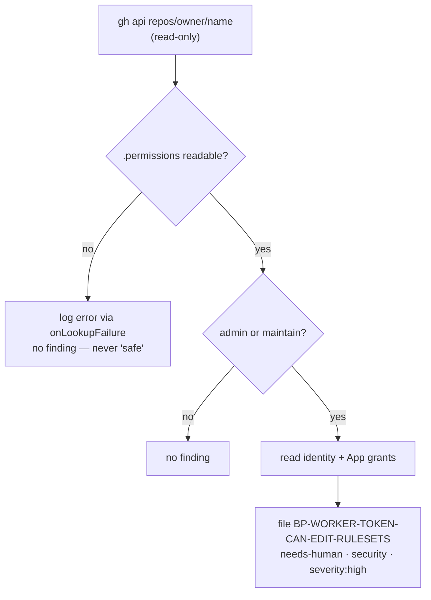

# Fail loud when the worker token can modify rulesets or repository settings

## Summary

The operator's hard constraint is that the Vibe Coder must never be able to
change a GitHub ruleset — rulesets are how a human keeps builds clean before a
merge, so a worker that can edit them can also erase the gate protecting the
fleet. Nothing checked that constraint: it held only because the worker did not
choose to call those endpoints, which is a convention, not a control.

This adds `worker/deno/lib/worker_token_privilege_scanner.ts`, a read-only
privilege check shaped like `repo_settings_scanner.ts` — same pattern, opposite
direction: that one asks whether the repository is locked down enough, this one
asks whether the worker's own token is trusted too much.

Per monitored repo it reads `repos/{owner}/{repo}` and inspects
`.permissions`. `admin` or `maintain` true means the token can create, edit and
delete rulesets and change repository settings, so it emits one finding with
the stable id `BP-WORKER-TOKEN-CAN-EDIT-RULESETS`, filed with `needs-human`,
`security` and `severity:high`. Only when a grant is found does it spend two
further reads to name it exactly: the token's identity (`user`) and, for a
GitHub App installation token, the installation's `administration` /
`repository_hooks` grants (`repos/{owner}/{repo}/installation`). The body
states which permission is granted, what it lets the worker do (delete the
required-status-check ruleset that gates merges), and the human remedy —
downgrade the service account to `write`/`push`, or narrow the App
installation's `administration` permission.

It is wired into the `github-actions-audit` template as section 5l, beside the
repository-settings pre-filer (5k), so every monitored repo is covered on the
existing weekly cadence.

Closes #599.

## Evidence

Backend/CLI change with no web interface to screenshot; the evidence is the
test suite plus the type check.

```
deno test --allow-all tests/worker_token_privilege_scanner_test.ts
ok | 7 passed | 0 failed

deno test --allow-all tests/github_actions_audit_template_test.ts
ok | 56 passed | 0 failed
```

Detection flow:



### Security-fix evidence

- **Regression test** —
  `worker/deno/tests/worker_token_privilege_scanner_test.ts::scanWorkerTokenPrivileges - a failed permission lookup is reported and yields no finding, never a safe verdict (Issue #599)`
  reproduces the flaw this issue names. It fails against the unfixed code (the
  branch point has no `worker_token_privilege_scanner.ts`, so the import does
  not resolve and the whole file errors) and passes after the fix.
  `…::scanWorkerTokenPrivileges - an admin token is one needs-human escalation naming the grant (Issue #599)`
  covers the detection itself on the same terms.
- **Original trigger closed, no trivial bypass** — the unchecked condition was
  an `admin`/`maintain` worker token silently retaining ruleset write access.
  It is now read on every audit cycle from the authoritative surface
  (`repos/{owner}/{repo}.permissions`), and both ruleset-capable permissions
  are checked, not just `admin`, so a token downgraded from `admin` to
  `maintain` — the obvious near-miss bypass — is still caught. The two ways to
  make the check *appear* clean are both closed: an API error and a payload
  carrying no `.permissions` object each report through `onLookupFailure` and
  return no finding, so an unreadable scope can never be rendered as a
  "verified safe" verdict.
- **No write probe** — `worker/deno/tests/worker_token_privilege_scanner_test.ts::scanWorkerTokenPrivileges - reads only; never probes a ruleset with a write (Issue #599)`
  asserts over every recorded `gh` invocation that it is an `api` call with no
  `-X`/`--method`/`-f`/`--field`/`--input` argument and no `rulesets` endpoint.

## Acceptance Criteria

- **met** — A privilege scanner exists that reads the worker token's repository
  permissions read-only and emits a finding when they include `admin` or
  `maintain` — evidence: `worker/deno/lib/worker_token_privilege_scanner.ts`,
  `worker/deno/tests/worker_token_privilege_scanner_test.ts::scanWorkerTokenPrivileges - maintain alone is still a finding; push-only is silent (Issue #599)`
- **met** — The finding is filed as a `needs-human` + `security` +
  `severity:high` issue, deduplicated by a stable id — evidence:
  `worker/deno/tests/github_actions_audit_template_test.ts::runTask - an over-privileged worker token is filed as a needs-human security escalation (Issue #599)`
  and `…worker_token_privilege_scanner_test.ts::scanWorkerTokenPrivileges - an already-open finding id is not re-filed (Issue #599)`
- **met** — The scanner performs no write of any kind — no ruleset probe —
  evidence: `worker/deno/tests/worker_token_privilege_scanner_test.ts::scanWorkerTokenPrivileges - reads only; never probes a ruleset with a write (Issue #599)`
- **met** — A failed lookup logs an error and yields no finding, never a "safe"
  verdict — evidence:
  `worker/deno/tests/worker_token_privilege_scanner_test.ts::scanWorkerTokenPrivileges - a failed permission lookup is reported and yields no finding, never a safe verdict (Issue #599)`
  and the template-level
  `…github_actions_audit_template_test.ts::runTask - a failing worker-token privilege check is logged loud and files nothing (Issue #599)`
- **met** — It runs for every monitored repo from the `github-actions-audit`
  template — evidence: section 5l in
  `worker/deno/lib/idle_task_templates/github_actions_audit_template.ts`
- **met** — Unit tests cover admin, maintain, push-only, lookup-failure and
  dedupe paths; `./quality.sh` passes — evidence: the seven tests in
  `worker/deno/tests/worker_token_privilege_scanner_test.ts`
- **unrequested** — `extraLabels` added to `fileWorkflowFinding`
  (`worker/deno/lib/workflow_scan_common.ts`) — reason: the shared filer
  attached only the scan label and `severity:*`, so the required `needs-human`
  and `security` labels could not be filed without it; four lines rather than a
  second filer.
- **unrequested** — `ensureFindingLabelsFn` in the audit template — reason:
  `gh issue create` fails outright on a label the repo does not have, so the
  escalation would silently never file in a repo missing `needs-human`.
- **unrequested** — the shared `makeGhStub` fixture in
  `github_actions_audit_template_test.ts` now returns `permissions` on
  `repos/org/repo` — reason: fixture update only (no test removed or
  weakened), so the default-wired scanner sees a correctly scoped push-only
  token in the existing scenarios.

## Test Plan

- Added `worker/deno/tests/worker_token_privilege_scanner_test.ts` — 7 tests:
  admin → finding; maintain-only → finding and push-only → silent; read-only
  invariant over every `gh` call; App installation grant named in the
  evidence; lookup failure and a missing `.permissions` object → reported, no
  finding; identity read failure → reported but the finding still stands;
  known-open id → not re-filed.
- Added two tests to
  `worker/deno/tests/github_actions_audit_template_test.ts` — the escalation is
  filed with `needs-human`, `security` and `severity:high` after its labels are
  ensured; a failing lookup is logged loud and files nothing.
- `./quality.sh` run in full.
