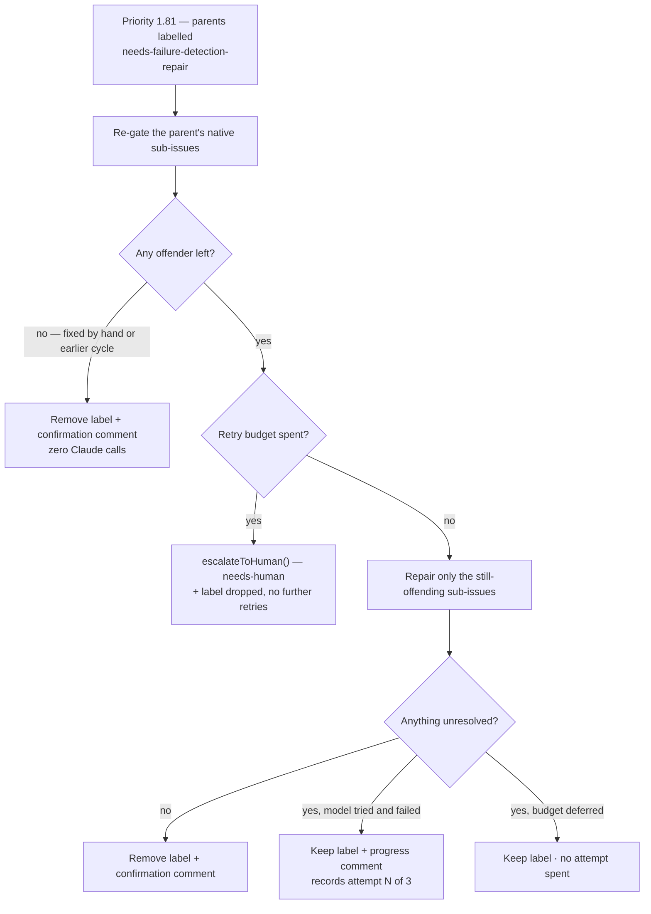

# Resume pass finishes outstanding Failure-Detection repairs (Issue #60)

## Summary

A partially-repaired planning run leaves its parent labelled
`needs-failure-detection-repair` instead of `failed-once` (Issue #59). That state
was inert: nothing ever revisited it, so sub-issues stayed published without a
`## Failure Detection` section. This adds the pass that finishes the job.
Closes #60.

**Priority 1.81 — `Failure-Detection Repair Resume`** (`agentBacked: true`, sits
straight after Planning Mode because it consumes the state Planning produces):

1. `worker/deno/lib/find_failure_detection_repair_issues.ts` lists the **open**
   issues carrying the label in every configured repository. A repository whose
   listing fails is logged and skipped — one unreachable repo can never hide
   another's outstanding repairs.
2. `worker/deno/lib/failure_detection_resume.ts` enumerates each parent's
   **native** sub-issues (`fetchNativeSubIssueNumbers` — the original run's
   `subIssueUrls` are long gone), re-runs `runFailureDetectionGate()` over them,
   and calls `repairFailureDetectionSections()` on **only** what is still
   offending.
3. A clean set removes the label and posts a confirmation comment.

Re-gating first is what makes the pass idempotent and self-healing: a sub-issue a
human fixed by hand is no longer an offender, so an already-clean parent costs
**zero Claude calls** and simply loses its label.

**Retries are bounded.** A cycle that genuinely attempted a repair and still
failed records `<!-- failure-detection-resume-attempt: N -->` in its parent
comment — the count lives in the comments so it survives a restart and reads the
same for every worker in the fleet. After
`MAX_FAILURE_DETECTION_RESUME_ATTEMPTS` (3) the parent goes through the existing
`escalateToHuman()` chokepoint (`needs-human` + explanation, always together) and
the resume label is dropped so the pass stops re-picking it. Offenders the
handler budget merely **deferred** (Issue #58 — never attempted) do not spend an
attempt: a budget shortfall is no evidence that a repair is impossible. A parent
whose native sub-issues cannot be enumerated is treated exactly like a failed
repair — an empty list is indistinguishable from a failed API read, so it is
never mistaken for a clean pass.

**Enabling fix in the same change.** #59 added `needs-failure-detection-repair`
to `RESERVED_LABELS` but not to `WORKER_APPLIABLE_LABEL_LITERALS`, so the worker
label guard refused every apply
(`[SECURITY] [WORKER_LABEL_REFUSED] … not_in_worker_allowlist`) and the label
never reached a parent for this pass to find. Seven tests were red on the
milestone branch because of it (four in
`tests/failure_detection_repair_label_test.ts`, three in
`tests/planning_processor_test.ts`); all seven now pass.

## Evidence

Backend/CLI change with no web interface to screenshot — the evidence is the test
suite below plus the ladder-documentation gate.



`./quality.sh` output (this branch):

```
  deno lint                      PASSED
  deno type check                PASSED
  deno fmt                       PASSED
  mermaid                        PASSED
  markdownlint                   PASSED
  needs-human chokepoint         PASSED
  deno tests                     FAILED
```

The `deno tests` failure is **seven pre-existing, environment-dependent tests**
that fail identically on a clean checkout of this branch (verified with
`git stash`): `buildFleetHealthConfig - container mode …`,
`applyOptionalFeatureEnv - reads the file …`, and five
`remind_obsolete_host_work_dirs - …` cases. They exercise host work-dir and
container-mount paths that do not exist in this sandbox and are untouched by this
change. Every test in the modules this change touches passes.

## Test Plan

New — `worker/deno/tests/failure_detection_resume_test.ts` (13 tests):

- **Label discovery** — the finder lists open parents carrying the label across
  every configured repository, scopes each `gh issue list` to `--state open` and
  the label, survives a failing repository, and skips malformed repo names and
  unparseable responses.
- **Zero-Claude idempotent re-gate** — a parent whose sub-issues were fixed by
  hand makes **no** Claude call, loses the label, and gets a confirmation
  comment.
- **Repair + label removal** — with one of two sub-issues offending, only the
  offender is edited (`gh issue edit 843`), the label is removed, and the comment
  names it.
- **Outstanding** — an un-repairable sub-issue keeps the label and records
  attempt 1 in the parent comment.
- **Bounded escalation** — a parent whose comments already carry three attempt
  markers adds `needs-human`, drops the resume label, and spends **no** Claude
  call.
- **Deferral does not burn an attempt** — a spent deadline defers the offender
  and records no attempt marker.
- **Enumeration failure** — no native sub-issues keeps the label and spends an
  attempt; repeated failure escalates.
- **The pass** — bounded to `maxParentsPerCycle` parents (the rest logged as
  picked up next cycle), and a clean no-op when no parent carries the label.

Existing gates re-run:

- `worker/deno/tests/priority_ladder_docs_test.ts` — passes with the 1.81 tier
  added to `docs/workflows/README.md` (table + flow diagram) and the
  `docs/USAGE.md` diagram.
- `worker/deno/tests/failure_detection_repair_label_test.ts` and
  `worker/deno/tests/planning_processor_test.ts` — the seven previously-failing
  cases now pass with the label-guard allowlist fix.

Documentation updated in the same change:
`docs/workflows/planning-and-questions.md` (new "Resume pass finishes outstanding
repairs" section with a flow diagram), `docs/workflows/label-flows.md` (the label
row now states who clears it), and both ladder restatements.
