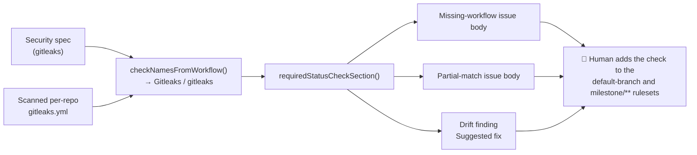

# Tell the human how to make the gitleaks check block merges

## Summary

Every gitleaks recommendation the fleet files at a human now says how to make
the scan **block** a merge, not merely report. A failing scan that is not a
required status check stops nothing, so the missing-workflow issue body, the
partial-match issue body and every gitleaks drift finding's suggested fix now
carry a "Make this scan block merges (human action required)" section naming:

- the exact check the workflow reports (`Gitleaks / gitleaks`, derived from the
  workflow's own `name:` and job id — never hard-coded);
- where to add it — Settings → Rules → Rulesets → **Require status checks to
  pass**;
- **both** ruleset targets: the default branch *and* `milestone/**`. A ruleset
  requiring the check on the default branch alone leaves every `milestone/**`
  PR merging unblocked, which is where most PRs land (Issue #1300);
- that **a human must make this change — the worker cannot and must not**. The
  worker's token is deliberately denied ruleset and repository-settings
  permissions (Issue #599), so ruleset ownership stays with a human.

The prose sits above the deduplication tags, which are byte-for-byte unchanged
(`<!-- vibe-coder:workflow-sync:gitleaks -->` and its `:partial:` twin), as are
the `BP-GITLEAKS-…` finding ids — so no repo re-files an existing issue.

Closes #600.

## Changes

- **New** `worker/deno/lib/required_status_check_guidance.ts` — two pure
  helpers: `checkNamesFromWorkflow()` derives the `<workflow name> / <job name>`
  check names a workflow reports, and `requiredStatusCheckSection()` renders the
  markdown. The section builder **throws** on an empty check list rather than
  emitting vague, unactionable prose (fail loud).
- `worker/deno/setup/workflow_sync.ts` — `issueBody` (now exported for test) and
  `issueBodyPartial` interpolate the section for `category: "security"` specs
  only; quality and dependency-update bodies are untouched. The check name comes
  from the spec's own template, so it always matches the workflow the issue
  recommends.
- `worker/deno/lib/gitleaks_drift_scanner.ts` — every emitted finding's
  `suggestedFix` gains the same section, with the check names derived from the
  **scanned repo's** workflow file rather than the canonical template.
- Docs: `docs/EXTENDING.md` (workflow-sync section) and
  `docs/GITHUB-ACTIONS-AUDIT-SCAN.md` (gitleaks-drift pre-filer section).



## Evidence

Backend/CLI change with no web interface, so there is nothing to screenshot; the
evidence is the rendered body and the tests. Rendered gitleaks missing-workflow
issue body (tail), produced by the real `issueBody()`:

```markdown
### Make this scan block merges (human action required)

Adding the workflow only makes the scan *advisory*: a red run reports the
problem and the pull request still merges. It blocks a merge only once its
check is a **required status check** on the ruleset that gates the branch
being merged into.

1. Open **Settings → Rules → Rulesets** in this repository.
2. Edit the ruleset that targets the **default branch**, and the ruleset that
   targets `milestone/**` (create it if there is none). …
3. In each ruleset, enable **Require status checks to pass** and add:
   `Gitleaks / gitleaks`
4. Save each ruleset. …

**A human must make this change — the worker cannot and must not.** …

---
*Raised automatically by VibeCoder workflow sync.*
<!-- vibe-coder:workflow-sync:gitleaks -->
```

Test run: `deno test --allow-all tests/required_status_check_guidance_test.ts`
→ **14 passed, 0 failed**. Adjacent suites re-run green:
`tests/setup_workflow_sync_test.ts`, `tests/gitleaks_drift_scanner_test.ts`,
`tests/setup_cli_workflow_sync_integration_test.ts`,
`tests/workflow_definitions_test.ts`,
`tests/gitleaks_template_conformance_test.ts` → 120 passed, 0 failed.
`./quality.sh` passes.

### Security-fix evidence

- **Regression test** —
  `worker/deno/tests/required_status_check_guidance_test.ts::issueBody - the
  gitleaks missing-workflow issue tells the human how to make the check block
  merges` reproduces the gap: run against the unfixed code it failed (the
  first run errored at type-check because `issueBody` was not exported, and the
  body assertions failed once it was), and it passes after the change. The
  companion tests cover the partial-match body, every drift finding's suggested
  fix, and the dedup-tag/finding-id invariants.
- **Original trigger closed, no trivial bypass** — the enforcement gap was that
  a gitleaks recommendation never told the human to require the check, so a red
  scan stayed advisory. Every path that renders one of these bodies now
  interpolates `requiredStatusCheckSection()`: `issueBody` and
  `issueBodyPartial` for all `category: "security"` specs (a per-spec test
  iterates the whole catalogue, so a newly added security spec cannot slip
  through), and the drift scanner's single `emit()` chokepoint, through which
  every `GitleaksDriftFinding` is constructed — there is no second construction
  site to bypass. The builder throws rather than emitting a check-less section,
  so guidance cannot silently degrade to unactionable prose.

## Acceptance Criteria

- **met** — The gitleaks missing-workflow issue body and the partial-match body
  both include required-status-check instructions naming the check and both
  ruleset targets (default branch and `milestone/**`) — evidence:
  `worker/deno/tests/required_status_check_guidance_test.ts::issueBody - the
  gitleaks missing-workflow issue tells the human how to make the check block
  merges` and `::issueBodyPartial - the gitleaks partial-match issue carries the
  same instructions` (both assert the check name, `Settings → Rules → Rulesets`,
  `Require status checks to pass`, `default branch` and `` `milestone/**` ``).
- **met** — The body states the human must make the change and the worker must
  not — evidence: the `A human must make this change — the worker cannot and
  must not.` assertion in `assertCarriesGuidance()`, applied by every body test.
- **met** — Drift findings carry the same guidance in their suggested fix —
  evidence:
  `worker/deno/tests/required_status_check_guidance_test.ts::scanGitleaksDrift -
  every finding's suggested fix carries the required-status-check guidance` and
  `::scanGitleaksDrift - the guidance names the check the scanned file actually
  reports`.
- **met** — Dedup tags are unchanged, verified by test — evidence:
  `worker/deno/tests/required_status_check_guidance_test.ts::issueBody - dedup
  tags are unchanged and still appear exactly once` pins both literal tag
  strings and asserts each appears exactly once, at the end of the body;
  `::scanGitleaksDrift - finding ids are unchanged by the added prose` pins the
  `BP-GITLEAKS-…` ids.
- **met** — `./quality.sh` passes — evidence: full gate run in the foreground
  before the PR.
- **unrequested** — the guidance is added for **all** `category: "security"`
  specs (semgrep as well as gitleaks), not gitleaks alone — reason: the issue
  scopes the section to security specs "at minimum for the `gitleaks` spec", and
  deriving the check name from each spec's own template makes the general case
  no more code than special-casing one id; the choice is pinned by
  `::issueBody/issueBodyPartial - every security spec carries the guidance with
  its own check name` and by `::issueBody - non-security specs are unaffected by
  the guidance`.
- **unrequested** — `issueBody` is now exported from
  `worker/deno/setup/workflow_sync.ts` — reason: the issue asks for tests over
  the issue-body builders, and `issueBodyPartial` was already exported; testing
  the missing-workflow body directly beats asserting it through the `gh` mock.

## Test Plan

New file `worker/deno/tests/required_status_check_guidance_test.ts` (14 tests):

- `checkNamesFromWorkflow` — derives `Gitleaks / gitleaks` from the canonical
  template; a job's own `name:` beats its id; one name per job with the file
  path as the workflow-name fallback; a job-less workflow still yields a name.
- `requiredStatusCheckSection` — throws when given no usable check name; lists
  every name when a workflow reports several.
- `issueBody` / `issueBodyPartial` — gitleaks bodies carry the full
  instruction; every security spec carries it with its own check name;
  non-security specs are unaffected; dedup tags unchanged and emitted once.
- `scanGitleaksDrift` — every finding's suggested fix carries the guidance
  exactly once; the check name follows the scanned file's own workflow/job
  names; finding ids unchanged.

Re-ran unchanged: `tests/setup_workflow_sync_test.ts`,
`tests/gitleaks_drift_scanner_test.ts`,
`tests/setup_cli_workflow_sync_integration_test.ts`,
`tests/workflow_definitions_test.ts`,
`tests/gitleaks_template_conformance_test.ts`.
