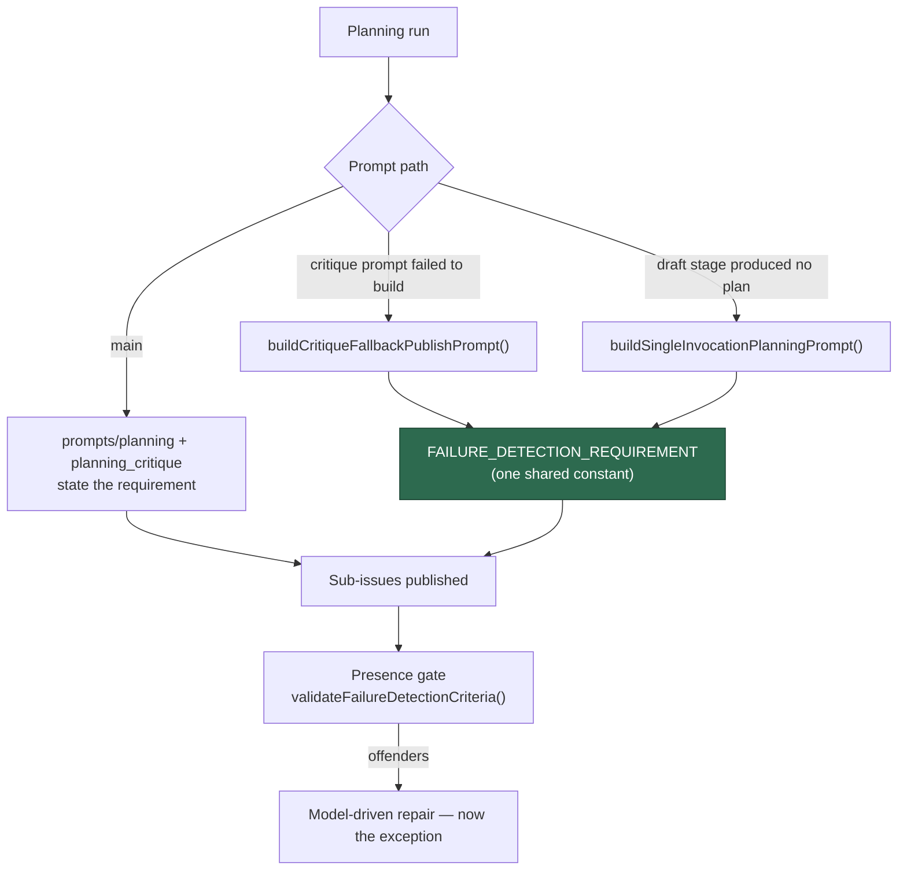

# Fallback publish prompts now carry the `## Failure Detection` requirement

## Summary

The `## Failure Detection` instruction existed only on the **main** publish path
(`prompts/planning/v21.md`, `prompts/planning_critique/v5.md`). The two in-code
fallback publish prompts in `worker/deno/lib/planning_processor.ts` never
mentioned the criterion, so any run that degraded to a fallback published a whole
plan of presence-gate offenders — the 8/8 and 3/3 shapes observed — and each one
cost a model-driven repair call inside the Planning handler's watchdog budget.

This adds one exported constant, `FAILURE_DETECTION_REQUIREMENT` (next to
`RESERVED_LABEL_PROHIBITION`), interpolated by both fallback builders:

- `buildCritiqueFallbackPublishPrompt()` — used when `buildPlanningCritiquePrompt()`
  fails to build.
- `buildSingleInvocationPlanningPrompt()` — the single-invocation fallback used
  when the draft stage produced no usable plan.

The wording states the section, the concrete test / CI gate / alert criterion, the
`N/A — <reason>` escape hatch, that a bracketed placeholder does not count, and
that both the `## Failure Detection` heading and the bolded
`**Failure detection:**` shape are accepted — matching what
`validateFailureDetectionCriteria()` in `worker/deno/lib/failure_detection_gate.ts`
actually implements. One constant means the two fallbacks cannot drift apart, nor
from the gate.

Prompt-only change to two fallback paths; no gate or handler behaviour changed.

Closes #61.

## Evidence

Backend/CLI change with no web interface to screenshot — evidence is the test
suite. Where the requirement now sits relative to the existing backstops:



Negative control — with the two `${FAILURE_DETECTION_REQUIREMENT}`
interpolations removed, the new prompt assertion fails:

```
fallback publish prompts carry the shared Failure-Detection requirement (Issue #61) => ./tests/planning_processor_test.ts:4141:6
FAILED | 2 passed | 1 failed
```

With the change in place:

```
ok | 165 passed | 0 failed (205ms)
```

(`planning_processor_test.ts`, `reserved_label_warning_v2826_test.ts`,
`comment_header_forgery_test.ts`, `failure_detection_gate_test.ts`.)

`./quality.sh` passes every check except `deno tests`, which reports **7
pre-existing environment-dependent failures** unrelated to this change
(`fleet_health_test.ts`, `optional_feature_env_test.ts`,
`setup_workdir_reminder_test.ts`). Verified pre-existing: the same 7 fail on a
stashed, clean tree at the same commit.

## Test Plan

Added to `worker/deno/tests/planning_processor_test.ts`:

- **`fallback publish prompts carry the shared Failure-Detection requirement
  (Issue #61)`** — asserts both `buildSingleInvocationPlanningPrompt()` and
  `buildCritiqueFallbackPublishPrompt()` output contains the shared constant, so
  either builder losing it fails CI.
- **`FAILURE_DETECTION_REQUIREMENT - names the section, the N/A escape hatch and
  the placeholder rule (Issue #61)`** — pins the constant's wording to the
  `## Failure Detection` heading, the `N/A — <reason>` escape hatch, the bolded
  `**Failure detection:**` shape, and the "does NOT count as filled" rule.
- **`FAILURE_DETECTION_REQUIREMENT - the shapes it promises are the shapes the
  gate implements (Issue #61)`** — the drift catcher: feeds template-shaped
  bodies through `validateFailureDetectionCriteria()` and asserts the gate
  accepts a concrete criterion, an `N/A — <reason>` line and the bolded shape,
  and rejects both a missing section and the bracketed placeholder **extracted
  from the constant itself**. Changing the prompt to describe something the gate
  would still reject fails here.

Docs: `docs/workflows/planning-and-questions.md` — the "Pre-publish prevention"
section now records that both in-code fallbacks carry the requirement from the
one shared constant.
