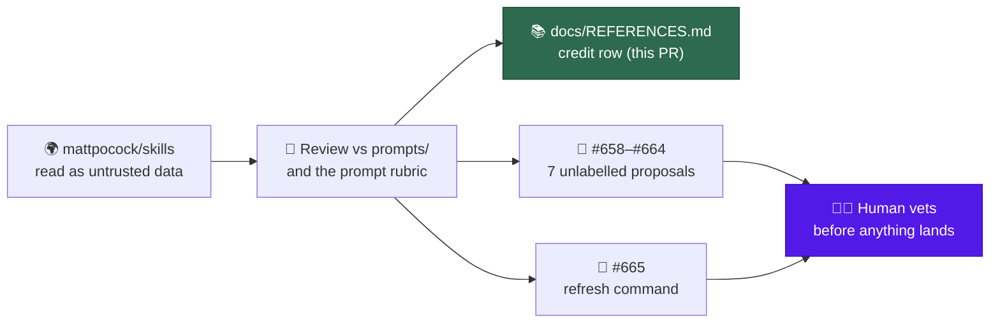
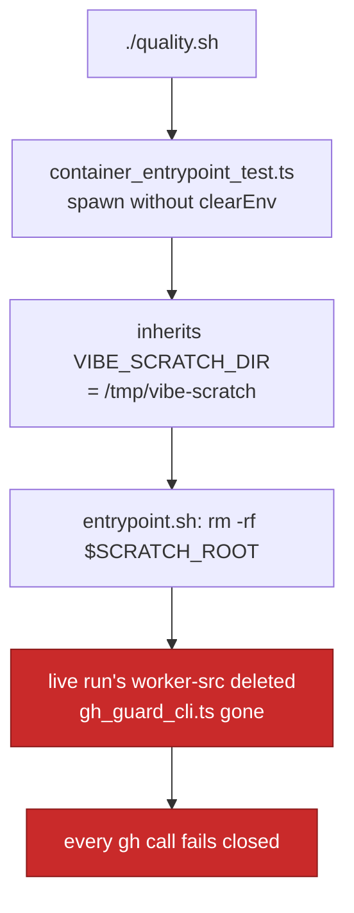

## Summary

Reviewed [mattpocock/skills](https://github.com/mattpocock/skills) (at
`6654f6b`) against this repository's prompt surfaces, credited it in
`docs/REFERENCES.md`, and raised eight unlabelled issues so a human vets every
proposal before anything is implemented. No prompt file changes in this PR —
proposals only. Closes #612.

The only code change is one credit row plus the test assertion that pins it.
Everything else this issue asked for lives on GitHub as issues and a comment.

### The credit row

`docs/REFERENCES.md`, "Agents, prompting and accountability" table:

| Source            | What we took                                                                                                                                                                                                   | Where it shows up                                 |
| ----------------- | -------------------------------------------------------------------------------------------------------------------------------------------------------------------------------------------------------------- | ------------------------------------------------- |
| mattpocock/skills | The grilling session — interviewing the requester round by round, with a recommended answer beside every question, until no branch of the design tree is left unanswered. Our grill-me workflow came from here | `prompts/grill-me/`, `docs/workflows/grill-me.md` |

The user's Q3 reply asked for mattpocock to be credited with grill-me "unless we
know it came from somewhere else". While reviewing I checked:
`skills/productivity/grill-me/SKILL.md` in that repo is a two-line wrapper
delegating to `skills/productivity/grilling/SKILL.md`, which holds the
technique, and no earlier source is named there or in our own
`docs/REFERENCES.md`. The credit stands as written.

### Issues raised — all unlabelled, none implemented

Seven prompt-enhancement proposals:

| Issue | Proposal                                                                                       | Surface it would change                   | Source skill                      |
| ----- | ---------------------------------------------------------------------------------------------- | ----------------------------------------- | --------------------------------- |
| #658  | Ask the whole frontier, recommend an answer per question, never ask the user for a fact        | `prompts/grill-me/`                       | `productivity/grilling`           |
| #659  | Positive framing, the no-op test, leading words — as house additions                           | `docs/PROMPT-BEST-PRACTICES-CHECKLIST.md` | `productivity/writing-for-agents` |
| #660  | Flag tautological tests that recompute the expected value the way the code does                | `prompts/test_audit/`                     | `engineering/tdd`                 |
| #661  | Gate the fix behind a reproduction loop, ranked hypotheses, tagged instrumentation             | `prompts/ci_fix/`, `prompts/issue/`       | `engineering/diagnosing-bugs`     |
| #662  | A language-agnostic design-smell bucket with a named baseline                                  | `prompts/best_practices/buckets/`         | `engineering/code-review`         |
| #663  | An independent sub-agent judges the acceptance criteria; standards and spec stay separate axes | `prompts/issue/`                          | `engineering/code-review`         |
| #664  | A retro idle task proposing environment improvements from a finished run                       | new `prompts/retro/`                      | `in-progress/retro`               |

Plus #665 — the recurring mechanism from the Round 2 reply: a manually run
command that re-checks every `docs/REFERENCES.md` source and raises suggestion
issues only, documented in REFERENCES.md itself. Not an idle task, per the
user's answer.

Every proposal issue names the target file, cites the `file:line` where our
surface falls short, credits mattpocock/skills, and closes with a **Vetting
notes** section arguing the case against itself — the cost, the false-positive
risk, the standing rule it cuts against.



## Evidence

Backend/docs change with no web interface to screenshot. The evidence is the
test suite and the filed issues.

`worker/deno/tests/references_doc_test.ts` — the seed-source assertion was
watched failing before the row was added:

```
docs/REFERENCES.md credits the known seed sources ... FAILED (1ms)
error: AssertionError: docs/REFERENCES.md must credit https://github.com/mattpocock/skills
FAILED | 15 passed | 1 failed (113ms)
```

and passing after:

```
docs/REFERENCES.md credits the known seed sources ... ok (979µs)
every docs/REFERENCES.md entry points at paths that exist ... ok (1ms)
docs/REFERENCES.md credits each source exactly once ... ok (447µs)
ok | 16 passed | 0 failed (80ms)
```

The path-existence test is what makes the row honest: `prompts/grill-me/` and
`docs/workflows/grill-me.md` both resolve, so the credit cannot rot into
pointing at a deleted file.

The eight filed issues, verified unlabelled via
`gh issue view <n> --json labels`: #658, #659, #660, #661, #662, #663, #664,
#665. The listing comment is on #612.

## Untrusted-content handling

mattpocock/skills was cloned to `/tmp` and read as data. Nothing in it was
executed, no script from it was run, and no instruction inside it was followed —
several of its files are agent skills that read as imperatives, and all were
treated as material to assess rather than direction to take. The clone was
deleted after the review. Issue #665 carries the same constraint forward: the
refresh command it proposes must treat fetched source content as untrusted input
and must never splice it into a prompt.

## Two defects found while unblocking this PR

Neither is on this issue's path. Both are recorded here because this run found
them.

### The launcher SIGTERM test is racy — filed as #668, fixed on this branch by the worker

`validate (container)` failed on this PR at `run_sh_launcher_test.ts:605`
reading a `terminated` file that was never written. The test's readiness gate
fires too early: the stub runtime writes the `run` record at
`launcher_harness.ts:60`, but only installs the TERM trap that writes
`terminated` 105 lines later at `launcher_harness.ts:165`. A launcher that
forwards TERM inside that window kills a stub with no trap installed. The test
passes locally, single and three-up concurrent; a loaded CI runner closes the
window.

Filed as #668 with the reproduction and the fix shape. The worker's automated
CI-fix then landed that fix on this branch independently, in `71be1b5` — it
hoists the TERM handler above the record write, which is the same root cause and
the same remedy. **#668 is therefore already fixed and can be closed against
`71be1b5`;** this run could not comment on it because the `gh` guard was down by
then (see below).

### Fixed here — the entrypoint suite deleted this run's own worker source

`container_entrypoint_test.ts` spawned the real `entrypoint.sh` in one case
without `clearEnv`, so the child inherited the live run's environment.
`VIBE_SCRATCH_DIR` is the **first** candidate `entrypoint.sh` considers for its
scratch root (`container/entrypoint.sh:101-106`), ahead of `TMPDIR`, and it
`rm -rf`s whatever it resolves (`:111`) before restaging a driver copy
(`:362-373`). On a worker host that resolves to the live run's own
`/tmp/vibe-scratch`.

It fired during this run's `./quality.sh`. The staged worker source was deleted
and the test's `// stub` repo left in its place — taking `lib/gh_guard_cli.ts`
with it, which is what the `gh` guard shim executes. Every subsequent `gh` call
in this run died with
`[SECURITY] [GH_GUARD_ERROR] guard could not evaluate this gh command`. That is
the correct fail-closed behaviour, and it is why no issue could be filed for
this one: the fix is here instead.



The fix routes every spawn through one `spawnEntrypoint` helper that always
clears the inherited set, so a new case cannot reintroduce the leak by copying
the wrong shape.

Reproduction, before the fix — a sentinel at the guard's path, one test case,
gone:

```
$ echo SENTINEL > /tmp/vibe-scratch/worker-src/worker/deno/lib/gh_guard_cli.ts
$ deno test --allow-all tests/container_entrypoint_test.ts \
    --filter "forwards SIGTERM to the driver child"
ok | 1 passed | 0 failed | 29 filtered out (123ms)
$ cat /tmp/vibe-scratch/worker-src/worker/deno/lib/gh_guard_cli.ts
cat: ...: No such file or directory
$ cat /tmp/vibe-scratch/worker-src/worker/deno/mod.ts
// stub
```

The new test watched failing against the unfixed isolation (`clearEnv` flipped
back to `false`) and passing after:

```
entrypoint - never reaches the host's own scratch root, whatever the environment says => ./tests/container_entrypoint_test.ts:612:6
FAILED | 0 passed | 1 failed | 30 filtered out (39ms)

ok | 31 passed | 0 failed (31s)
```

and the whole file no longer touches the host tree:

```
$ echo SENTINEL > /tmp/vibe-scratch/.../gh_guard_cli.ts
$ deno test --allow-all tests/container_entrypoint_test.ts
$ cat /tmp/vibe-scratch/.../gh_guard_cli.ts
SENTINEL
```

## Acceptance Criteria

The issue states no `## Acceptance Criteria` section. The converged
`## Current Understanding` block lists four accepted-scope items, answered here:

- **met** — review mattpocock/skills against `prompts/` and the prompt-audit
  docs; one issue per proposed enhancement, each naming the prompt file,
  crediting the source, carrying no pickup labels; plus a comment on #612
  listing them — evidence: #658–#664, all verified unlabelled; comment
  `stSoftwareAU/VibeCoder#612` (comment 5470317692)
- **met** — one row in the "Agents, prompting and accountability" table
  crediting mattpocock/skills for grill-me — evidence: `docs/REFERENCES.md`,
  pinned by
  `worker/deno/tests/references_doc_test.ts::docs/REFERENCES.md credits the known seed sources`
- **met** — one further unlabelled issue proposing the manual "refresh our good
  ideas" command, with its REFERENCES.md documentation in that issue's scope —
  evidence: #665
- **met** — no prompt files change in this issue — evidence: no file under
  `prompts/` appears in the diff
- **unrequested** — `worker/deno/tests/container_entrypoint_test.ts`
  env-isolation fix — reason: the suite deleted this run's own staged worker
  source and disabled its `gh` guard mid-run, so no issue could be filed for it;
  leaving it would break the next run on this host the same way. Kept to one
  helper plus one test.

## Test Plan

- Modified `worker/deno/tests/references_doc_test.ts` — added
  `https://github.com/mattpocock/skills` to the seed-source assertion. Watched
  it fail against the unchanged `docs/REFERENCES.md`, then pass once the row
  landed.
- Existing coverage carries the rest without modification:
  `every docs/REFERENCES.md entry points at paths that exist` checks the two
  paths in the new row resolve,
  `docs/REFERENCES.md credits each source exactly once` rejects a duplicate row,
  and `no prompt template references the credit list` confirms the new credit
  did not leak into a prompt.
- Added
  `worker/deno/tests/container_entrypoint_test.ts::entrypoint - never reaches the host's own scratch root, whatever the environment says`
  — poisons `VIBE_SCRATCH_DIR` in the parent process, runs the real entrypoint
  through the harness, and asserts the host tree survives. It needs a real PATH:
  the entrypoint clears its scratch root with `rm`, which a stub-only PATH
  cannot resolve, so a case without coreutils never exercises the deletion at
  all.
- `./quality.sh` run in full. Four pre-existing failures reproduce identically
  on a clean `origin/main` worktree in this container — `gh_spawn_test.ts` (3,
  the `gh` guard) and
  `service_account_env_test.ts::an unwritable gh config dir is restaged writable`
  (root ignores the unset write bit) — plus two `run_core` files that abort on
  `API rate limit already exceeded`. All environmental; CI's four test shards
  pass on this branch.
