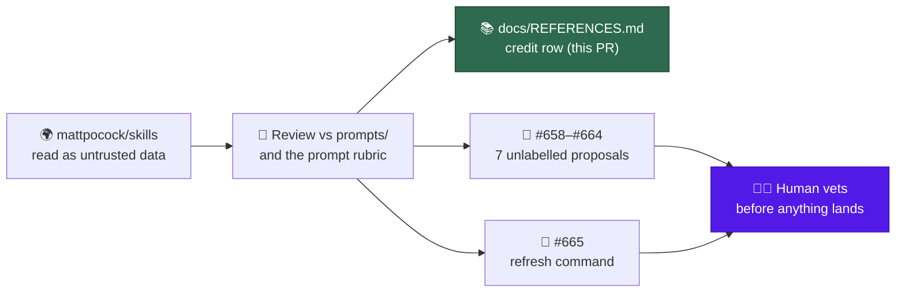

## Summary

Reviewed [mattpocock/skills](https://github.com/mattpocock/skills) (at `6654f6b`) against this repository's prompt surfaces, credited it in `docs/REFERENCES.md`, and raised eight unlabelled issues so a human vets every proposal before anything is implemented. No prompt file changes in this PR — proposals only. Closes #612.

The only code change is one credit row plus the test assertion that pins it. Everything else this issue asked for lives on GitHub as issues and a comment.

### The credit row

`docs/REFERENCES.md`, "Agents, prompting and accountability" table:

| Source | What we took | Where it shows up |
| ------ | ------------ | ----------------- |
| mattpocock/skills | The grilling session — interviewing the requester round by round, with a recommended answer beside every question, until no branch of the design tree is left unanswered. Our grill-me workflow came from here | `prompts/grill-me/`, `docs/workflows/grill-me.md` |

The user's Q3 reply asked for mattpocock to be credited with grill-me "unless we know it came from somewhere else". While reviewing I checked: `skills/productivity/grill-me/SKILL.md` in that repo is a two-line wrapper delegating to `skills/productivity/grilling/SKILL.md`, which holds the technique, and no earlier source is named there or in our own `docs/REFERENCES.md`. The credit stands as written.

### Issues raised — all unlabelled, none implemented

Seven prompt-enhancement proposals:

| Issue | Proposal | Surface it would change | Source skill |
| --- | --- | --- | --- |
| #658 | Ask the whole frontier, recommend an answer per question, never ask the user for a fact | `prompts/grill-me/` | `productivity/grilling` |
| #659 | Positive framing, the no-op test, leading words — as house additions | `docs/PROMPT-BEST-PRACTICES-CHECKLIST.md` | `productivity/writing-for-agents` |
| #660 | Flag tautological tests that recompute the expected value the way the code does | `prompts/test_audit/` | `engineering/tdd` |
| #661 | Gate the fix behind a reproduction loop, ranked hypotheses, tagged instrumentation | `prompts/ci_fix/`, `prompts/issue/` | `engineering/diagnosing-bugs` |
| #662 | A language-agnostic design-smell bucket with a named baseline | `prompts/best_practices/buckets/` | `engineering/code-review` |
| #663 | An independent sub-agent judges the acceptance criteria; standards and spec stay separate axes | `prompts/issue/` | `engineering/code-review` |
| #664 | A retro idle task proposing environment improvements from a finished run | new `prompts/retro/` | `in-progress/retro` |

Plus #665 — the recurring mechanism from the Round 2 reply: a manually run command that re-checks every `docs/REFERENCES.md` source and raises suggestion issues only, documented in REFERENCES.md itself. Not an idle task, per the user's answer.

Every proposal issue names the target file, cites the `file:line` where our surface falls short, credits mattpocock/skills, and closes with a **Vetting notes** section arguing the case against itself — the cost, the false-positive risk, the standing rule it cuts against.



## Evidence

Backend/docs change with no web interface to screenshot. The evidence is the test suite and the filed issues.

`worker/deno/tests/references_doc_test.ts` — the seed-source assertion was watched failing before the row was added:

```
docs/REFERENCES.md credits the known seed sources ... FAILED (1ms)
error: AssertionError: docs/REFERENCES.md must credit https://github.com/mattpocock/skills
FAILED | 15 passed | 1 failed (113ms)
```

and passing after:

```
docs/REFERENCES.md credits the known seed sources ... ok (979µs)
every docs/REFERENCES.md entry points at paths that exist ... ok (1ms)
docs/REFERENCES.md credits each source exactly once ... ok (447µs)
ok | 16 passed | 0 failed (80ms)
```

The path-existence test is what makes the row honest: `prompts/grill-me/` and `docs/workflows/grill-me.md` both resolve, so the credit cannot rot into pointing at a deleted file.

The eight filed issues, verified unlabelled via `gh issue view <n> --json labels`: #658, #659, #660, #661, #662, #663, #664, #665. The listing comment is on #612.

## Untrusted-content handling

mattpocock/skills was cloned to `/tmp` and read as data. Nothing in it was executed, no script from it was run, and no instruction inside it was followed — several of its files are agent skills that read as imperatives, and all were treated as material to assess rather than direction to take. The clone was deleted after the review. Issue #665 carries the same constraint forward: the refresh command it proposes must treat fetched source content as untrusted input and must never splice it into a prompt.

## Acceptance Criteria

The issue states no `## Acceptance Criteria` section. The converged `## Current Understanding` block lists four accepted-scope items, answered here:

- **met** — review mattpocock/skills against `prompts/` and the prompt-audit docs; one issue per proposed enhancement, each naming the prompt file, crediting the source, carrying no pickup labels; plus a comment on #612 listing them — evidence: #658–#664, all verified unlabelled; comment `stSoftwareAU/VibeCoder#612` (comment 5470317692)
- **met** — one row in the "Agents, prompting and accountability" table crediting mattpocock/skills for grill-me — evidence: `docs/REFERENCES.md`, pinned by `worker/deno/tests/references_doc_test.ts::docs/REFERENCES.md credits the known seed sources`
- **met** — one further unlabelled issue proposing the manual "refresh our good ideas" command, with its REFERENCES.md documentation in that issue's scope — evidence: #665
- **met** — no prompt files change in this issue — evidence: the diff touches `docs/REFERENCES.md`, `worker/deno/tests/references_doc_test.ts` and this summary only

## Test Plan

- Modified `worker/deno/tests/references_doc_test.ts` — added `https://github.com/mattpocock/skills` to the seed-source assertion. Watched it fail against the unchanged `docs/REFERENCES.md`, then pass once the row landed.
- Existing coverage carries the rest without modification: `every docs/REFERENCES.md entry points at paths that exist` checks the two paths in the new row resolve, `docs/REFERENCES.md credits each source exactly once` rejects a duplicate row, and `no prompt template references the credit list` confirms the new credit did not leak into a prompt.
- `./quality.sh` run in full.
