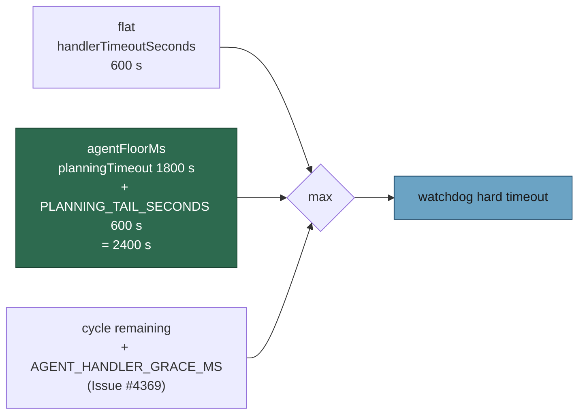

# Planning Mode's watchdog floor now covers the post-publish gate and repair tail

## Summary

Planning Mode is agent-backed, so its watchdog budget came from
`handlerHardTimeoutMs()`: the cycle remainder plus a 5-minute grace, but never
below the flat `handlerTimeoutSeconds` (600 s). Late in a cycle the remainder is
small and the budget collapsed onto that 600 s floor — **one third of the 1800 s
`planningTimeout` the handler wraps**, and blind to the post-publish tail that
runs inside the same handler (the Failure-Detection gate reads every published
sub-issue, then the self-repair makes one Claude call per offender). Observed on
`stSoftwareAU/GRQ-validation#835`: planning ~5 min, repair ~18 s × 8 ≈ 2.5 min,
watchdog abandoned the handler at 600 s with the repair 6/8 done.

A handler that keeps working after its agent returns now declares a **floor**:

- `PLANNING_TAIL_SECONDS = 600` — the named, documented allowance for planning's
  post-agent tail (a gate sweep plus a repair across ~25 sub-issues).
- `agentHandlerFloorMs(agentTimeoutSeconds, postAgentTailSeconds)` — derives the
  floor from the wrapped agent timeout plus that allowance.
- `PriorityHandler.agentFloorMs` — Planning Mode carries
  `agentHandlerFloorMs(config.planningTimeoutSeconds, PLANNING_TAIL_SECONDS)`
  = 2400 s. `RunCoreConfig.planningTimeoutSeconds` mirrors the operator's
  `planning_timeout`, so raising it widens the handler budget with it.
- `handlerHardTimeoutMs(..., agentFloorMs)` takes the floor as a further lower
  bound for agent-backed handlers only.

Invariant established: **an agent-backed handler's budget is never smaller than
the agent timeout it wraps plus that agent's post-agent tail allowance.**
Non-agent-backed handlers keep exactly the flat `handlerTimeoutSeconds`, the
Issue #4369 cycle-deadline-plus-grace bound still applies on top of the floor,
and abandonment still calls `deps.terminateActiveAgentRuns()` so nothing runs
detached. The change only makes that path rarer for planning; it does not change
what happens when it is reached.

Closes #62.

## Evidence

Backend/CLI change — no web interface to screenshot. Evidence is the test suite.

Budget resolution for an agent-backed handler after the change:



Red-then-green check — with the floor removed from `handlerHardTimeoutMs()`, the
three new behavioural cases fail; with it in place all 12 cases in the file pass:

```text
# floor removed from Math.max(...)
run_core watchdog - handlerHardTimeoutMs: an agent-backed budget is never below … FAILED
run_core watchdog - a wedged Planning Mode past the cycle deadline is abandoned … FAILED
run_core watchdog - a Planning Mode run whose post-publish repair tail outlives … FAILED
FAILED | 9 passed | 3 failed

# with the fix
ok | 12 passed | 0 failed (79ms)
```

Full gate: `./quality.sh < /dev/null` — every check PASSED except `deno tests`,
which reports 7 pre-existing failures unrelated to this change
(`fleet_health_test.ts`, `optional_feature_env_test.ts`,
`setup_workdir_reminder_test.ts` — all host-path/`HOME`-dependent). They fail
identically on the untouched milestone branch (`52 passed | 7 failed` with the
change stashed), so this PR neither introduces nor fixes them. Everything else:
`14472 passed`.

## Test Plan

Added to `worker/deno/tests/agent_run_termination_test.ts`:

- `handlerHardTimeoutMs: a non-agent handler ignores the agent floor and keeps
  exactly the flat handlerTimeoutSeconds (Issue #62)` — the "keep the flat
  budget unchanged" half of the acceptance criteria.
- `handlerHardTimeoutMs: an agent-backed budget is never below the wrapped agent
  timeout plus its tail allowance, at every cycle-remaining including zero and
  negative (Issue #62)` — the invariant case, swept over nine cycle remainders
  from a full cycle down to −3 600 000 ms; it also re-asserts the #4369 bound so
  the floor cannot be traded for it. This is the CI backstop for the
  GRQ-validation#835 mid-repair kill.
- `agentHandlerFloorMs derives the floor from the wrapped agent timeout plus the
  named tail allowance (Issue #62)` — including the negative-config edge case.
- `Planning Mode declares an agent floor of planningTimeout plus the tail
  allowance; handlers with no post-agent tail declare none (Issue #62)` — the
  dispatch table wiring.
- `a wedged Planning Mode past the cycle deadline is abandoned at the planning
  floor, not the flat 600 s, and its agent is still terminated (Issue #62)` —
  loop-level: proves the floor reaches the watchdog (the `[watchdog]` line reads
  `2400s`) and that `terminateActiveAgentRuns()` still fires on abandonment.
- `a Planning Mode run whose post-publish repair tail outlives the flat 600 s
  completes instead of being abandoned mid-repair (Issue #62)` — loop-level
  regression test for the observed failure: a 900 s planning + gate + repair now
  runs to completion with no abandonment logged.

Updated deliberately (not loosened): the existing Issue #4369 case is renamed to
`… for an agent-backed handler that declares no agent floor (Issue #4369)`. Its
assertions are unchanged — they describe a handler with no declared tail, which
still behaves exactly as before.

Unchanged backstops re-run green: `tests/run_core_watchdog_test.ts`,
`tests/handler_watchdog_test.ts`, `tests/run_core_test.ts`,
`tests/quorum_processor_test.ts`,
`tests/run_core_merge_conflict_dispatch_test.ts`,
`tests/pr_branch_update_integration_test.ts`, `tests/config_test.ts`,
`tests/config_defaults_test.ts` — 258 passed.

Docs updated: **DESIGN-PRINCIPLES.md** (Per-handler dispatch watchdog gains an
*Agent floor* bullet) and **docs/workflows/resilience-and-concurrency.md**.

## Pre-PR Security Self-Check

- Input validation: `agentHandlerFloorMs()` clamps a negative configuration to
  zero rather than shrinking the budget below the flat timeout.
- No secrets, no new dependencies, no new shell/SQL/HTTP surface, no
  user-facing output changes beyond an existing `[watchdog]` log line's number.
