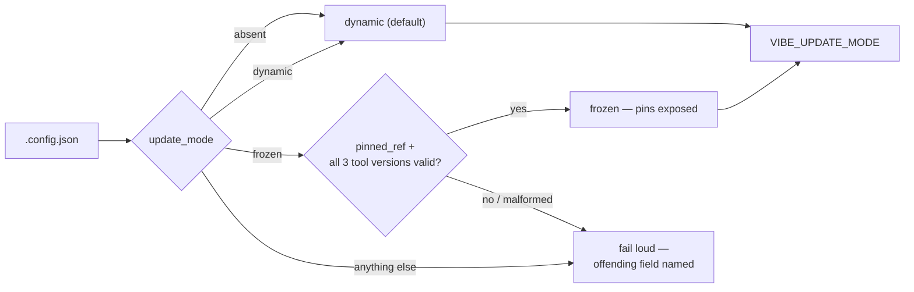

# Add update-mode fields to the `.config.json` schema

## Summary

Adds `update_mode`, `pinned_ref` and `pinned_tool_versions` to the
`.config.json` schema, with loading, fail-loud validation, a `dynamic` default
and a shell export, so the rest of #583 has one source of truth to read.
Closes #622.

Nothing acts on the pins yet — this sub-issue only makes them loadable and
validated, so it can land ahead of the checkout-freeze and tool-pinning parts.

- `worker/deno/types.ts` — `UpdateMode`, `PinnedToolVersions`, the three new
  `ConfigFile` keys and their resolved `WorkerConfig` counterparts.
- `worker/deno/lib/config_defaults.ts` — `DEFAULT_UPDATE_MODE` (`dynamic`),
  `UPDATE_MODES` and `PINNED_TOOLS`; the default `WorkerConfig` resolves to
  `dynamic`, so a host with no update-mode key behaves exactly as it does now.
- `worker/deno/lib/config.ts` — resolves the mode and carries the pins through
  in both modes, and validates at load time.
- `worker/deno/lib/config_validator.ts` — `validateUpdateModeSettings`: an
  unrecognised mode names the accepted values; `frozen` without `pinned_ref`
  or without any of the three tool versions names the missing field; blank
  values and values carrying whitespace or shell metacharacters are refused
  because they are later handed to `git` and to tool installers. `dynamic`
  ignores the pins rather than rejecting them, so a host can flip back without
  deleting them.
- `worker/deno/lib/validation.ts` / `config_unknown_keys.ts` — JSON-shape
  checks and the known-key set, so the new keys raise no unknown-key warning.
- `worker/deno/commands/load_config.ts` — exports `VIBE_UPDATE_MODE` so
  `run.sh` sees the resolved mode without re-parsing the JSON.
- `docs/CONFIGURATION.md` — the three keys in the settings table plus an
  "Update Mode" section with a worked frozen example and a flow diagram.

## Evidence

Backend/CLI change with no web interface to screenshot. The evidence is the
test suite: 25 tests in `worker/deno/tests/update_mode_config_test.ts`, each
loading a real temp `.config.json` through `loadConfig` (or running
`loadConfigCommand`) and asserting on the resolved config, the exported shell
line, or the thrown error message.

```text
deno test --allow-all tests/update_mode_config_test.ts
ok | 25 passed | 0 failed (17ms)
```

Resolution flow:



## Acceptance Criteria

- **met** — A `.config.json` with no update-mode keys loads with `update_mode`
  resolved to `dynamic` and no warning — evidence:
  `worker/deno/tests/update_mode_config_test.ts::update mode - absent keys
  resolve to dynamic with no pins` and `::update mode - the update-mode keys
  are recognised, so no unknown-key warning is raised`.
- **met** — `update_mode: "frozen"` with a `pinned_ref` and all three tool
  versions loads and exposes them — evidence:
  `worker/deno/tests/update_mode_config_test.ts::update mode - frozen with a
  ref and all three tool versions is exposed`.
- **met** — Each invalid case fails validation with a message naming the
  offending field — evidence: `worker/deno/tests/update_mode_config_test.ts`
  tests `::update mode - an unrecognised mode fails loud naming the accepted
  values`, `::update mode - frozen without a pinned ref fails loud`, `::update
  mode - frozen with a missing tool version names the tool`, `::update mode -
  frozen with a blank tool version names the tool`, `::update mode - a pinned
  ref carrying shell metacharacters fails loud`, `::update mode - a tool
  version carrying whitespace fails loud`.
- **met** — `dynamic` mode with stale pin fields present loads without error —
  evidence: `worker/deno/tests/update_mode_config_test.ts::update mode -
  dynamic ignores stale pin fields rather than rejecting them` and `::update
  mode - dynamic ignores a pin that would be rejected under frozen`.
- **partial** — Unit tests cover every case above and `./quality.sh` passes —
  evidence: `worker/deno/tests/update_mode_config_test.ts` (25 tests); every
  quality check passes except `deno tests` — reason: 36 pre-existing
  environment failures in `gh_spawn_test.ts`, `service_account_env_test.ts`,
  `run_core_test.ts` and `run_core_rate_limit_resume_test.ts` (a rate-limited
  `gh` and container-state paths inside this sandbox). The identical 36
  failures were reproduced on the unmodified milestone base in a clean
  worktree, so they are not caused by this change.
- **unrequested** — `docs/CONFIGURATION.md` gained the three key rows and an
  "Update Mode" section — reason: the repo's rule that a code change owes a
  docs change; `.config.json` keys are documented there, and the keys are
  meant to be hand-edited.
- **unrequested** — `VIBE_UPDATE_MODE` is exported by `load-config` — reason:
  the issue asks for the mode to be visible to `run.sh` without re-parsing the
  JSON; it is listed here because it is the one behavioural surface outside
  the schema itself.

## Test Plan

Added `worker/deno/tests/update_mode_config_test.ts` (25 tests):

- **Default and loading** — absent keys → `dynamic` with no pins; the default
  `WorkerConfig` and `DEFAULT_UPDATE_MODE`; the keys are in the known-key set;
  frozen with a SHA and with a tag name.
- **Dynamic ignores pins** — stale pins carried through; a pin that would be
  rejected under `frozen` loads fine under `dynamic`.
- **Fail-loud validation** — unrecognised mode, non-string mode, frozen
  without a ref, blank ref, missing tool version, no `pinned_tool_versions`
  block at all, blank tool version, shell metacharacters and command
  substitution in the ref, whitespace in a version, non-object
  `pinned_tool_versions`, non-string version.
- **Direct validator** — `validateUpdateModeSettings` accepts a complete pin
  and an absent mode, reports every missing tool once, and
  `validateConfigFull` rejects a malformed mode on an assembled config.
- **Shell export** — `loadConfigCommand` emits `VIBE_UPDATE_MODE` as `dynamic`
  by default and `frozen` when the host is pinned.
