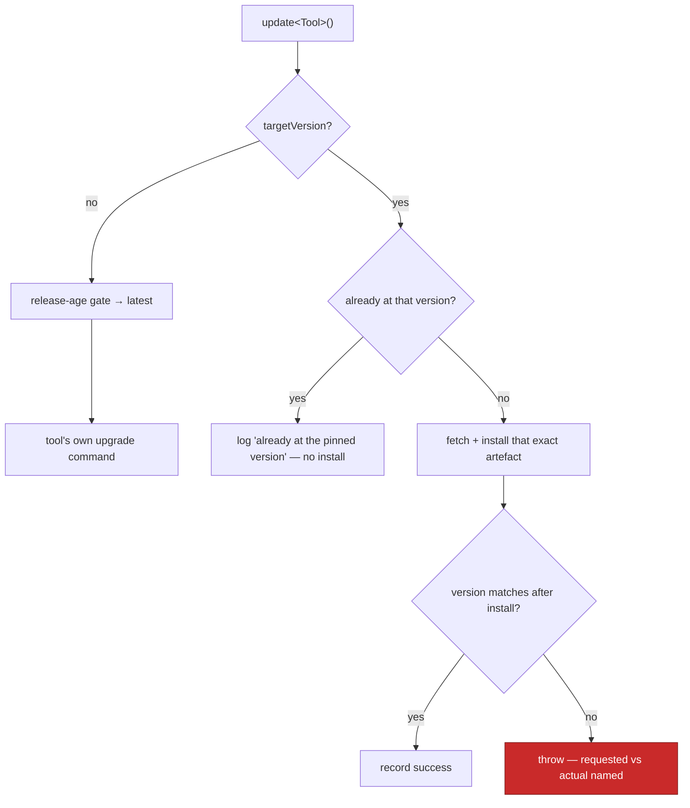

# Give the Claude CLI and `gh` updaters an exact-version install path

## Summary

`updateClaudeCli`, `updateGhCli` and `updateDeno` in
`worker/deno/lib/software_updates.ts` now accept an optional `targetVersion` on
their shared `ToolUpdateOptions` and install that exact version instead of
"whatever is latest". `claude update` and `brew upgrade gh` take no version
argument, so each pinned install fetches the artefact upstream published for
that version — following the pattern `container/Containerfile` already uses for
its pinned tools — while `deno upgrade <version>` (which already accepts one)
takes the requested version in place of the age-gate verdict.

With no `targetVersion` every path is unchanged: the release-age quarantine
resolves the candidate and the tool's own upgrade command runs. No caller passes
`targetVersion` yet — the sub-issue that reads `update_mode` and decides which
version to pass is separate. Closes #623.

| Tool       | Pinned install                                                                                                                  |
| ---------- | ------------------------------------------------------------------------------------------------------------------------------- |
| Claude CLI | `curl` the `@anthropic-ai/claude-code` tarball for that version, then `npm install -g --ignore-scripts <tarball>`                 |
| `gh`       | `curl` the `cli/cli` archive `gh_<version>_<os>_<arch>`, extract, `install` the binary over the `gh` already on PATH              |
| Deno       | `deno upgrade <version>`                                                                                                          |

Behaviour of the pinned path:

- **Already pinned → no work.** A tool reporting exactly that version is left
  alone with a log line saying so, so a launch does not reinstall every run.
- **Fails loud.** A failed install, an unreadable version afterwards, or a
  version that does not match throws, naming the requested and the actual
  version. The check reuses the existing `VERSION_COMMANDS` reader
  (`makeVersionReader`) rather than adding a second version reader.
- **The age gate is bypassed only when pinned.** It is the control for unpinned
  "latest" installs; a pinned version is an explicit choice. Unpinned callers
  keep the quarantine exactly as it was (Issue #3655).
- **Input is validated before it is used.** `targetVersion` is interpolated into
  a download URL and a command line, so only a plain semver is accepted — a
  shell-shaped value is refused before any command runs.

`resolveDynamicVersions()` reports what dynamic mode would install right now for
each of the three tools, resolved through the same release-age gate, for the
setup prompts to offer as their per-tool default.

## Evidence

Backend/CLI change — no web interface to screenshot. Evidence is the unit tests,
which drive every path through the injected `runFn`, so no test touches a real
network, registry or installer.

`worker/deno/tests/software_updates_test.ts` — 99 tests pass, including the 13
added here. No existing test was modified, removed or weakened; the only edit to
pre-existing content is the import list.

### Quality gate

`./quality.sh` is green on every check (prompt immutability, benchmark audit,
hardcoded branch names, needs-human chokepoint, gh spawn chokepoint, host
work-dir guard, git ref chokepoint, workflow hygiene, source targets, mermaid,
markdownlint, docs prompt versions, deno lint, deno type check, deno fmt) except
`deno tests`, which fails on **34 pre-existing failures in files this change
does not touch**: `tests/gh_spawn_test.ts` (3),
`tests/service_account_env_test.ts` (1), and uncaught errors in
`tests/run_core_test.ts` / `tests/run_core_rate_limit_resume_test.ts`. They are
environmental — the failing assertions spawn a real `gh`, and this run's GitHub
token is rate-limited
(`gh command failed: GraphQL: API rate limit already exceeded for user ID …`),
while `service_account_env_test.ts` reads the container's own
`.container-state/gh-config` instead of its temp dir.

Verified pre-existing: the base branch was checked out into a separate worktree
(`git worktree add /tmp/base-623 origin/milestone/583-update-mode-at-setup-dynamic-or-frozen-pinned`)
and those four files re-run there with none of this work applied — the same six
failure identities, byte-for-byte. `worker/deno/tests/software_updates_test.ts`
passes in full (99 passed, 0 failed).

## Acceptance Criteria

- **met** — `updateClaudeCli`, `updateGhCli` and `updateDeno` each install the
  exact requested version when `targetVersion` is given — evidence:
  `worker/deno/tests/software_updates_test.ts::updateClaudeCli - targetVersion installs that exact npm tarball`,
  `::updateGhCli - targetVersion installs that exact release archive`,
  `::updateDeno - targetVersion pins the upgrade instead of the gate verdict`
- **met** — with no `targetVersion` all three behave as before; existing tests
  pass unchanged — evidence: the 86 pre-existing tests in
  `worker/deno/tests/software_updates_test.ts` are unmodified and pass, plus
  `::updateDeno - no targetVersion still pins to the gate verdict`
- **met** — a tool already at the requested version is left alone, with a log
  line saying so — evidence:
  `::updateClaudeCli - a tool already at the pinned version is left alone`
  (asserts the only command run is `claude --version`)
- **met** — a version mismatch after install fails loud, naming requested and
  actual — evidence:
  `::updateClaudeCli - a version mismatch after install fails loud`;
  install failures covered by `::updateClaudeCli - a failed pinned install fails loud`
  and `::updateGhCli - an unlocatable gh binary fails loud`
- **met** — the "what would dynamic install now" helper returns a version per
  tool, or a clear failure — evidence:
  `::resolveDynamicVersions - reports what dynamic mode would install now` and
  `::resolveDynamicVersion - an unresolvable version is reported as a failure`
- **partial** — unit tests cover each path with the injected `runFn`, so no test
  touches a real network or installer; `./quality.sh` passes — evidence:
  `worker/deno/tests/software_updates_test.ts` (99 passed, every pinned path
  driven through `makePinnedRunner`) — reason: `./quality.sh` is green on all
  other checks, but `deno tests` fails on 34 pre-existing failures in unrelated
  files caused by this container's broken `gh` wrapper and a rate-limited token
  (verified by stashing this change and reproducing them)
- **met** — the release-age quarantine gate is untouched for unpinned installs —
  evidence: `worker/deno/lib/software_updates.ts` (the gate calls in the
  unpinned branches are unchanged) and the pre-existing quarantine tests

Note on reuse: the issue asks to reuse `verifyFloorAfterUpdate` and
`VERSION_COMMANDS` for the post-install check. `VERSION_COMMANDS` is reused
through `makeVersionReader`, so there is still exactly one version reader.
`verifyFloorAfterUpdate` implements floor semantics (installed **≥** floor, warn
and wait for the interval), which cannot express "exactly this version, throw on
mismatch"; `verifyPinnedVersion` is its sibling and shares the reader.

## Test Plan

Added to `worker/deno/tests/software_updates_test.ts` (all via injected `runFn`,
no real spawn, network or sleep):

- `updateClaudeCli - targetVersion installs that exact npm tarball` — asserts the
  tarball URL, `npm install -g --ignore-scripts <tarball>`, staged-file cleanup,
  the recorded success timestamp, and that `claude update` is never run
- `updateClaudeCli - a tool already at the pinned version is left alone`
- `updateClaudeCli - a version mismatch after install fails loud`
- `updateClaudeCli - a failed pinned install fails loud`
- `installPinnedVersion - a malformed version is refused before any command`
- `updateGhCli - targetVersion installs that exact release archive` — asserts the
  `cli/cli` URL, the `install -m 0755` destination taken from the located `gh`,
  and that neither brew nor the extension sweep runs
- `updateGhCli - an unlocatable gh binary fails loud`
- `ghReleaseArchive - names the published archive per platform` — Linux tarball,
  macOS zip, unsupported OS and arch
- `updateDeno - targetVersion pins the upgrade instead of the gate verdict`
- `updateDeno - no targetVersion still pins to the gate verdict` — the
  unchanged path
- `resolveDynamicVersions - reports what dynamic mode would install now`
- `resolveDynamicVersion - an unresolvable version is reported as a failure`
- `versionMatchesExactly - exact match, mismatch, and unparseable`

Docs: `docs/INTERNALS.md` gains an "Exact-version installs" subsection under
software auto-update, with the per-tool install table and a Mermaid flowchart of
the pinned path.
