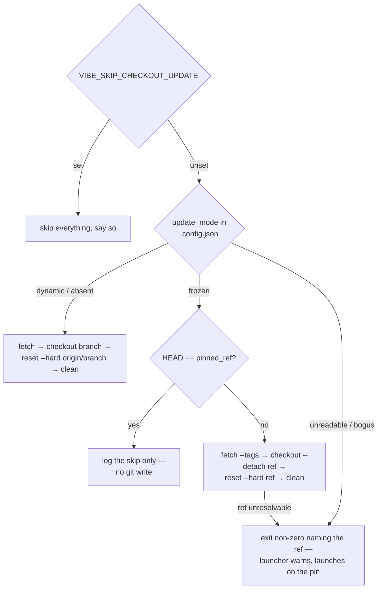

# Frozen mode: hold the worker checkout at the pinned ref before launch

## Summary

`worker-checkout-update` resets the worker checkout to the tip of the default
branch before every container launch, which would drag a frozen host straight
off its pin. It now reads `update_mode` and `pinned_ref` from `.config.json`
under `--base-dir` — it runs before the configuration load, and that file lives
at the checkout root — and in `frozen` mode holds the checkout at the pinned
ref instead, saying so in `run_core.log` rather than skipping silently.
Closes #624.

- **`dynamic`, or no `update_mode`** — byte-for-byte the update it always was:
  `git fetch origin` → `git checkout <branch>` → `git reset --hard
  origin/<branch>` → `git clean -fd`, logged as before.
- **`frozen`** — `git fetch --tags origin` (so a tag pushed since the last
  launch resolves), then `git checkout --force --detach <ref>` → `git reset
  --hard <ref>` → `git clean -fd`. A commit SHA and a tag are both accepted,
  the checkout is left on that ref with a detached HEAD, and
  `origin/<branch>` is never consulted.
- **Already on the pin** — when `HEAD` resolves to `pinned_ref` there is no
  fetch, no checkout and no clean; only the log line. A launch does not churn
  the tree.
- **Fail loud** — an unresolvable `pinned_ref`, an unreadable or malformed
  `.config.json`, an unrecognised `update_mode`, or `frozen` with no usable
  `pinned_ref` exits non-zero naming the offending value and telling the
  operator to correct `.config.json`. `run.sh` warns on that exit and launches
  on the existing checkout — which is still the pinned one. Resolving a bad
  config quietly to `dynamic` would have reset a host that asked to be pinned,
  so it is refused instead.
- **Crash-loop escalation is shared** — a pin that keeps failing counts in the
  same `checkout-update-failure-streak` and raises the same one-per-streak
  GitHub issue (Issue #4204).
- **`VIBE_SKIP_CHECKOUT_UPDATE` is untouched** — it is checked first, wins over
  both modes, and keeps its existing message.

`pinned_ref` is validated with the same allowlist the config loader uses
(`pinValueErrors`, exported for this caller rather than copied), so a
hand-edited value carrying whitespace or shell metacharacters never reaches
git.

## Evidence

Backend/CLI change — no web interface to screenshot. The evidence is the two
Deno test suites, both run against real temporary git repositories (command
level) and injected `CheckoutUpdateDeps` (library level):

```text
deno test --allow-all tests/worker_checkout_update_test.ts tests/checkout_update_test.ts
ok | 42 passed | 0 failed (3s)
```

`./quality.sh` reports every check PASSED except `deno tests`, which fails on
36 pre-existing environment failures in `tests/gh_spawn_test.ts`,
`tests/service_account_env_test.ts`, `tests/run_core_test.ts` and
`tests/run_core_rate_limit_resume_test.ts` (discarded-stream handling, an
"unwritable" directory this container can still write to, and a dangling
rate-limit promise). Running those four files on the base commit in a separate
worktree reproduces the same `FAILED | 36 failed` set, so none of them come
from this change; the whole rest of the 16,083-test suite passes.



## Acceptance Criteria

- **met** — With `update_mode` absent or `dynamic`, the update sequence and its
  logging are unchanged — evidence:
  `worker/deno/tests/checkout_update_test.ts::updateCheckout - an absent update
  mode is dynamic and unchanged (Issue #624)` (asserts the
  `Updating <dir> to origin/trunk` log line and that no pinned path runs), plus
  `worker/deno/tests/worker_checkout_update_test.ts::dynamic mode in
  .config.json is the update it always was` and the ten pre-existing command
  tests, all still passing untouched.
- **met** — With `update_mode: "frozen"` and a `pinned_ref` tag, the checkout
  ends at that tag and `run_core.log` carries the skip line naming mode and ref
  — evidence: `worker/deno/tests/worker_checkout_update_test.ts::frozen holds
  the checkout at a pinned tag (Issue #624)`, which pushes a `v1.0.0` tag,
  moves the default branch on, and asserts `HEAD` is the tagged commit, the
  branch is detached, and the log line is present.
- **met** — The same holds for a `pinned_ref` given as a commit SHA — evidence:
  `worker/deno/tests/worker_checkout_update_test.ts::frozen holds the checkout
  at a pinned commit SHA (Issue #624)`.
- **met** — A checkout already at the pinned ref does no git write, and still
  logs — evidence: `worker/deno/tests/worker_checkout_update_test.ts::frozen
  leaves a checkout already on the pin untouched (Issue #624)` (an untracked
  scratch file survives a launch that would otherwise clean it) and
  `worker/deno/tests/checkout_update_test.ts::frozen does no git write when
  HEAD is already the pin (Issue #624)` (asserts not even a fetch runs).
- **met** — An unresolvable `pinned_ref` exits non-zero with a message naming
  the ref; `run.sh` warns and launches on the existing checkout — evidence:
  `worker/deno/tests/worker_checkout_update_test.ts::frozen fails loud on a
  pinned ref that does not resolve (Issue #624)` (the command fails, names the
  ref, and leaves `HEAD` where it was) and the unchanged `run.sh` warn-only
  handling at `run.sh:277-286`.
- **met** — `VIBE_SKIP_CHECKOUT_UPDATE` still skips everything, in both modes,
  with its existing message — evidence: the two pre-existing skip tests plus
  `worker/deno/tests/worker_checkout_update_test.ts::VIBE_SKIP_CHECKOUT_UPDATE
  wins over frozen mode (Issue #624)`.
- **met** — Unit tests in `worker/deno/tests/checkout_update_test.ts` and
  `worker/deno/tests/worker_checkout_update_test.ts` cover the above through
  the injected `CheckoutUpdateDeps`; `./quality.sh` passes — evidence: 42 tests
  across the two files (10 new in the library suite, 12 new in the command
  suite), the new frozen dependencies (`fetchOrigin`, `resolveCommit`,
  `readHeadCommit`, `checkoutPinnedRef`) all injected through
  `CheckoutUpdateDeps`, and a clean `./quality.sh` run.
- **unrequested** — `git checkout --force` (rather than a plain `--detach`) on
  the pinned path — reason: without `--force` a dirty checkout that has drifted
  off the pin refuses the checkout and the host silently stays off its pin;
  covered by `worker/deno/tests/worker_checkout_update_test.ts::frozen moves a
  dirty checkout that has drifted off the pin (Issue #624)`.
- **unrequested** — `pinValueErrors` in `worker/deno/lib/config_validator.ts`
  changed from private to exported — reason: the command validates the
  hand-edited `pinned_ref` with the loader's own allowlist instead of a second
  copy of the pattern.
- **unrequested** — comment-only edits in `run.sh` and the doc updates in
  `docs/CONFIGURATION.md`, `docs/CONTAINER.md` and `docs/INTERNALS.md` —
  reason: all three describe the pre-launch update as an unconditional reset to
  the default branch, which is no longer true for a frozen host.

## Test Plan

`worker/deno/tests/checkout_update_test.ts` (10 added, all through injected
`CheckoutUpdateDeps`):

- frozen holds the checkout at the pinned ref and never resets to origin
- frozen logs the skipped update with its mode and ref
- frozen accepts a commit SHA as the pin
- frozen does no git write when `HEAD` is already the pin
- frozen fails loud on a pinned ref that does not resolve
- frozen escalates a pin that keeps failing to resolve
- frozen with no pinned ref fails loud naming the field
- frozen still pins when the fetch fails but the ref resolves locally
- frozen fails loud when the fetch fails and the ref is unknown locally
- an absent update mode is dynamic and unchanged

`worker/deno/tests/worker_checkout_update_test.ts` (12 added, each against a
real temporary remote + clone):

- frozen holds the checkout at a pinned tag / at a pinned commit SHA
- frozen leaves a checkout already on the pin untouched
- frozen moves a dirty checkout that has drifted off the pin
- frozen fails loud on a pinned ref that does not resolve
- dynamic mode in `.config.json` is the update it always was
- a `.config.json` without `update_mode` is dynamic
- an unreadable update mode fails loud rather than resetting a pinned host
- an unrecognised `update_mode` names the accepted values
- frozen without a `pinned_ref` fails loud naming the field
- a `pinned_ref` carrying shell metacharacters is refused
- `VIBE_SKIP_CHECKOUT_UPDATE` wins over frozen mode
