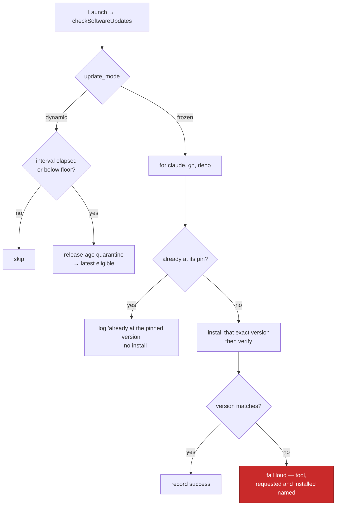

# Frozen mode installs the pinned Claude CLI, `gh` and Deno versions at launch

## Summary

`checkSoftwareUpdates` now honours `update_mode`. In `dynamic` mode — the
default and what every existing host does — nothing changes: the interval gate,
the version floors and the release-age quarantine behave exactly as before. In
`frozen` mode the three tools are installed at the exact versions named in
`pinned_tool_versions`, using the pinned-install path added in #623, so editing
those versions by hand and relaunching is all it takes to move a frozen host.
Closes #625.

The mode and its pins reach every entry point through the one shared builder
`softwareUpdateOptionsFromEnv(config)`, which the `run-bootstrap` command,
`run_worker`, the run-core production deps and the `software-updates` command
already call — so no call site had to learn about update modes individually.

Behaviour of the frozen path:

- **Runs at launch, not on the weekly cadence.** The interval and floor gates
  are dynamic-mode machinery; a pin is the operator's recorded decision and the
  edit must take effect on the next launch. A tool already at its pin costs one
  `--version` read and installs nothing.
- **One log line per tool** — `Claude CLI pinned to 2.0.76 (update_mode=frozen)`
  — so a launch never leaves the operator guessing why nothing updated.
- **The release-age quarantine is deliberately out of this path.** It exists to
  keep a just-published, possibly hijacked release out of an unattended "latest"
  pull; a frozen version is a human's deliberate choice recorded in config. The
  reasoning is recorded in the code comment beside the branch, and the version
  is logged at install so the choice stays auditable.
- **Fails loud.** A failed install, an unverifiable version or a mismatch throws
  through #623's verification, naming the tool, the requested version and the
  installed one. A tool with no pin at all also throws rather than being left to
  drift (config load already refuses a half-pinned frozen host; this is defence
  in depth). A tool suppressed by `SKIP_CLAUDE_UPDATE` and friends is reported
  as a warning naming the pin it is not being held to — never silently skipped.

## Evidence

Backend/CLI change — no web interface to screenshot. The evidence is the unit
tests: every path is driven through an injected `runFn`, so no test touches a
real network, registry or installer.

The seven new tests were observed failing against the unmodified
`lib/software_updates.ts` (five frozen-path tests fail; the dynamic-mode test
passes, which is the point — it asserts unchanged behaviour) and passing after
the change. `deno test tests/software_updates_test.ts` — 106 passed, 0 failed.
No existing test was modified, removed or weakened.

## Acceptance Criteria

- **met** — With `update_mode` absent or `dynamic`, `checkSoftwareUpdates`
  behaves exactly as today — evidence:
  `worker/deno/tests/software_updates_test.ts::checkSoftwareUpdates - dynamic mode ignores leftover pins`,
  plus the 99 pre-existing tests in that file passing unchanged.
- **met** — With `update_mode: "frozen"`, each of Claude CLI, `gh` and Deno is
  installed at the version named in `pinned_tool_versions` — evidence:
  `worker/deno/tests/software_updates_test.ts::checkSoftwareUpdates - frozen mode installs each tool at its pin`
  (asserts the exact npm tarball URL, the exact `cli/cli` archive and
  `deno upgrade 2.5.4`).
- **met** — Tools already at their pinned versions produce no install and a log
  line saying so — evidence:
  `worker/deno/tests/software_updates_test.ts::checkSoftwareUpdates - frozen tools already at their pins install nothing`
  (the only commands run are the three `--version` reads).
- **met** — Each pinned install emits a log line naming tool and version —
  evidence: the same "installs each tool at its pin" test asserts the three
  `<tool> pinned to <version> (update_mode=frozen)` lines;
  `installFrozenToolVersions` in `worker/deno/lib/software_updates.ts` emits
  them.
- **met** — A failed or mismatched pinned install fails loud, naming the tool,
  the requested version and the actual one — evidence:
  `worker/deno/tests/software_updates_test.ts::checkSoftwareUpdates - a frozen install that misses its pin fails loud`
  and `::checkSoftwareUpdates - frozen mode without a pin for a tool fails loud`.
- **met** — Unit tests cover dynamic and frozen paths with an injected runner;
  `./quality.sh` passes — evidence: the seven tests added to
  `worker/deno/tests/software_updates_test.ts`, all driven through `runFn`; the
  quality-gate result is recorded below.
- **unrequested** — `worker/deno/lib/run_core_production_deps.ts` now logs the
  error instead of swallowing it in `checkSoftwareUpdates`'s `catch` — reason:
  that empty `catch` would have hidden a frozen host's failed pinned install
  entirely, defeating the issue's fail-loud requirement; the step stays
  best-effort for the cycle, it is just no longer silent.
- **unrequested** — the per-tool updater map and the `claude → gh → deno` tool
  order are now module-level constants (`TOOL_UPDATERS`, `UPDATE_TOOLS`) —
  reason: the frozen path needs the same map and order the dynamic loop uses,
  and two copies would drift.

## Test Plan

Added to `worker/deno/tests/software_updates_test.ts` (all with an injected
`runFn`; no real command, network or installer is touched):

- `checkSoftwareUpdates - frozen mode installs each tool at its pin` — the exact
  artefact per tool, the three log lines, per-tool success timestamps recorded,
  and installs proceeding through a gate that blocks every channel (proving the
  quarantine is out of the frozen path) even with the weekly interval not
  elapsed.
- `checkSoftwareUpdates - frozen tools already at their pins install nothing` —
  only the three `--version` reads run.
- `checkSoftwareUpdates - a frozen install that misses its pin fails loud` —
  rejects naming the tool, the requested and the installed version.
- `checkSoftwareUpdates - frozen mode without a pin for a tool fails loud` —
  rejects naming the tool and `pinned_tool_versions.gh`, and stops before the
  next tool.
- `checkSoftwareUpdates - a suppressed frozen tool is reported, not silently pinned`
  — `skipClaude` warns naming the pin and `SKIP_CLAUDE_UPDATE`.
- `checkSoftwareUpdates - dynamic mode ignores leftover pins` — a host with
  stale pins still runs `claude update` and the gate-resolved
  `deno upgrade 9.9.9`, and downloads nothing.
- `softwareUpdateOptionsFromEnv - carries the update mode and its pins` — the
  shared builder threads both fields; an unset mode stays undefined.

Documentation: `docs/CONFIGURATION.md` — the Update Mode section gains a bullet
describing what a frozen launch does, and a Mermaid diagram of the
dynamic-versus-frozen decision.

### Quality gate

`./quality.sh` is green on every check (prompt immutability, benchmark audit,
hardcoded branch names, needs-human chokepoint, gh spawn chokepoint, host
work-dir guard, git ref chokepoint, workflow hygiene, source targets, mermaid,
markdownlint, docs prompt versions, deno lint, deno type check, deno fmt)
except `deno tests`, which reports **33 pre-existing failures in files this
change does not touch**: uncaught errors in `tests/run_core_test.ts` and
`tests/run_core_rate_limit_resume_test.ts`
(`gh command failed: GraphQL: API rate limit already exceeded for user ID …`)
and `tests/service_account_env_test.ts::applyServiceAccountEnv - an unwritable
gh config dir is restaged writable`, which asserts a `/tmp` path while the
container resolves `/home/vibe/auto-issue-work/.container-state/gh-config`.
16,072 tests pass. Verified environmental, not caused here: reverting both
production files to their pre-change state and re-running those three files
reproduces the identical 33 failures.
