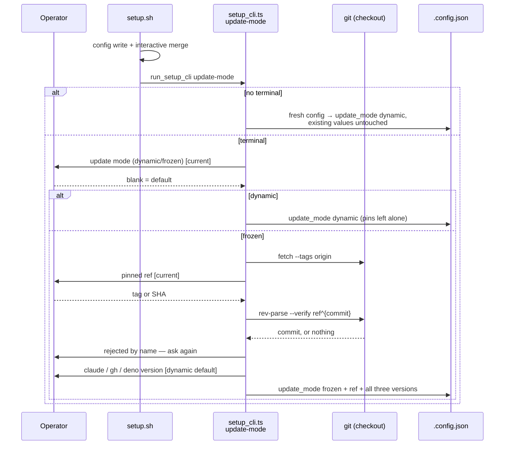

# Ask for the update mode, pinned ref and pinned tool versions at setup

## Summary

Setup now asks how this host tracks Vibe Coder releases, and records the
answer. A new `update-mode` subcommand under `worker/deno/setup/` owns the
whole conversation — the prompts, the ref validation and the merge into
`.config.json` — and `setup.sh` delegates to it in the same shape as
`run.sh` → `worker-checkout-update`, keeping no mode logic of its own.

The conversation:

1. **Update mode** — `dynamic` or `frozen`, defaulting to `dynamic` and, on a
   re-run, to whatever the host already says. Blank accepts the default.
   `dynamic` ends the conversation and writes `update_mode: "dynamic"`.
2. **Pinned ref** — a commit SHA or tag, validated by fetching origin and
   resolving it in this very checkout (`git rev-parse --verify <ref>^{commit}`).
   A ref that does not resolve is rejected with a message naming it and the
   prompt is asked again; nothing invalid is written.
3. **Tool versions** — one prompt each for the Claude CLI, `gh` and Deno, each
   defaulting to the version `dynamic` mode would install today, resolved
   through the `resolveDynamicVersions` helper added in #623.

A run with no terminal never prompts: existing update-mode values are left
untouched and a fresh config is defaulted to `dynamic`. `setup.ps1` is
unchanged — the Windows counterpart is a follow-up, which is exactly what
putting the logic in the Deno command buys.

Closes #626.

## Evidence

Backend/CLI change with no web interface to screenshot. The evidence is the
unit suite: 18 tests in `worker/deno/tests/setup_update_mode_test.ts` drive the
real command with injected input, injected git and an injected dynamic-version
resolver, asserting on what actually lands in a temporary `.config.json` — no
terminal, no network, no real checkout.

```
deno test --allow-all tests/setup_update_mode_test.ts
ok | 18 passed | 0 failed (14ms)
```

Where the conversation sits in the setup sequence:



## Acceptance Criteria

- **met** — A fresh interactive setup that accepts the defaults writes
  `update_mode: "dynamic"` and no pin fields — evidence:
  `worker/deno/tests/setup_update_mode_test.ts::runUpdateModeSetup - accepting the defaults writes dynamic and no pins`
- **met** — Choosing frozen and supplying a valid tag writes
  `update_mode: "frozen"` with that `pinned_ref` and all three
  `pinned_tool_versions` — evidence:
  `worker/deno/tests/setup_update_mode_test.ts::runUpdateModeSetup - frozen with a valid tag writes the ref and all three versions`
- **met** — The same holds for a commit SHA — evidence:
  `worker/deno/tests/setup_update_mode_test.ts::runUpdateModeSetup - frozen accepts a commit SHA`
- **met** — A ref that does not resolve is rejected with a message naming it,
  and nothing invalid is written — evidence:
  `worker/deno/tests/setup_update_mode_test.ts::runUpdateModeSetup - an unresolvable ref is rejected by name and asked again`
  and `::runUpdateModeSetup - a ref that never resolves writes nothing at all`
- **met** — Blank answers at the tool-version prompts store the versions
  dynamic mode would install today — evidence: the same frozen-tag test, whose
  three blank answers store the injected resolver's `2.0.76` / `2.62.0` /
  `2.5.4`
- **met** — A non-interactive setup run neither prompts nor changes existing
  update-mode values — evidence:
  `worker/deno/tests/setup_update_mode_test.ts::runUpdateModeSetup - a non-interactive run neither prompts nor changes existing values`
  (its injected `ask` throws if called) and
  `::runUpdateModeSetup - a non-interactive fresh config defaults to dynamic`
- **met** — Re-running setup on a frozen host and pressing Enter throughout
  leaves `.config.json` unchanged — evidence:
  `worker/deno/tests/setup_update_mode_test.ts::runUpdateModeSetup - re-running on a frozen host and pressing Enter changes nothing`
  (asserts the file text is byte-for-byte identical)
- **met** — Unit tests cover the prompt/validation/write logic with injected
  input and git; `./quality.sh` passes — evidence: the 18-test file above, all
  driving `runUpdateModeSetup` through injected dependencies

Changes beyond the criteria, and why each is here:

- **unrequested** — `docs/SETUP.md` gains the update-mode phase (and the
  following phases are renumbered), and `docs/CONFIGURATION.md` gains a bullet
  under Update Mode — reason: a code change owes a docs change; the setup
  sequence and the config reference both described a setup that did not ask.
- **unrequested** — a `setup.sh` delegation test in the same test file —
  reason: the issue's own requirement is that the shell keeps no mode logic, so
  the contract is asserted rather than assumed.

## Test Plan

- Added `worker/deno/tests/setup_update_mode_test.ts` (18 tests):
  - dynamic by default, and dynamic leaving stale pins in place
  - frozen with a tag, and frozen with a commit SHA
  - an unresolvable ref rejected by name then re-asked; a ref that never
    resolves writing nothing at all
  - a ref carrying shell metacharacters refused before git sees it
  - an unresolvable version default reported, then typed by hand
  - a failed fetch reported, with a local ref still pinning
  - a frozen re-run of blank answers leaving the file byte-identical
  - non-interactive runs: existing values untouched, fresh config defaulted to
    `dynamic`, a missing file created
  - malformed JSON failing loud instead of being overwritten; an unrecognised
    `update_mode` failing loud; the written file staying at mode `0600`
  - `setup.sh` delegating to `run_setup_cli update-mode` and merging no
    update-mode fields itself
- `./quality.sh` run in full.
