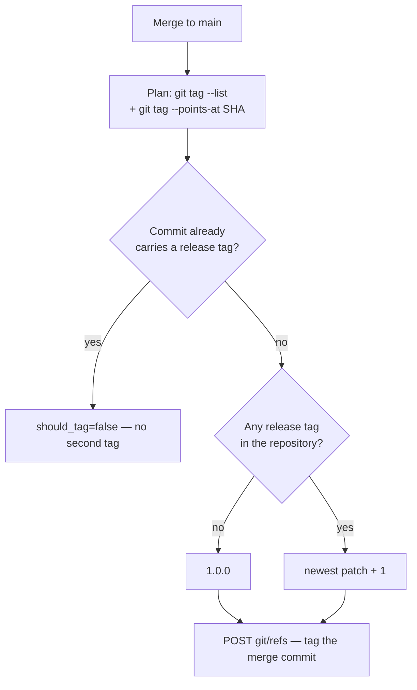

# Tag every merge to `main` with the next auto-incremented patch semver

## Summary

Frozen mode pins a host to a released version, and this repository had no
released versions — `git tag` listed none, so the only thing a host could pin
to was a raw commit SHA. This is the supply side: every merge to `main` now
leaves a tag behind. Closes #627.

- **`.github/workflows/release-tag.yml`** — fires on `push` to `main` (the
  merge commit only exists post-merge, so `push` is the one trigger that can
  see it), works out the tag, and creates the ref at the merge commit.
- **`.github/scripts/next-release-tag.sh`** — the version-selection and
  increment logic, in its own script so unit tests exercise it instead of a
  real merge being the only proof. Given every tag in the repository and the
  tags already on the commit it prints `should_tag=` and `tag=` for
  `$GITHUB_OUTPUT`.

Behaviour:

- No release tag in the repository yet → `1.0.0`; otherwise the newest tag's
  patch is incremented (`1.0.0` → `1.0.1` → `1.0.2`).
- Patch only. A human minting `1.1.0` or `2.0.0` by hand moves the series, and
  the next merge continues from there (`1.1.1`).
- Segments compare numerically, so `1.0.10` is newer than `1.0.9`.
- A release tag is a bare `MAJOR.MINOR.PATCH` triple, optionally `v`-prefixed;
  pre-releases, build metadata and moving names such as `latest` are not part
  of the series, and minted tags are always bare.
- Idempotent: a commit that already carries a release tag is not tagged again,
  so a re-run mints nothing.
- Concurrency-safe: the `concurrency` group never cancels, so two merges
  landing together are tagged one after the other rather than racing for the
  same number.
- Never blocks a merge — the merge has already landed; a failure is a red run
  on this workflow and a missing tag, nothing downstream waits on it.

Hardening, matching the other workflows in `.github/workflows/`:
`actions/checkout` SHA-pinned with its version tag in a leading comment
(Issue #2123) and `persist-credentials: false`; the workflow-level token stays
`contents: read` with the single `contents: write` grant scoped to the tagging
job; the tag ref is created through the API with the job token; and the tag
name reaches the shell through `env:`, never interpolated into a `run:` body.

## Evidence

Backend/CI change with no web interface to screenshot. The evidence is the
tests below, plus `actionlint` and `shellcheck` clean on the new files:

```text
$ actionlint -color .github/workflows/release-tag.yml   # rc=0
$ shellcheck -e SC1091 -e SC2034 .github/scripts/next-release-tag.sh   # rc=0
$ cd worker/deno && deno task test tests/next_release_tag_test.ts \
    tests/release_tag_workflow_test.ts
ok | 20 passed | 0 failed
```

`docs/audits/dependency-inventory.md` was regenerated so the new workflow's
`actions/checkout` usage is recorded; `deno run … mod.ts supply-chain-gate`
reports no findings.



## Acceptance Criteria

- **met** — A merge to `main` in a repository with no semver tags produces
  `1.0.0` — evidence:
  `worker/deno/tests/next_release_tag_test.ts::next-release-tag - a repository with no tags mints 1.0.0`
- **met** — The next merge produces `1.0.1`, and the one after `1.0.2` —
  evidence:
  `worker/deno/tests/next_release_tag_test.ts::next-release-tag - the merge after 1.0.0 produces 1.0.1`
  and `…- the merge after 1.0.1 produces 1.0.2`
- **met** — After a human pushes `1.1.0`, the next merge produces `1.1.1` —
  evidence:
  `worker/deno/tests/next_release_tag_test.ts::next-release-tag - a hand-minted 1.1.0 moves the series to 1.1.1`
- **met** — A commit that already carries a semver tag is not tagged again —
  evidence:
  `worker/deno/tests/next_release_tag_test.ts::next-release-tag - a commit that already carries a release tag is not tagged again`,
  and against a real repository in
  `worker/deno/tests/release_tag_workflow_test.ts::release-tag - the plan step reads real git tag output`
- **met** — The workflow passes `actionlint` in the `validate` job, uses
  SHA-pinned actions and minimal permissions — evidence: `actionlint` clean on
  `.github/workflows/release-tag.yml` (run above; the `validate` job runs the
  same binary over the directory), and
  `worker/deno/tests/release_tag_workflow_test.ts::release-tag.yml - only the tagging job holds contents: write`
  and `…- the checkout is SHA-pinned, tag-complete and credential-free`
- **met** — The version-selection and increment logic is covered by a test
  rather than only being exercised by a real merge — evidence:
  `worker/deno/tests/next_release_tag_test.ts` (14 tests over the real script)
- **unrequested** — `docs/RELEASE-TAGGING.md`, its README row and
  `_data/page_titles.yml` entry — reason: a new workflow with rules an operator
  has to know (patch-only, hand-minted minor/major) owes a docs surface, and
  every published page needs a `page_titles.yml` entry to pass the Pages
  metadata gate.
- **unrequested** — `docs/audits/dependency-inventory.md` — reason:
  regenerated by `supply-chain-gate --write-inventory`; the gate fails when the
  inventory does not match the tree, and the new workflow adds an
  `actions/checkout` usage.

## Test Plan

- Added `worker/deno/tests/next_release_tag_test.ts` — 14 tests running the
  real `.github/scripts/next-release-tag.sh`: first tag, successive patches,
  hand-minted minor/major, numeric (not lexical) ordering, list order
  independence, `v`-prefixed tags, pre-releases and moving names ignored,
  already-tagged commit, non-release tag on the commit, padded segments, and
  two fail-loud cases (missing file, missing argument).
- Added `worker/deno/tests/release_tag_workflow_test.ts` — 6 tests parsing the
  real workflow YAML (trigger, workflow-level vs job-level permissions,
  serialising concurrency, SHA-pinned credential-free full-tag checkout, the
  gated create step with no `${{ }}` in a `run:` body) plus an end-to-end plan
  over a throwaway git repository driven by real `git tag` output.
- `./quality.sh` run in full.
