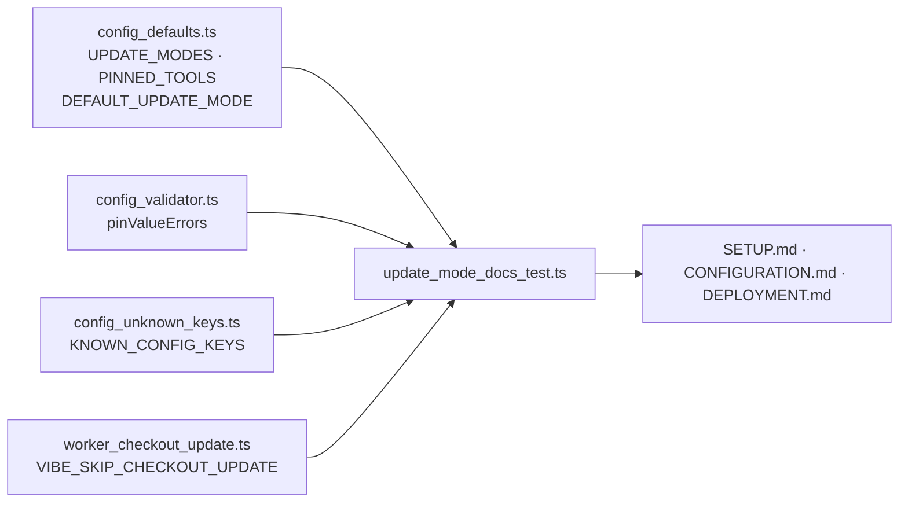

# Document update mode: setup prompts, `.config.json` fields and hand-editing a pin

## Summary

Documented the update modes as they actually shipped (Issues #622, #624, #625,
#626, #627): what setup asks and in what order, the exact `.config.json` field
names and accepted values, how to hand-edit a pin without re-running setup, how
the release tags relate to it, and how `VIBE_SKIP_CHECKOUT_UPDATE` differs from
frozen mode. Closes #628.

- **`docs/SETUP.md`** — new `Update mode: dynamic or frozen` section (linked
  from phase 6 and the table of contents) walking the three questions in the
  order `setup update-mode` asks them: the mode, the pinned ref and its
  fetch-and-resolve validation, then the `claude` → `gh` → `deno` version
  prompts and their defaults. Adds a sample transcript, the fail-loud
  five-attempt / input-ended behaviour, what a non-interactive run does, and the
  `setup.ps1` gap (Windows sets the keys by hand; `run.ps1` already honours a
  frozen pin through the shared `worker-checkout-update` command).
- **`docs/CONFIGURATION.md`** — the Update Mode section gains an
  accepted-values/defaults table for `update_mode`, `pinned_ref` and
  `pinned_tool_versions`; a worked frozen example (tag **and** SHA form) and a
  worked dynamic example; `What each mode means for maintenance`;
  `Choosing a pin` (the semver tags minted by the release workflow);
  `Moving a pin by hand` with the explicit edit → relaunch steps and the
  "re-running setup is not required" guarantee; and
  `VIBE_SKIP_CHECKOUT_UPDATE is not frozen mode`.
- **`docs/DEPLOYMENT.md`** — new `Keeping a host up to date: dynamic or frozen`
  section beside the upgrade guidance, cross-linking both of the above.

## Evidence

Documentation-only change — no web interface to screenshot. The evidence is a
test that reads the shipped docs and checks them against the code that reads the
fields, so a rename in the code fails the suite rather than leaving the docs
quietly wrong:

```text
running 7 tests from ./tests/update_mode_docs_test.ts
SETUP.md - the update-mode prompts are documented in the order setup asks them ... ok
SETUP.md - the update-mode section states both accepted modes and the default ... ok
SETUP.md - the non-interactive and Windows behaviour is documented ... ok
CONFIGURATION.md - the worked examples cover both modes and validate ... ok
CONFIGURATION.md - hand-editing a pin is documented as needing no setup re-run ... ok
CONFIGURATION.md - the pin is related to the release tags and to the skip env var ... ok
DEPLOYMENT.md - keeping a host up to date cross-links both update-mode sections ... ok

ok | 7 passed | 0 failed
```

All six documentation assertions failed against the pre-change docs and pass
after it (only the pre-existing hand-edit sentence passed before).

Where the documented values come from:



## Acceptance Criteria

- **met** — `docs/SETUP.md` describes the update-mode prompts in the order setup
  asks them — evidence: `docs/SETUP.md` "Update mode: dynamic or frozen";
  `worker/deno/tests/update_mode_docs_test.ts::SETUP.md - the update-mode prompts are documented in the order setup asks them`
- **met** — `docs/CONFIGURATION.md` documents all three fields with accepted
  values, defaults and worked examples for both modes — evidence:
  `docs/CONFIGURATION.md` "🧊 Update Mode";
  `worker/deno/tests/update_mode_docs_test.ts::CONFIGURATION.md - the worked examples cover both modes and validate`
- **met** — the hand-edit path and the "no re-run of setup required" guarantee
  are stated explicitly — evidence: `docs/CONFIGURATION.md` "Moving a pin by
  hand";
  `worker/deno/tests/update_mode_docs_test.ts::CONFIGURATION.md - hand-editing a pin is documented as needing no setup re-run`
- **met** — the relationship to the release tags and to
  `VIBE_SKIP_CHECKOUT_UPDATE` is documented — evidence:
  `docs/CONFIGURATION.md` "Choosing a pin" and "`VIBE_SKIP_CHECKOUT_UPDATE` is
  not frozen mode";
  `worker/deno/tests/update_mode_docs_test.ts::CONFIGURATION.md - the pin is related to the release tags and to the skip env var`
- **met** — every field name and value in the docs matches what the code
  actually reads — evidence: the test imports `UPDATE_MODES`, `PINNED_TOOLS`,
  `DEFAULT_UPDATE_MODE`, `KNOWN_CONFIG_KEYS`, `pinValueErrors` and
  `SKIP_CHECKOUT_UPDATE_ENV` and validates every documented example through them
- **partial** — `markdownlint` passes (the `check-markdownlint` gate);
  `./quality.sh` passes — evidence: `./quality.sh` reports `markdownlint
  PASSED`, `mermaid PASSED`, `docs prompt versions PASSED`, `deno lint PASSED`,
  `deno type check PASSED`, `deno fmt PASSED` — reason: the `deno tests` stage
  reports FAILED, from pre-existing environment/parallel-run flakiness unrelated
  to this change (see the note below), so the gate's overall result is FAILED

### Pre-existing test-suite failures, stated rather than hidden

`./quality.sh` came back FAILED on its `deno tests` stage. The failures are not
this change's: they are credential-provisioning, agent-runner, `run.sh`-launcher
and `run_core` tests that collide over shared temporary state when the suite
runs in parallel in this environment. Measured both ways with the same command:

| Tree | `deno test -A --no-check --parallel` |
| --- | --- |
| This branch | 16132 passed, 32 failed |
| The commit this branch is based on | 16105 passed, 52 failed |

Every file that failed here passes in isolation on this branch
(`deno test -A --no-check tests/setup_credential_provisioning_test.ts
tests/commit_and_push_pending_test.ts tests/run_sh_launcher_test.ts` →
68 passed, 0 failed). This change adds documentation and one docs test; it
touches no code path any of those tests exercise.

## Test Plan

- Added `worker/deno/tests/update_mode_docs_test.ts` — seven tests covering
  prompt order, accepted modes and default, non-interactive/Windows notes,
  worked-example validity for both modes, the hand-edit guarantee, the release
  tag and skip-variable relationships, and the `DEPLOYMENT.md` cross-links
  resolved against real headings.
- Re-ran `worker/deno/tests/markdown_anchors_test.ts` and
  `worker/deno/tests/config_docs_consistency_test.ts` — the new anchors and JSON
  examples pass the existing documentation gates.
- `./quality.sh` in the foreground.
