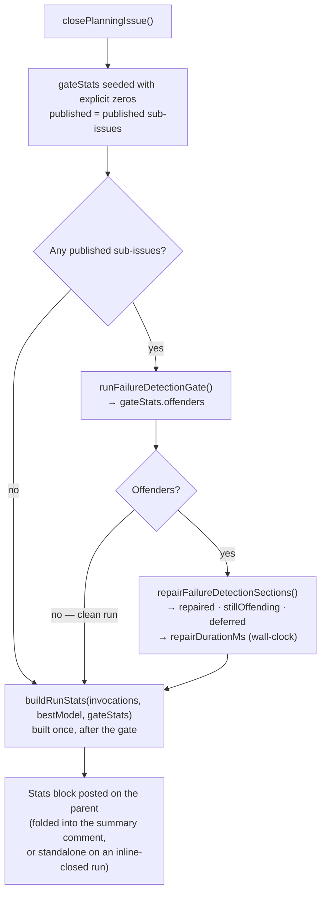

# Record Failure-Detection gate and repair counts in planning run stats

## Summary

The Failure-Detection gate's hit rate was observable only by reading worker
logs. That is how the systemic scale of the problem was found — 8/8 offenders on
one run, 3/3 on another, by grepping a single day's log — and it is why the
omission went unnoticed long enough for the self-repair to become a routine,
load-bearing part of every planning run rather than a rare fallback.

The gate and repair outcome is now recorded in the planning run's structured
stats and surfaced in the run-stats comment posted on the parent planning issue.
Closes #63.

**What changed**

- **`worker/deno/lib/planning_run_stats.ts`** — new exported
  `FailureDetectionGateStats` interface carrying `published`, `offenders`,
  `repaired`, `stillOffending`, `deferred` and `repairDurationMs`.
  `buildPlanningStatsSection()` and `buildDegradationReport()` take an optional
  `gate` argument and append two lines to the block:

  ```markdown
  - **Failure-Detection gate:** published 8 · offenders 8 · repaired 6 · still offending 1 · deferred 1
  - **Failure-Detection repair:** 1m 4s
  ```

- **`worker/deno/lib/planning_processor.ts`** — the counters are seeded with
  **explicit zeros** at the gate call site in `closePlanningIssue()` and
  populated on every gate path: clean, fully repaired, and partially repaired. A
  metric emitted only on the unhappy path cannot distinguish "healthy" from "not
  reporting", which is the failure mode this issue exists to fix, so a run with
  zero offenders records `offenders 0` rather than omitting the fields.

**Design notes for the reviewer**

- **`deferred` is a required field, not optional.** The issue asked for it to be
  optional so as not to block on the deadline-aware repair sub-issue of #54 —
  that work has landed (`FailureDetectionRepairResult.deferred` exists in
  `failure_detection_repair.ts`), so the count is real data. Making it required
  guarantees the explicit zero rather than a `?? 0` fallback that could silently
  stand in for "not reported".
- **The run stats are now built once, after the gate**, instead of being built
  at the top of `closePlanningIssue()` and rebuilt inside the repair branch. The
  verdict and section were not read between those two points, so the behaviour
  is identical — it simply removes the duplicate call and gives the single build
  site both the repair's invocations and the gate's counters.
- **The block is emitted when gate stats exist even if no planning invocation
  produced model stats.** A recovery close that skipped Claude still gates its
  published sub-issues, and those counts must not vanish with the model stats.
  Every other caller (grill-me and the phase-parametric callers in
  `phase_run_stats.ts` / `quorum_run_stats.ts` / `issue_run_stats_comment.ts`)
  supplies no gate stats, so their output is byte-for-byte unchanged.
- **The additions are additive.** The gate lines are appended *after* the
  existing `Degraded:` line, so every established line keeps its exact shape and
  order and `parsePlanningStatsComment()` is unaffected.
- **Cross-run aggregate — checked, deliberately not extended.**
  `planning_run_aggregation.ts` folds observations into a single verdict:
  one-off vs systemic **Fable-tier served-model substitution**. The gate counts
  are an orthogonal dimension with no bearing on that verdict, so carrying them
  through `PlanningRunSummary` would mean designing a second aggregate feature
  beyond this issue's acceptance criteria. The per-run counts are in the comment
  the aggregation already reads, so a future cross-run gate-rate aggregate has
  the data it needs without this change pre-empting its shape.

## Evidence

This is a backend/CLI change with no web interface, so there is no screenshot to
capture. Evidence is the test suite below plus the rendered output the new
processor test asserts reaches the parent issue:

```markdown
## Planning run model stats

- **Requested model:** `fable`
- **Served model(s):** `claude-fable-5-20250101`
- **Planning invocations:** 2
- **Degraded:** no
- **Failure-Detection gate:** published 3 · offenders 2 · repaired 1 · still offending 1 · deferred 0
- **Failure-Detection repair:** 5ms
```

Where the counters are captured relative to the existing gate/repair flow:



### Quality gate

`./quality.sh` reports the **same** 7 test failures and 3 lint problems on this
branch as on its base commit — all pre-existing and untouched by this change,
verified by re-running them against a stashed working tree:

- `tests/fleet_health_test.ts`, `tests/optional_feature_env_test.ts`,
  `tests/setup_workdir_reminder_test.ts` (5 cases) — environment-dependent
  fixtures unrelated to planning.
- `deno lint`: three `no-unused-vars` in `tests/agent_run_termination_test.ts`
  (`agentHandlerFloorMs`, `buildPriorityDispatchTable`,
  `PLANNING_TAIL_SECONDS`), arriving on this milestone branch with the `main`
  merge in 2a7d8d9.

Everything this change touches passes: `deno check`, `deno fmt`, `deno lint`
(clean on all six changed files), markdownlint, mermaid, and the 203 tests
across `planning_processor_test.ts`, `planning_run_stats_test.ts`,
`planning_run_aggregation_test.ts`, `prompt_cache_telemetry_test.ts`,
`run_stats_redaction_test.ts` and `fable_globally_disabled_cycle_test.ts`.

## Test Plan

Added to `worker/deno/tests/planning_run_stats_test.ts`:

- `buildPlanningStatsSection - records the gate counts for a partially repaired
  run (Issue #63)` — the full counter line plus the formatted repair duration.
- `buildPlanningStatsSection - records explicit zeros when the gate found no
  offenders (Issue #63)` — the case that catches "only reported when broken".
- `buildPlanningStatsSection - omits the gate lines entirely when no gate stats
  are supplied (Issue #63)` — the additions stay additive for every other
  caller.
- `buildPlanningStatsSection - reports the gate counts even when no planning
  invocation produced stats (Issue #63)`.
- `buildDegradationReport - threads the gate counts into the rendered section
  (Issue #63)` — the field can be populated and still be dropped by the shared
  orchestration helper.

Added to `worker/deno/tests/planning_processor_test.ts`:

- `processIssuePlanning - the Failure-Detection gate counts reach the parent
  run-stats comment for a partially repaired run (Issue #63)` — three sub-issues
  published, two offending, the batched repair drafts a section for one only, and
  the comment posted on the parent carries
  `published 3 · offenders 2 · repaired 1 · still offending 1 · deferred 0`. This
  is the case that fails if the counts are populated but silently dropped before
  they reach the issue.

Modified (documented in a test-modification note beside the case):

- `processIssuePlanning - safety-net skips comment + close when Claude already
  closed inline (Issue #2465)` — previously asserted the inline-close path posts
  **zero** comments. That was incidental to the mock Claude result carrying no
  `runStats`: with no model stats the section rendered empty and
  `postStatsComment()` had nothing to post. The gate counts are now recorded on
  every gate path, so this path posts the stats comment even without model stats.
  The assertion now pins what the test is actually about — no duplicate
  **summary** comment and no extra close — and additionally pins the gate's
  explicit zeros reaching the parent.
