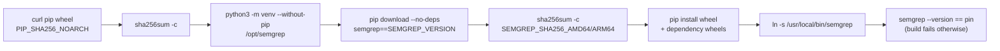

# Bake semgrep into the agent image so the SAST gate stage scans

## Summary

The quality gate's `semgrep` stage (`worker/deno/lib/semgrep_check.ts`, Issue
#559) reported `SKIPPED` on every fleet run: `container/tools.json` pinned no
`semgrep`, and the image carries no container runtime to run the CI-pinned
`semgrep/semgrep` image with either. The skip was loud and `--strict` promoted
it to `FAILED`, but agents still met `p/default` findings only after a red PR.

The image now installs semgrep at exactly the version CI runs. semgrep's CLI is
a Python application with no standalone binary release, so the install is not
the usual single checksum-verified binary:

- `container/tools.json` pins the manylinux wheel per architecture (each
  bundles its own `semgrep-core`) as a `semgrep` toolchain, and the `pip` wheel
  that installs it as a build-time `tools` entry — Debian's `python3` ships no
  `ensurepip`, so the installer is an artefact in its own right.
- `container/Containerfile` verifies the pip wheel against its digest, runs it
  as a zipapp (nothing installs pip *into* the image), creates a
  `/opt/semgrep` virtualenv — the system interpreter is PEP 668 externally
  managed — verifies the resolved semgrep wheel against the committed
  per-architecture digest **before** installing it, symlinks
  `/usr/local/bin/semgrep`, and asserts `semgrep --version` reports the pin.
- `SEMGREP_VERSION` must equal `SEMGREP_IMAGE_TAG` in
  `worker/deno/lib/pinned_actions.ts`; `container_manifest_test.ts` fails the
  gate on drift, and `semgrep` joins `REQUIRED_REPO_TOOLCHAIN_COMMANDS` so a
  manifest that stops supplying it fails loudly rather than silently skipping.

Image-size decision: about **350 MB**, ~260 MB of it the bundled
`semgrep-core`. That is the largest single toolchain in the image and it was a
deliberate trade — the alternative is every fleet agent discovering SAST
findings in CI. The stage scans changed files only, so run-time cost stays
small.

Closes #650.

## Evidence

Backend/CLI change — no web interface to screenshot. Evidence is the install
steps executed in the agent container and the gate stage's own output.



**1. The Containerfile's install steps run end to end** — the same commands,
with `/opt/semgrep` → `/tmp/opt-semgrep` and `/usr/local/bin` → `/tmp/bin` so
they run unprivileged inside the agent container (aarch64, Debian trixie):

```text
/tmp/pip-26.2.1-py3-none-any.whl: OK
/tmp/sg/semgrep-1.173.0-...-none-manylinux_2_34_aarch64.whl: OK
BUILD STEP OK: semgrep 1.173.0
```

Both checksums are the committed pins, and the final `semgrep --version |
grep -qxF "${SEMGREP_VERSION}"` assertion passed.

**2. The gate stage scans instead of skipping** — `runSemgrepCheck()` over this
branch's changed files, with that semgrep on PATH:

```text
status: PASSED
semgrep: PASSED (3 changed file(s), p/default via semgrep 1.173.0 on PATH)
```

No drift note in the output, i.e. the installed version is the CI pin — which
is the issue's "done when".

**3. Full gate** — `./quality.sh` reports `semgrep PASSED` (it reported
`SKIPPED` before this change) and every other stage passes. 36 unrelated
failures in `gh_spawn_test.ts`, `service_account_env_test.ts` and
`run_core*_test.ts` reproduce identically on the parent commit (this sandbox's
`gh` guard shim and container permissions), so they are pre-existing.

`docs/audits/dependency-inventory.md` is regenerated
(`supply-chain-gate --write-inventory`) with the two new pins, which the
supply-chain gate requires.

## Done when

- **met** — `./quality.sh` inside the agent container reports `semgrep PASSED`
  over the changed files instead of `SKIPPED` — evidence: gate output above,
  and `container/Containerfile` puts `semgrep` on the image PATH.
- **met** — the installed version matches the CI pin — evidence:
  `worker/deno/tests/container_manifest_test.ts::container/ - semgrep is
  pinned at the version CI runs (Issue #650)` asserts
  `manifest.toolchains.semgrep.version === SEMGREP_IMAGE_TAG`, and the build
  step asserts `semgrep --version` reports it.

## Test Plan

Added to `worker/deno/tests/container_manifest_test.ts`:

- `findMissingRuntimeTools - reports semgrep when no toolchain installs it
  (Issue #650)` — the manifest state that made the stage skip.
- `container/ - semgrep is pinned at the version CI runs (Issue #650)` —
  exactly one toolchain owns the `semgrep` command, its version equals
  `SEMGREP_IMAGE_TAG`, both architecture digests and the `pip` pin are
  64-hex, and nothing falls back to a host install.
- `container/ - the base image supplies the Python semgrep needs (Issue #650)`
  — the base records `python3` in `provides` with a floor at or above
  semgrep's requires-python of 3.10.
- `container/Containerfile - installs the pinned semgrep wheel and proves the
  version (Issue #650)` — the build verifies both checksums, selects the
  per-architecture digest, exposes the binary on PATH and asserts the version.
- Extended `container/ - the image supplies every monitored-repo toolchain
  command` with the `semgrep` requirement.

The existing `findContainerfileViolations` checks cover the other half: every
manifest version and checksum must be restated verbatim as a build `ARG`, and
no build step may download without verifying a checksum.
