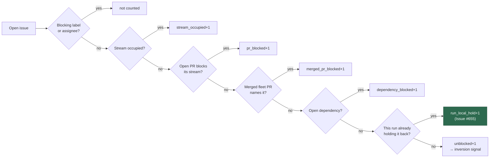
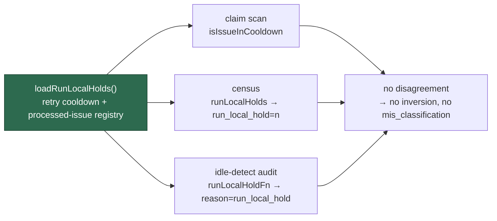

## Summary

The idle-decision census and the claim scan disagreed about
`stSoftwareAU/VibeCoder#622` and `#623` for three consecutive cycles, and the
census was wrong. Closes #655.

Both issues carried `work-on` applied by a trusted human, no assignee, no
blocking label, and no PR in their work stream — every gate the census models
said "claimable". Both had also been claimed and handed back earlier the same
day, so this run held them in its **processed-issue registry**, and
`find_oldest_issue.ts` filtered them out as `cooldown` *after* every collector
had passed them. Registry entries live as long as the process does, so that
refusal repeated on every later cycle of the run — a permanent strand behind a
skip reason nobody could see.

Nobody could see it because the second half of the fault was in the scan's own
reporting: the cooldown filters called `logIssueSkipped` and recorded **nothing**
in `blockedDetails`, the field Issue #460 added precisely so the escalation can
name the gate per issue. Issue #655 was therefore filed with an empty
"What the claim scan did with them" section — the one fact its reader needed.

The same over-count sat in the **idle-detect audit**, the second alert the issue
names. It counted #622 and #623 as claimable on every tick, so
`[idle-detect] ... ALERT mis_classification ...` fired beside the census's
inversion alert — and because the audit's `claimableTotal` gates the idle-task
filer (`auditDisagrees` in `run_core.ts`), fixing only the census would have
left the filer suppressed by the same two held issues for the life of the run.

Four changes:

1. **`find_oldest_issue.ts`** — the local and cross-worker cooldown filters now
   record a `BlockedCandidateInfo` alongside the log line, so a refusal there
   reaches `FindIssuesResult.blockedDetails` and the escalation body names it.
   The five copy-pasted local filters collapse into one `applyLocalCooldown`
   helper.
2. **`idle_decision_census.ts`** — new `runLocalHolds` input and
   `run_local_hold=<n>` output. It is applied last of the per-issue gates,
   mirroring the scan, so an issue refused for a more fundamental reason keeps
   that reason. `CENSUS_SCAN_GATE_COVERAGE["cooldown"]` moves from `run-local`
   to `modelled`.
3. **`idle_detect_diagnostics.ts`** — new `run_local_hold` exclusion reason, a
   `runLocalHolds` classifier input and a `runLocalHoldFn` audit option, applied
   last for the same reason and ranked in `pickDominantReason` below the two PR
   gates (which describe fleet state outliving this process) and above the gates
   applied before it. Exactly the shape Issue #4223 and GRQ#4419 used to give the
   audit the open-PR and merged-PR gates. A hold source that throws falls back to
   no hold, so a failure restores the old over-count rather than reporting a repo
   as having nothing to do.
4. **`run_core_production_deps.ts`** — `loadRunLocalHolds()` resolves the
   persisted retry cooldown plus the processed-issue registry **once**, and all
   three readers use it: the claim scan's `isIssueInCooldown`, the census's
   `runLocalHolds` and the audit's `runLocalHoldFn`. One source of truth, so they
   cannot drift again.

A held `work-on` issue still serialises the repo's lower tiers, because the scan
increments its suppression count inside the collector, before this filter runs.
The per-cycle adaptive-floor deferral (Issue #245) stays unmodelled — it is
rebuilt every cycle, so it cannot hold a streak open.

## Evidence

Backend/CLI only — no web interface to screenshot. Evidence is the test suite
plus the field state recorded into the incident corpus.

Where the gate sits in the census pipeline:

The audit takes the same gate in the same position, so all three instruments
agree about the hold set:

The 2026-08-30 state is now a permanent CI fixture —
`worker/deno/tests/fixtures/claim_path_incidents/vibecoder-2026-08-30.json` —
replayed through **both** instruments by `claim_path_incident_test.ts`. The
`cooldown` gate also joins `MODELLED_GATES`, so the generated differential
(`claim_path_differential_test.ts`) now pairs it against every other modelled
gate in both tier arrangements.

## Reproduction

- **symptom** — the census reported `work_on=2 inversion_signal=true` for
  `stSoftwareAU/VibeCoder` on cycle after cycle, and the audit reported
  `claimable=2` beside it, while the claim scan silently refused #622 and #623
  — and the filed escalation named no scan reason at all
- **status** — `verified` — every regression check was observed failing against
  the unfixed code and passing after the fix: the finder test read
  `blockedDetails` reason `undefined` for the cooled-down issues, the recorded
  incident's census verdict disagreed with the scan's, and — with the new gate
  removed from `classifyIssues` and everything else in place — the audit test
  reported the field symptom exactly, `claimableTotal` 2 where 0 was expected
- **regression test** —
  `worker/deno/tests/issue_finder_test.ts::issue_finder - a cooldown refusal is recorded in blockedDetails (Issue #655)`,
  `worker/deno/tests/claim_path_incident_test.ts::claim path incident - stSoftwareAU/VibeCoder 2026-08-30 (VibeCoder#655)`
  and
  `worker/deno/tests/idle_detect_diagnostics_test.ts::auditClaimableState - a run-held backlog raises no ALERT (Issue #655)`

## Test Plan

Added to `worker/deno/tests/idle_decision_census_test.ts`:

- a held issue is not claimable and raises no inversion signal
- a hold removes only the issues it names
- a more fundamental gate (`pr_blocked`) keeps its own attribution
- the `idle_task` count honours holds, as the scan's filter does
- omitted `runLocalHolds` preserves the previous behaviour exactly
- a held `work-on` issue still serialises the lower tiers
- the formatter emits `run_local_hold=`
- `CENSUS_SCAN_GATE_COVERAGE["cooldown"]` is `modelled`

Added to `worker/deno/tests/idle_detect_diagnostics_test.ts`:

- a run-local hold excludes the issue, and only the issues it names
- a more fundamental gate (`assignee_filter`) keeps its own attribution
- omitted holds preserve the pre-#655 verdict exactly
- `pickDominantReason` ranks `run_local_hold` under the two PR gates and over
  `stream_occupied`
- the 2026-08-30 two-issue state raises no ALERT and logs
  `reason=run_local_hold`
- a hold naming another repo excludes nothing here
- a throwing hold source falls back to no hold rather than to "nothing to do"

Added to `worker/deno/tests/issue_finder_test.ts`:

- a local cooldown refusal and a cross-worker cooldown refusal each name
  themselves in `blockedDetails`
- a clean scan leaves no cooldown entry behind

Added to the incident corpus and the differential harness:

- `tests/fixtures/claim_path_incidents/vibecoder-2026-08-30.json`
- `cooldown` added to `MODELLED_GATES` in `tests/fixtures/claim_path_state.ts`,
  wired to both instruments from one set

Docs updated: `docs/IDLE-TASK-FRAMEWORK.md` (gate flowchart, "unblocked"
definition, the new gate's incident narrative and the audit's share of it),
`docs/workflows/issue-processing.md`, and the incident corpus README.
