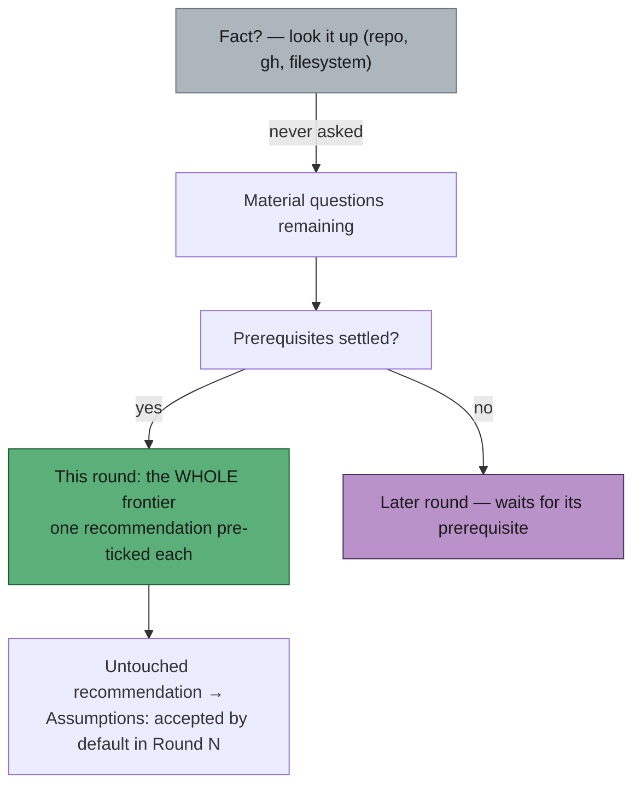

# PR Summary — grill-me v14: ask the whole frontier, recommend an answer, never ask for a fact

## Summary

`prompts/grill-me/v14.md` adds the three mechanics the mattpocock/skills
grilling primitive has and v13 did not: the **design tree and its frontier**
(which questions belong in this round), a **recommended answer beside every
question** (pre-ticked in our checkbox format), and **facts are yours, decisions
are theirs** (never ask the user something a read of the repository, `gh`, or
the filesystem answers). Committed prompt versions are immutable, so v13 is
untouched and v14 becomes the version the worker loads. Closes #658.

The issue left two conflicts to be decided before implementing; both are
resolved explicitly in v14 rather than left to model judgement:

- **Frontier vs the ~1500-character mobile bound.** The frontier wins. The round
  compresses instead of dropping questions — one-line stems, at most four
  options each, no restated context. One numeric backstop keeps a phone screen
  usable: past **eight** questions the frontier is split, the eight that most
  change the plan are asked, and the TL;DR says how many remain.
- **Pre-ticking changes what a tick means.** Silence now reads as consent, so
  consent is made visible: every recommendation the user leaves untouched is
  written into the body's `Assumptions` list as
  `— accepted by default in Round N`. A `work-on` reader therefore sees which
  parts of the scope the user actively chose and which they merely did not
  contest, and the user can overturn any of them in a later round. A question is
  only "unanswered" when it was posted with no recommendation at all.

Round composition after the change:



## Evidence

Backend/prompt-template change with no web interface to screenshot, so the
evidence is the test run. The tests drive the real `getLatestVersion`,
`loadPrompt` and `buildGrillMePrompt` functions — the same path the worker uses
to build a round — rather than reading the template file directly:

```
$ deno test --allow-read --allow-env tests/grill_me_frontier_test.ts
grill-me - the latest version is v14 or newer ... ok
grill-me v14 - states the frontier, recommendation and facts rules ... ok
grill-me v14 - drops the smallest-set round rule ... ok
grill-me v14 - resolves the frontier vs mobile-length conflict ... ok
grill-me v14 - defines what a pre-ticked box means ... ok
grill-me v14 - keeps every contract inherited from v13 ... ok
grill-me v13 - stays immutable ... ok
buildGrillMePrompt - a built round carries the frontier rules and no placeholders ... ok
ok | 8 passed | 0 failed
```

All eight failed before `v14.md` existed except the v13-immutability test, which
passed unchanged throughout — that is the point of it.

### Quality gate

`./quality.sh` passes every check except `deno tests`, which fails on three
**pre-existing, environment-bound** cases unrelated to this change:

- `tests/run_core_rate_limit_resume_test.ts` — uncaught dangling-promise error
  from its simulated `gh` rate-limit path.
- `tests/run_core_test.ts` — the same dangling-promise class.
- `tests/service_account_env_test.ts::applyServiceAccountEnv - an unwritable gh
  config dir is restaged writable`
  — asserts a `/tmp/…/vibe-gh-config` path but reads
  `/home/vibe/auto-issue-work/.container-state/gh-config` from the ambient
  container environment.

Verified pre-existing by running those files in a worktree at the parent commit
(`HEAD~1`, `05e093c`), with none of this PR's files present: they fail
identically there. No prompt, grill-me, docs, mermaid, markdownlint or
immutability check fails — `prompt immutability`, `mermaid`, `markdownlint`,
`docs prompt versions`, `semgrep`, `deno lint`, `deno type check` and `deno fmt`
all pass.

## Test Plan

- Added `worker/deno/tests/grill_me_frontier_test.ts`:
  - `grill-me - the latest version is v14 or newer` — the worker (which loads
    the latest version) now picks up v14.
  - `grill-me v14 - states the frontier, recommendation and facts rules` — the
    three mechanics are present in the template.
  - `grill-me v14 - drops the smallest-set round rule` — the v13 "smallest set
    of clarifying choices" instruction is gone, not merely supplemented.
  - `grill-me v14 - resolves the frontier vs mobile-length conflict` — the
    frontier wins, with the eight-question split stated.
  - `grill-me v14 - defines what a pre-ticked box means` — exactly one ticked
    option per question, and untouched recommendations recorded as
    `accepted by default in Round N`.
  - `grill-me v14 - keeps every contract inherited from v13` — every
    placeholder, marker, comment title, footer and rubric class the processor
    and the rubric depend on survives the rewrite.
  - `grill-me v13 - stays immutable` — committed versions never change.
  - `buildGrillMePrompt - a built round carries the frontier rules and no
    placeholders`
    — a prompt built through the processor carries the new rules and leaves no
    `{{PLACEHOLDER}}` unsubstituted.
- Existing suites unchanged: `requirements_rubric_test.ts` still pins v13, and
  `fable5_remaining_prompts_test.ts`'s "latest is v10 or newer" check still
  holds.

## Documentation

- `docs/workflows/grill-me.md` — the round description no longer says "smallest
  set"; new sections cover the design tree and its frontier (with a Mermaid
  diagram), the pre-ticked recommendation and what leaving it means, and the
  facts-vs-decisions split. The worked mobile example and both existing diagrams
  were updated to show pre-ticked recommendations and a whole-frontier round.
